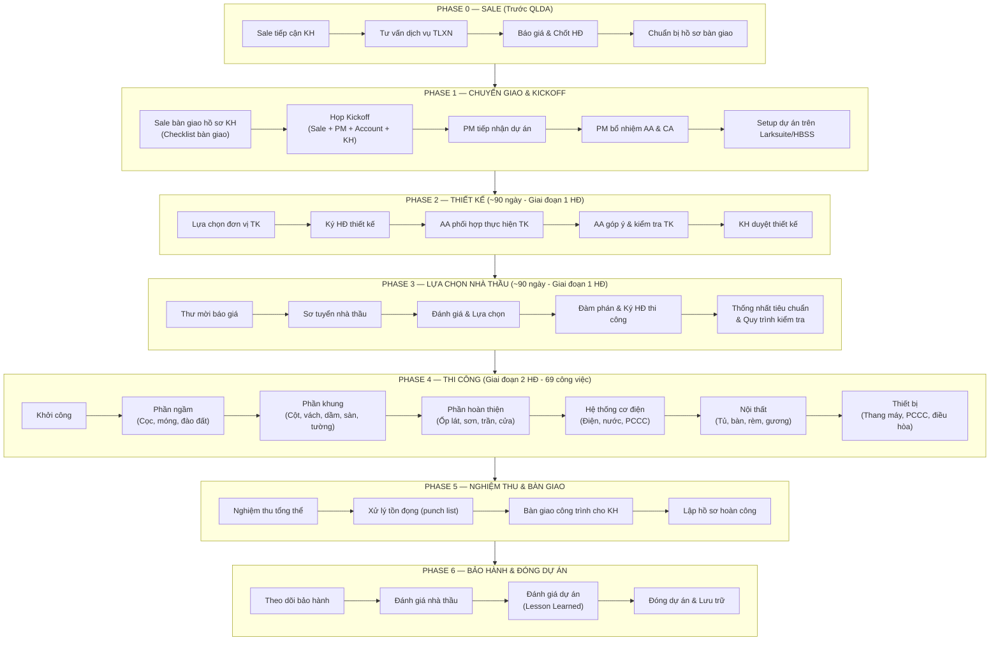

# Flow Tổng Thể Dự Án — End-to-End

> Tài liệu mô tả toàn bộ vòng đời một dự án từ khi bộ phận Sale tiếp cận khách hàng cho đến khi đóng dự án và bàn giao bảo hành.

---

## Sơ Đồ Tổng Quan

---

## Chi Tiết Từng Phase

### PHASE 0: SALE (Trước khi đến QLDA)

| Bước | Mô tả | Người thực hiện | Công cụ | Output |
|------|-------|-----------------|---------|--------|
| 0.1 | Tiếp cận khách hàng có nhu cầu xây/sửa nhà | Sale | - | Thông tin KH |
| 0.2 | Tư vấn dịch vụ TLXN (QTDA / TLXN / TLXN Từ Xa) | Sale | Bảng giá dịch vụ | KH hiểu dịch vụ |
| 0.3 | Báo giá & chốt gói dịch vụ | Sale | Báo giá TLXN | Báo giá được duyệt |
| 0.4 | Ký hợp đồng TLXN | Sale + KH | HĐ QTDA/TLXN/TLXN TX | HĐ đã ký |
| 0.5 | Ký phụ lục QC/CC & Ticket/Scorecard | Sale + KH | Phụ lục HĐ | Phụ lục đã ký |
| 0.6 | Chuẩn bị hồ sơ bàn giao cho QLDA | Sale | Checklist bàn giao | Hồ sơ đầy đủ |

> **👉 Xem chi tiết:** [01-PHOI-HOP-SALE-QLDA/quy-trinh-ban-giao-tu-sale.md](../01-PHOI-HOP-SALE-QLDA/quy-trinh-ban-giao-tu-sale.md)

---

### PHASE 1: CHUYỂN GIAO & KICKOFF

| Bước | Mô tả | Người thực hiện | Thời hạn | Output |
|------|-------|-----------------|----------|--------|
| 1.1 | Sale bàn giao hồ sơ KH đầy đủ | Sale → PM + Account | Ngay sau ký HĐ | Hồ sơ KH trên Larksuite |
| 1.2 | PM & Account kiểm tra hồ sơ | PM + Account | 1 ngày | Xác nhận đủ / yêu cầu bổ sung |
| 1.3 | Tổ chức họp Kickoff | Sale + PM + Account + KH | Trong 3 ngày | Biên bản Kickoff |
| 1.4 | PM lên kế hoạch tổng thể dự án | PM | 3 ngày sau Kickoff | Kế hoạch dự án |
| 1.5 | PM bổ nhiệm AA & CA phù hợp | PM | Ngay sau Kickoff | Thông báo phân công |
| 1.6 | Setup dự án trên hệ thống | AA | 1 ngày | Folder Larksuite, nhóm Zalo, HBSS |

> **Nội dung Kickoff bắt buộc:**
> - Giới thiệu team QLDA (PM, Account) cho KH
> - Review lại nội dung HĐ & phạm vi dịch vụ
> - Thống nhất kênh liên lạc (Zalo, Larksuite)
> - Thống nhất lịch báo cáo định kỳ
> - KH chia sẻ yêu cầu, mong muốn, timeline mong đợi
> - Giải đáp thắc mắc

> **👉 Xem chi tiết:** [01-PHOI-HOP-SALE-QLDA/hop-kickoff-du-an.md](../01-PHOI-HOP-SALE-QLDA/hop-kickoff-du-an.md)

---

### PHASE 2: THIẾT KẾ (~90 ngày — Giai đoạn 1 HĐ)

| Bước | Mô tả | Thực hiện | Phối hợp | Output |
|------|-------|-----------|----------|--------|
| 2.1 | Tổng hợp yêu cầu thiết kế từ KH | AA + Account | KH | Brief thiết kế |
| 2.2 | Tìm kiếm & đề xuất đơn vị TK | PM + AA | KH | Danh sách đề xuất |
| 2.3 | KH lựa chọn đơn vị TK | KH | PM tư vấn | Đơn vị TK được chọn |
| 2.4 | Đàm phán & ký HĐ thiết kế | PM + AA | KH + ĐV Thiết kế | HĐ thiết kế |
| 2.5 | Phối hợp thực hiện thiết kế | AA | ĐV Thiết kế | Bản vẽ draft |
| 2.6 | Góp ý & kiểm tra thiết kế | AA + PM | KH | Báo cáo góp ý |
| 2.7 | Chỉnh sửa theo góp ý | ĐV Thiết kế | AA theo dõi | Bản vẽ chỉnh sửa |
| 2.8 | KH duyệt & nghiệm thu thiết kế | KH | PM + AA | Bộ hồ sơ TK hoàn chỉnh |

> **Công việc song song trong Phase 2:**
> - PM thống nhất tiêu chuẩn thi công cho dự án
> - PM thống nhất quy trình kiểm tra & đánh giá CL
> - Account duy trì liên lạc với KH, báo cáo tiến độ TK

---

### PHASE 3: LỰA CHỌN NHÀ THẦU (~trong Giai đoạn 1 HĐ)

| Bước | Mô tả | Thực hiện | Phối hợp | Output |
|------|-------|-----------|----------|--------|
| 3.1 | Phát hành thư mời báo giá | PM | AA chuẩn bị | Thư mời + Hồ sơ yêu cầu |
| 3.2 | Thu thập & tổng hợp báo giá | AA | PM | Bảng so sánh báo giá |
| 3.3 | Sơ tuyển nhà thầu | PM + AA | KH tham gia | Báo cáo sơ tuyển |
| 3.4 | Đánh giá chi tiết & lựa chọn | PM | KH quyết định | Báo cáo lựa chọn NT |
| 3.5 | Đàm phán điều khoản HĐ thi công | PM | KH + Nhà thầu | Dự thảo HĐ |
| 3.6 | Ký HĐ thi công | KH + Nhà thầu | PM chứng kiến | HĐ thi công đã ký |
| 3.7 | Thông báo tiêu chuẩn cho nhà thầu | PM + CA | Nhà thầu | Biên bản thống nhất |
| 3.8 | Lập tiến độ thi công | PM + CA | Nhà thầu | Bảng tiến độ |
| 3.9 | Cài đặt & hướng dẫn HBSS | AA/CA | Nhà thầu | Tài khoản HBSS |

> **Lưu ý:** Quy trình này cũng áp dụng cho nhà thầu phụ & NCC (có SOP riêng)

---

### PHASE 4: THI CÔNG (Giai đoạn 2 HĐ — 69 công việc)

#### 4.1 Công việc kiểm tra & nghiệm thu theo hạng mục

| Nhóm | Hạng mục chính | Người kiểm tra | Số mục |
|------|---------------|----------------|--------|
| **Phần ngầm** | Cọc ép, đào đất, ván khuôn móng, cốt thép móng, đổ BT móng | CA | ~8 |
| **Phần khung** | Cốt thép cột/vách, ván khuôn dầm/sàn, BT dầm sàn, xây tường, tô tường | CA | ~12 |
| **Hoàn thiện** | Ốp lát, sơn, trần, cửa, lan can, mặt tiền | CA + AA | ~15 |
| **Cơ điện thô** | Ống điện âm tường/sàn, thoát nước, cấp nước | CA | ~5 |
| **Cơ điện hoàn thiện** | Dây điện, đèn, ổ cắm, điều hòa, thiết bị VS | CA | ~5 |
| **Nội thất** | Trần trang trí, tủ bếp, tủ quần áo, rèm, gương | CA + AA | ~7 |
| **Thiết bị** | Thang máy, PCCC, điều hòa | CA | ~3 |

> **👉 Chi tiết checklist:** [05-CA/checklist-nghiem-thu/README.md](../05-CA/checklist-nghiem-thu/README.md)

#### 4.2 Công việc phụ trợ (xuyên suốt Phase 4)

| Công việc | Người thực hiện | Tần suất |
|-----------|-----------------|----------|
| Đánh giá thay đổi thiết kế/thi công | PM + AA | Khi phát sinh |
| Điều phối nhà thầu phụ | PM + CA | Liên tục |
| Theo dõi tiến độ nhà thầu | CA → PM | Hàng tuần |
| Theo dõi ngân sách & thanh toán | PM + AA | Hàng tháng |
| Kiểm tra nhật ký công trình | CA | Hàng tuần |
| Họp giao ban công trường | PM + CA + NT | Hàng tuần |
| Báo cáo tuần cho KH | Account + PM | Hàng tuần |
| Xử lý Ticket từ KH | Account → PM/CA | Theo SLA |

---

### PHASE 5: NGHIỆM THU & BÀN GIAO

| Bước | Mô tả | Thực hiện | Output |
|------|-------|-----------|--------|
| 5.1 | Kiểm tra tổng thể công trình | PM + CA + AA | Punch list (danh sách tồn đọng) |
| 5.2 | Yêu cầu nhà thầu khắc phục | PM | Biên bản yêu cầu |
| 5.3 | Kiểm tra lại sau khắc phục | CA | Biên bản xác nhận |
| 5.4 | Nghiệm thu công trình với KH | PM + Account + KH + NT | Biên bản nghiệm thu |
| 5.5 | Bàn giao công trình | PM + NT → KH | Biên bản bàn giao |
| 5.6 | Bàn giao hồ sơ hoàn công | AA | Bộ hồ sơ hoàn công |

---

### PHASE 6: BẢO HÀNH & ĐÓNG DỰ ÁN

| Bước | Mô tả | Thực hiện | Thời hạn |
|------|-------|-----------|----------|
| 6.1 | Theo dõi bảo hành từ nhà thầu | Account + PM | Theo HĐ thi công |
| 6.2 | Xử lý phát sinh bảo hành | PM + CA | Khi phát sinh |
| 6.3 | Đánh giá nhà thầu/NCC (rating) | PM | Sau bàn giao 1 tháng |
| 6.4 | Thu thập feedback KH (Scorecard) | Account | Sau bàn giao |
| 6.5 | Đánh giá dự án (Lesson Learned) | PM + Team | Trong 2 tuần |
| 6.6 | Lưu trữ hồ sơ dự án | AA | Trên Larksuite |
| 6.7 | Đóng dự án chính thức | PM | Sau khi hoàn tất |

---

## Quy Trình Xuyên Suốt (Áp dụng tất cả Phase)

| Quy trình | Mô tả | Tham chiếu |
|-----------|-------|------------|
| **Ticket** | KH tạo ticket → Tiếp nhận 24h → P1/P2/P3 → Xử lý theo SLA | [09-PHU-LUC/ticket-scorecard-escalation.md](../09-PHU-LUC/ticket-scorecard-escalation.md) |
| **Escalation** | Cấp 1: PM → Cấp 2: Director → Cấp 3: Biên bản + HĐ | [07-PHOI-HOP-NOI-BO/escalation-noi-bo.md](../07-PHOI-HOP-NOI-BO/escalation-noi-bo.md) |
| **Báo cáo định kỳ** | Tuần: CA báo cáo → PM tổng hợp → Account gửi KH | [03-PM/bao-cao-review-dinh-ky.md](../03-PM/bao-cao-review-dinh-ky.md) |
| **Quản lý thay đổi** | Phát sinh → PM đánh giá → KH duyệt → Cập nhật ngân sách | [03-PM/quan-ly-thay-doi-phat-sinh.md](../03-PM/quan-ly-thay-doi-phat-sinh.md) |
| **Scorecard** | KH đánh giá dịch vụ, đối soát Quỹ Cam kết CL hàng tháng | [09-PHU-LUC/ticket-scorecard-escalation.md](../09-PHU-LUC/ticket-scorecard-escalation.md) |
