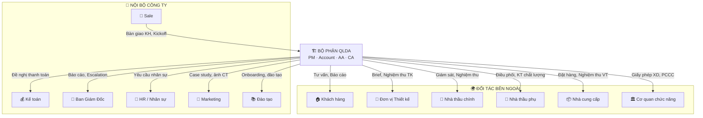

# Bản Đồ Các Bên Liên Quan (Stakeholder Map)

> Tài liệu mô tả tất cả các bên mà bộ phận QLDA tương tác, bao gồm nội bộ công ty và đối tác bên ngoài.

---

## Sơ Đồ Stakeholder

---

## Chi Tiết Từng Stakeholder

### 🏢 NỘI BỘ

#### 1. Bộ phận Sale 💼

| Tiêu chí | Chi tiết |
|----------|---------|
| **Điểm phối hợp** | Bàn giao KH sau ký HĐ, tổ chức Kickoff |
| **QLDA cần từ Sale** | Hồ sơ KH đầy đủ, HĐ đã ký, thông tin gói dịch vụ |
| **Sale cần từ QLDA** | Feedback về chất lượng lead, case study cho marketing |
| **Kênh làm việc** | Larksuite (bàn giao), Zalo (trao đổi nhanh) |
| **Tần suất** | Mỗi lần có DA mới + follow-up hàng tháng |
| **SOP liên quan** | [01-PHOI-HOP-SALE-QLDA/](../01-PHOI-HOP-SALE-QLDA/) |

#### 2. Kế toán / Tài chính 💰

| Tiêu chí | Chi tiết |
|----------|---------|
| **Điểm phối hợp** | Thanh toán cho nhà thầu, đối soát thu chi, Quỹ Cam kết CL |
| **QLDA cần từ KT** | Xác nhận thanh toán, tình hình thu phí từ KH |
| **KT cần từ QLDA** | Đề nghị thanh toán (PM duyệt), dữ liệu thu chi (AA nhập) |
| **Kênh làm việc** | Larksuite (đề nghị TT), Email (xác nhận) |
| **Tần suất** | Hàng tháng (đối soát) + khi phát sinh |
| **SOP liên quan** | [07-PHOI-HOP-NOI-BO/phoi-hop-ke-toan.md](../07-PHOI-HOP-NOI-BO/phoi-hop-ke-toan.md) |

#### 3. Ban Giám Đốc 👔

| Tiêu chí | Chi tiết |
|----------|---------|
| **Điểm phối hợp** | Phê duyệt kế hoạch DA, escalation cấp 2-3, review hiệu suất |
| **QLDA cần từ BGĐ** | Phê duyệt nhân sự, ngân sách, quyết định chiến lược |
| **BGĐ cần từ QLDA** | Báo cáo tổng hợp, cảnh báo rủi ro, KPI |
| **Tần suất** | Hàng tháng (báo cáo) + khi escalation |
| **SOP liên quan** | [07-PHOI-HOP-NOI-BO/bao-cao-ban-giam-doc.md](../07-PHOI-HOP-NOI-BO/bao-cao-ban-giam-doc.md) |

#### 4. HR / Nhân sự 👥

| Tiêu chí | Chi tiết |
|----------|---------|
| **Điểm phối hợp** | Tuyển dụng, phân bổ AA/CA, đánh giá hiệu suất |
| **QLDA cần từ HR** | Nhân sự có năng lực phù hợp, hỗ trợ onboarding |
| **HR cần từ QLDA** | Yêu cầu nhân sự, đánh giá KPI nhân viên |
| **Tần suất** | Khi cần bổ sung nhân sự + đánh giá định kỳ |
| **SOP liên quan** | [07-PHOI-HOP-NOI-BO/phoi-hop-HR.md](../07-PHOI-HOP-NOI-BO/phoi-hop-HR.md) |

#### 5. Marketing 📣

| Tiêu chí | Chi tiết |
|----------|---------|
| **Điểm phối hợp** | Cung cấp ảnh/video công trường, case study, testimonial |
| **QLDA cần từ MKT** | Template báo cáo, quy chuẩn branding |
| **MKT cần từ QLDA** | Hình ảnh (không chứa thông tin cá nhân KH), feedback KH |
| **Tần suất** | Hàng tháng hoặc theo mốc quan trọng |
| **SOP liên quan** | [07-PHOI-HOP-NOI-BO/phoi-hop-marketing.md](../07-PHOI-HOP-NOI-BO/phoi-hop-marketing.md) |

#### 6. Đào tạo 📚

| Tiêu chí | Chi tiết |
|----------|---------|
| **Điểm phối hợp** | Onboarding nhân viên mới, nâng cao nghiệp vụ |
| **QLDA cần từ ĐT** | Chương trình đào tạo, tài liệu huấn luyện |
| **ĐT cần từ QLDA** | Feedback kỹ năng nhân viên, case study đào tạo |
| **Tần suất** | Khi có nhân sự mới + đào tạo định kỳ |

---

### 🌍 ĐỐI TÁC BÊN NGOÀI

#### 1. Khách hàng (Chủ nhà) 🏠

| Tiêu chí | Chi tiết |
|----------|---------|
| **Vai trò** | Bên A trong HĐ, người quyết định cuối cùng |
| **Đầu mối QLDA** | Account (quan hệ) + PM (vận hành) |
| **Kênh liên lạc** | Zalo (hàng ngày), Larksuite/HBSS (chính thức), Email (quan trọng) |
| **Tần suất** | Hàng ngày (Account) + Hàng tuần (PM báo cáo) |
| **Quyền của KH** | Tạo Ticket, đánh giá Scorecard, phê duyệt thanh toán, thay đổi nhân sự |

#### 2. Đơn vị Thiết kế 📐

| Tiêu chí | Chi tiết |
|----------|---------|
| **Vai trò** | Đối tác thực hiện thiết kế kiến trúc/nội thất |
| **Đầu mối QLDA** | AA (phối hợp kỹ thuật) + PM (hợp đồng) |
| **Kênh liên lạc** | Zalo + Email |
| **SOP liên quan** | [06-PHOI-HOP-DOI-TAC/thiet-ke/](../06-PHOI-HOP-DOI-TAC/thiet-ke/) |

#### 3. Nhà thầu chính 🔨

| Tiêu chí | Chi tiết |
|----------|---------|
| **Vai trò** | Đơn vị thi công chính, ký HĐ trực tiếp với KH |
| **Đầu mối QLDA** | CA (giám sát) + PM (điều phối) |
| **Kênh liên lạc** | HBSS (chính thức), Zalo (hàng ngày) |
| **SOP liên quan** | [06-PHOI-HOP-DOI-TAC/nha-thau/](../06-PHOI-HOP-DOI-TAC/nha-thau/) |

#### 4. Nhà thầu phụ 🔧

| Tiêu chí | Chi tiết |
|----------|---------|
| **Vai trò** | Thi công chuyên ngành (điện, nước, PCCC, nội thất...) |
| **Đầu mối QLDA** | PM + CA (điều phối) |
| **Nguyên tắc** | Lựa chọn theo quy trình minh bạch, có thể từ mạng lưới đối tác NCM |
| **SOP liên quan** | [06-PHOI-HOP-DOI-TAC/nha-thau/lua-chon-nha-thau-phu-NCC.md](../06-PHOI-HOP-DOI-TAC/nha-thau/lua-chon-nha-thau-phu-NCC.md) |

#### 5. Nhà cung cấp (Vật tư, Vật liệu) 📦

| Tiêu chí | Chi tiết |
|----------|---------|
| **Vai trò** | Cung cấp vật liệu xây dựng, thiết bị |
| **Đầu mối QLDA** | PM (lựa chọn) + Account (kết nối từ mạng lưới NCM) |
| **Nguyên tắc** | Giá niêm yết công khai, ưu đãi KH NCM minh bạch (theo HĐ Đối tác) |
| **SOP liên quan** | [06-PHOI-HOP-DOI-TAC/nha-cung-cap/](../06-PHOI-HOP-DOI-TAC/nha-cung-cap/) |

#### 6. Cơ quan chức năng 🏛️

| Tiêu chí | Chi tiết |
|----------|---------|
| **Vai trò** | Cấp giấy phép xây dựng, nghiệm thu PCCC, kiểm tra an toàn |
| **Đầu mối QLDA** | PM + AA (hồ sơ) |
| **Lưu ý** | Thủ tục pháp lý là nghĩa vụ của KH, QLDA chỉ tư vấn & hỗ trợ |
| **SOP liên quan** | [06-PHOI-HOP-DOI-TAC/co-quan-chuc-nang/](../06-PHOI-HOP-DOI-TAC/co-quan-chuc-nang/) |
