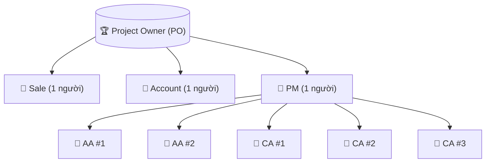
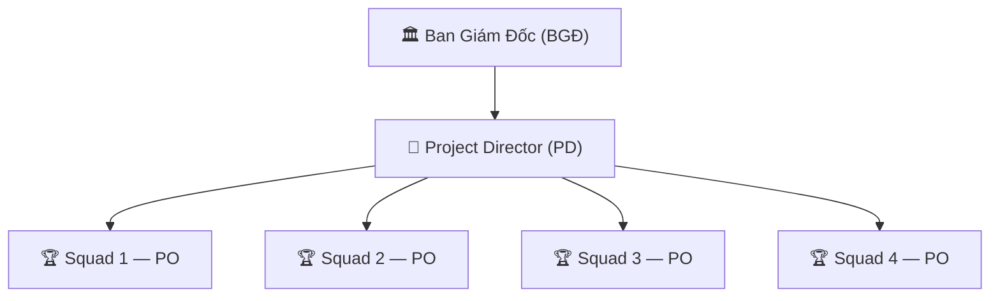
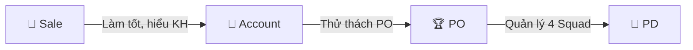
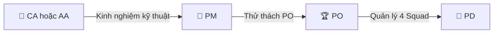
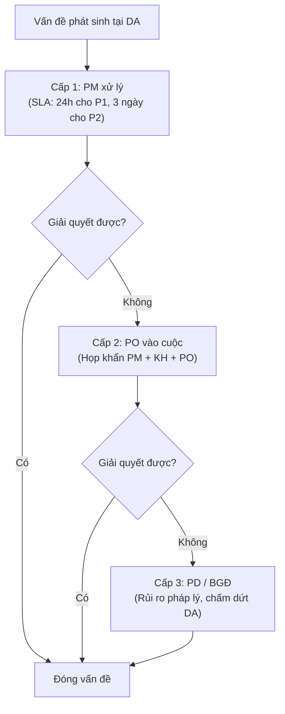

# Project Owner — Vai Trò & Vận Hành Squad

> **Mã SOP:** SOP-00-PO
> **Phiên bản:** 1.0
> **Ngày hiệu lực:** 2026-03-27

---

## 1. Định Nghĩa Vai Trò

**Project Owner (PO)** là **người đứng đầu một Squad** — đơn vị vận hành độc lập nhỏ nhất của NCM. PO được trao toàn bộ quyền hạn về nhân sự, vận hành và chịu trách nhiệm về doanh số của Squad trước **Project Director (PD)**.

> ⚠️ **Tại sao PO cần được vun đắp cẩn thận:** PO được trao quyền con người và tài chính — đây là điều kiện đủ để một PO có thể tách ra lập công ty riêng. Vì vậy, việc lên PO đòi hỏi quá trình cống hiến, thử thách và tin tưởng lâu dài với NCM.

---

## 2. Cấu Trúc Squad

| Thành phần Squad | Số lượng | Báo cáo cho  |
| ------------------ | :---------: | -------------- |
| Sale               |      1      | PO trực tiếp |
| Account            |      1      | PO trực tiếp |
| PM                 |      1      | PO trực tiếp |
| AA hoặc CA        |     ~5     | PM             |

**Mục tiêu doanh số:** ~500 triệu VND/tháng (~25 công trình đang vận hành đồng thời)

---

## 3. Cấu Trúc Cấp Trên

**Project Director (PD)** quản lý 4 Squad (4 PO), chịu trách nhiệm tổng doanh số ~2 tỷ VND/tháng.

---

## 4. Con Đường Thăng Tiến Lên PO

### Hướng 1: Sale → Account → PO

**Điều kiện:** Account hiểu sâu mối quan hệ KH, ngân sách, vận hành tổng thể, có khả năng lãnh đạo team.

### Hướng 2: CA/AA → PM → PO

**Điều kiện:** PM hiểu sâu kỹ thuật xây dựng, vận hành dự án, có năng lực kinh doanh.

### Điều Kiện Chung Để Được Xét Lên PO

| Tiêu chí                              | Mô tả                                                                  |
| --------------------------------------- | ------------------------------------------------------------------------ |
| Thâm niên                             | Tối thiểu 2 năm ở vai trò hiện tại (Account hoặc PM)             |
| Kết quả KPI                           | ≥ 24 tháng liên tiếp đạt mục tiêu KPI                            |
| Không vi phạm nội quy nghiêm trọng | Không có vụ tranh chấp KH, không leak thông tin nội bộ           |
| Năng lực lãnh đạo                  | Chứng minh khả năng đào tạo và dẫn dắt 1-2 nhân viên          |
| Vượt qua thử thách PO               | Hoàn thành chương trình thử thách nội bộ do PD/BGĐ thiết lập |

---

## 5. Trách Nhiệm & Quyền Hạn PO

### 5.1 Trách Nhiệm

| Nhóm                        | Chi tiết                                                                            |
| ---------------------------- | ------------------------------------------------------------------------------------ |
| **Doanh số**          | Chịu Target 500M/tháng cho Squad; báo cáo KPI cho PD hàng tháng                |
| **Nhân sự**          | Tuyển dụng, đào tạo, phân công, đánh giá thưởng phạt trong Squad        |
| **Vận hành**         | Đảm bảo PM + Account + Sale vận hành đúng SOP; giải quyết Escalation cấp 2 |
| **Chất lượng DV**   | Chịu trách nhiệm Scorecard trung bình của Squad ≥ ngưỡng cam kết            |
| **Phát triển Squad** | Onboard nhân sự mới, review SOP nội bộ, đề xuất cải tiến                   |

### 5.2 Quyền Hạn

| Quyền                                      | PO được làm |          Phải xin PD/BGĐ          |
| ------------------------------------------- | :-------------: | :---------------------------------: |
| Tuyển/thôi việc trong Squad              |       ✅       |           Thông báo PD           |
| Phê duyệt Change Order 20-50 triệu       |       ✅       |                 —                 |
| Phê duyệt Change Order > 50 triệu        |       —       |                ✅ PD                |
| Quyết định Escalation cấp 2 (PM→PO)    |       ✅       | PD nếu không giải quyết được |
| Chấm dứt HĐ nhà thầu trong DA          |  ✅ (với PM)  |    PD nếu tranh chấp pháp lý    |
| Điều phối nhân sự giữa DA trong Squad |       ✅       |                 —                 |
| Đề xuất KPI/thưởng phạt cho team      |       ✅       | PD phê duyệt thưởng vượt mức |

---

## 6. Quy Trình Escalation (3 Cấp)

---

## 7. Họp Định Kỳ PO

| Họp                 | Tần suất   | Thành phần      | Nội dung                                  |
| -------------------- | ------------ | ----------------- | ------------------------------------------ |
| Giao ban Squad       | Hàng tuần  | PO + PM + Account | Tiến độ DA, vấn đề, kế hoạch tuần |
| Review KPI Squad     | Hàng tháng | PO + toàn Squad  | Doanh số, Scorecard, Lesson Learned       |
| Báo cáo PD         | Hàng tháng | PO + PD           | KPI Squad, nhân sự, escalation           |
| Review chiến lược | Hàng quý   | PO + PD + BGĐ    | Định hướng, target quý mới           |

---

## 8. Tài Liệu Liên Quan

| Tài liệu               | Link                                            |
| ------------------------ | ----------------------------------------------- |
| Ma trận RACI            | [ma-tran-RACI.md](./ma-tran-RACI.md)               |
| Thuật ngữ & Escalation | [thuat-ngu.md](./thuat-ngu.md)                     |
| SOP PM                   | [../04-PM/README.md](../04-PM/README.md)           |
| SOP Account              | [../05-ACCOUNT/README.md](../05-ACCOUNT/README.md) |
