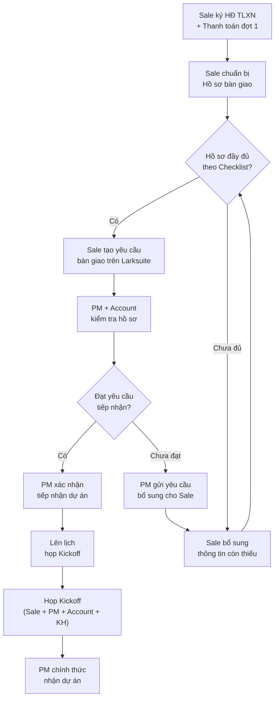

# Quy Trình Bàn Giao Dự Án Từ Sale Sang QLDA

> **Mã SOP:** SOP-01-001
> **Phiên bản:** 1.0
> **Ngày hiệu lực:** 2026-03-27
> **Người phê duyệt:** Ban Giám Đốc
> **Áp dụng:** Tất cả gói dịch vụ (QTDA / TLXN / TLXN TX)

---

## 1. Mục Đích

Quy trình này đảm bảo việc bàn giao thông tin khách hàng từ bộ phận Sale sang bộ phận QLDA diễn ra **đầy đủ, chính xác và có hệ thống**, tránh tình trạng:

- PM phải hỏi lại nhiều lần vì thiếu thông tin
- KH kỳ vọng sai do Sale hứa khác, QLDA làm khác
- Dự án bị delay ngay từ đầu vì thiếu dữ liệu

---

## 2. Phạm Vi Áp Dụng

- **Ai thực hiện:** Sale (bàn giao) + PM & Account (tiếp nhận)
- **Khi nào:** Ngay sau khi **HĐ TLXN được ký kết** và **thanh toán đợt 1 hoàn tất**
- **Ở đâu:** Trên Larksuite (lưu trữ) + Zalo/Họp trực tiếp (trao đổi)

---

## 3. Sơ Đồ Quy Trình

---

## 4. Checklist Bàn Giao Bắt Buộc

### 4.1 Thông tin Khách hàng

| # | Hạng mục                        | Bắt buộc | Ghi chú                        |
| - | --------------------------------- | :--------: | ------------------------------- |
| 1 | Họ tên đầy đủ KH            |     ✅     | Đúng theo CCCD                |
| 2 | Số CCCD                          |     ✅     | Dùng cho HĐ                   |
| 3 | Số điện thoại chính          |     ✅     | Số liên lạc hàng ngày      |
| 4 | Số điện thoại phụ (nếu có) |     ⬜     | Vợ/chồng, người đại diện |
| 5 | Email                             |     ✅     | Dùng cho kênh chính thức    |
| 6 | Địa chỉ thường trú          |     ✅     |                                 |
| 7 | Nghề nghiệp                     |     ⬜     | Giúp hiểu profile KH          |

### 4.2 Thông tin Công trình

| #  | Hạng mục                              | Bắt buộc | Ghi chú                                                                  |
| -- | --------------------------------------- | :--------: | ------------------------------------------------------------------------- |
| 8  | Địa chỉ công trình                 |     ✅     | Chính xác số nhà, đường, quận                                     |
| 9  | Loại công trình                      |     ✅     | Xây mới / Sửa chữa / Cải tạo                                        |
| 10 | Quy mô dự kiến                       |     ✅     | Số tầng, diện tích, có hầm không                                   |
| 11 | Ngân sách dự kiến của KH           |     ✅     | Tổng mức đầu tư KH mong muốn                                        |
| 12 | Timeline mong muốn                     |     ✅     | KH muốn hoàn thành khi nào                                            |
| 13 | Form Yêu Cầu Thiết Kế (Requirement) |     ✅     | KH đã hoàn thiện [trên web](https://dinhhoainam.com/yeu-cau-thiet-ke/) |
| 14 | Đã có bản vẽ thiết kế chưa      |     ✅     | Nếu có → gửi kèm                                                     |
| 15 | Đã có giấy phép XD chưa           |     ⬜     |                                                                           |
| 16 | Đã có nhà thầu chưa               |     ✅     | Nếu có → thông tin NT                                                 |

### 4.3 Thông tin Hợp đồng

| #  | Hạng mục                             | Bắt buộc | Ghi chú              |
| -- | -------------------------------------- | :--------: | --------------------- |
| 16 | Gói dịch vụ đã chọn              |     ✅     | QTDA / TLXN / TLXN TX |
| 17 | Bản HĐ TLXN đã ký (scan/PDF)      |     ✅     | Upload lên Larksuite |
| 18 | Phụ lục QC/CC (nếu có)             |     ✅     |                       |
| 19 | Phụ lục Ticket/Scorecard             |     ✅     |                       |
| 20 | Giá trị HĐ & tiến độ thanh toán |     ✅     |                       |
| 21 | Xác nhận thanh toán đợt 1         |     ✅     | Từ Kế toán         |

### 4.4 Thông tin bổ sung

| #  | Hạng mục                            | Bắt buộc | Ghi chú                            |
| -- | ------------------------------------- | :--------: | ----------------------------------- |
| 22 | Mong muốn đặc biệt của KH        |     ⬜     | Phong cách, sở thích, kiêng kỵ |
| 23 | Lưu ý về tính cách/giao tiếp KH |     ⬜     | Giúp Account phục vụ tốt hơn   |
| 24 | KH biết NCM qua kênh nào           |     ⬜     | Giới thiệu / MXH / Sự kiện      |
| 25 | Ghi chú khác từ Sale               |     ⬜     | Bất kỳ thông tin hữu ích       |

---

## 5. Quy Trình Chi Tiết

### Bước 1: Sale chuẩn bị hồ sơ bàn giao

- **Ai:** Sale phụ trách KH
- **Thời hạn:** Trong vòng **2 ngày làm việc** sau khi ký HĐ
- **Hành động:**
  1. Điền đầy đủ Checklist bàn giao (mục 4 ở trên)
  2. Upload tất cả file lên folder Larksuite của dự án
  3. Kiểm tra lại tất cả mục ✅ đã đầy đủ

### Bước 2: Sale gửi yêu cầu bàn giao

- **Ai:** Sale
- **Hành động:**
  1. Tạo yêu cầu bàn giao trên Larksuite (form/chat)
  2. Tag PM (hoặc Head of QLDA nếu chưa assign PM) + Account
  3. Gửi link folder hồ sơ
  4. Note: *"Hồ sơ KH [Tên KH] đã sẵn sàng bàn giao, vui lòng kiểm tra và xác nhận"*

### Bước 3: PM + Account kiểm tra hồ sơ

- **Ai:** PM + Account
- **Thời hạn:** **1 ngày làm việc** sau khi nhận yêu cầu
- **Hành động:**
  1. Kiểm tra từng mục trong Checklist
  2. Nếu đầy đủ → Xác nhận tiếp nhận (Bước 4)
  3. Nếu thiếu → Gửi danh sách cần bổ sung cho Sale (Bước 3b)

### Bước 3b: Xử lý thông tin thiếu

- **Ai:** PM → Sale
- **Thời hạn:** Sale bổ sung trong **1 ngày làm việc**
- **Hành động:**
  1. PM liệt kê cụ thể các mục còn thiếu
  2. Sale liên hệ KH hoặc bổ sung ngay
  3. Quay lại Bước 3

> ⚠️ **Xem thêm:** [xu-ly-thong-tin-thieu.md](./xu-ly-thong-tin-thieu.md)

### Bước 4: PM xác nhận tiếp nhận

- **Ai:** PM
- **Hành động:**
  1. Phản hồi trên Larksuite: *"Đã kiểm tra và xác nhận tiếp nhận dự án [Tên KH]"*
  2. Ghi nhận ngày tiếp nhận chính thức
  3. Lên lịch họp Kickoff trong vòng **3 ngày làm việc**

### Bước 5: Họp Kickoff

- **👉 Xem chi tiết:** [hop-kickoff-du-an.md](./hop-kickoff-du-an.md)

---

## 6. SLA Bàn Giao

| Mốc                                | Thời hạn                      | Trách nhiệm |
| ----------------------------------- | ------------------------------- | ------------- |
| Ký HĐ → Chuẩn bị hồ sơ       | ≤ 2 ngày làm việc           | Sale          |
| Gửi yêu cầu → PM kiểm tra      | ≤ 1 ngày làm việc           | PM + Account  |
| Yêu cầu bổ sung → Sale bổ sung | ≤ 1 ngày làm việc           | Sale          |
| Xác nhận tiếp nhận → Kickoff   | ≤ 3 ngày làm việc           | PM            |
| **Tổng: Ký HĐ → Kickoff** | **≤ 7 ngày làm việc** | Tất cả      |

---

## 7. Lưu Ý Quan Trọng

> ⚠️ **QLDA không tiếp nhận dự án nếu hồ sơ bàn giao chưa đầy đủ các mục bắt buộc (✅).**
> Điều này nhằm bảo vệ chất lượng dịch vụ và tránh rủi ro cho cả team.

> ⚠️ **Sale không được hứa với KH các nội dung ngoài phạm vi HĐ** mà chưa có sự đồng ý của PM/BGĐ. Nếu có cam kết đặc biệt, phải ghi rõ trong hồ sơ bàn giao.

---

## 8. Tài Liệu Liên Quan

| Tài liệu                     | Link                                                                          |
| ------------------------------ | ----------------------------------------------------------------------------- |
| Họp Kickoff dự án           | [hop-kickoff-du-an.md](./hop-kickoff-du-an.md)                                   |
| Tiêu chí tiếp nhận dự án | [tieu-chi-tiep-nhan-du-an.md](./tieu-chi-tiep-nhan-du-an.md)                     |
| Xử lý thông tin thiếu      | [xu-ly-thong-tin-thieu.md](./xu-ly-thong-tin-thieu.md)                           |
| Flow tổng thể dự án        | [../00-TONG-QUAN/flow-tong-the-du-an.md](../00-TONG-QUAN/flow-tong-the-du-an.md) |
