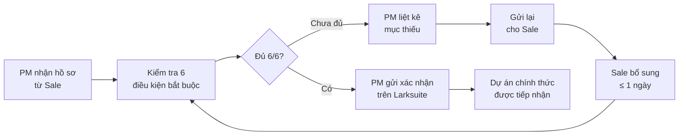

# Tiêu Chí Tiếp Nhận Dự Án

> **Mã SOP:** SOP-01-003
> **Phiên bản:** 1.0
> **Ngày hiệu lực:** 2026-03-27
> **Áp dụng:** Tất cả gói dịch vụ

---

## 1. Mục Đích

Xác định **điều kiện tối thiểu** để bộ phận QLDA chính thức tiếp nhận một dự án từ Sale. Điều này nhằm:

- Đảm bảo team QLDA có đủ thông tin để bắt đầu
- Tránh nhận dự án vội rồi phải quay lại hỏi Sale/KH
- Bảo vệ chất lượng dịch vụ ngay từ đầu

---

## 2. Điều Kiện Bắt Buộc (PHẢI ĐÁP ỨNG 100%)

| # | Điều kiện                                                  |    Kiểm tra bởi    | Bằng chứng          |
| - | ------------------------------------------------------------- | :------------------: | --------------------- |
| 1 | HĐ TLXN đã ký đầy đủ                                  |          PM          | File HĐ scan/PDF     |
| 2 | Phụ lục (QC/CC, Ticket/Scorecard) đã ký                  |          PM          | File phụ lục        |
| 3 | Thanh toán đợt 1 đã hoàn tất                           | Kế toán xác nhận | Email/Lark xác nhận |
| 4 | Thông tin KH đầy đủ (các mục ✅ trong Checklist)       |     PM + Account     | Checklist Larksuite   |
| 5 | Thông tin công trình cơ bản (địa chỉ, quy mô, loại) |          PM          | Checklist Larksuite   |
| 6 | Gói dịch vụ được ghi rõ                                |          PM          | Trong HĐ             |

> ⚠️ **Nếu bất kỳ điều kiện nào chưa đạt → QLDA KHÔNG tiếp nhận dự án.**

---

## 3. Điều Kiện Nên Có (Ưu tiên nhưng không bắt buộc)

| #  | Điều kiện                             | Lý do                                       |
| -- | ---------------------------------------- | -------------------------------------------- |
| 7  | Bản vẽ thiết kế (nếu KH đã có)   | Giúp PM đánh giá nhanh phạm vi          |
| 8  | Thông tin nhà thầu (nếu KH đã có) | Tiết kiệm thời gian Phase 3               |
| 9  | Giấy phép xây dựng (nếu có)        | Xác nhận DA hợp pháp                     |
| 10 | Mong muốn đặc biệt của KH           | Giúp team phục vụ tốt hơn               |
| 11 | Lưu ý về giao tiếp/tính cách KH    | Giúp Account điều chỉnh cách tiếp cận |

---

## 4. Quy Trình Xác Nhận Tiếp Nhận



---

## 5. Template Xác Nhận Tiếp Nhận

```
✅ XÁC NHẬN TIẾP NHẬN DỰ ÁN

Dự án: [Tên KH] - [Địa chỉ CT]
Gói dịch vụ: [QTDA / TLXN / TLXN TX]
Ngày tiếp nhận: [DD/MM/YYYY]

Checklist:
[✅] HĐ TLXN đã ký
[✅] Phụ lục đã ký
[✅] Thanh toán đợt 1 đã nhận
[✅] Thông tin KH đầy đủ
[✅] Thông tin công trình đầy đủ
[✅] Gói dịch vụ rõ ràng

PM tiếp nhận: [Tên PM]
Lịch Kickoff dự kiến: [DD/MM/YYYY]
```

---

## 6. Trường Hợp Đặc Biệt

| Tình huống                                      | Cách xử lý                                                                            |
| ------------------------------------------------- | ---------------------------------------------------------------------------------------- |
| KH muốn bắt đầu gấp (thiếu HĐ/thanh toán) | **Không tiếp nhận.** Sale phải hoàn tất HĐ + thanh toán trước            |
| Sale bàn giao thiếu nhưng hứa bổ sung sau    | PM ghi nhận, cho **deadline 2 ngày**. Quá hạn → escalation lên Head of Sale |
| KH thay đổi gói dịch vụ sau ký HĐ          | Cần ký lại HĐ/Phụ lục → Sale xử lý trước khi bàn giao                        |
| PM đang quá tải, không thể nhận thêm DA    | PM báo BGĐ → BGĐ điều phối PM khác hoặc điều chỉnh lịch                     |
