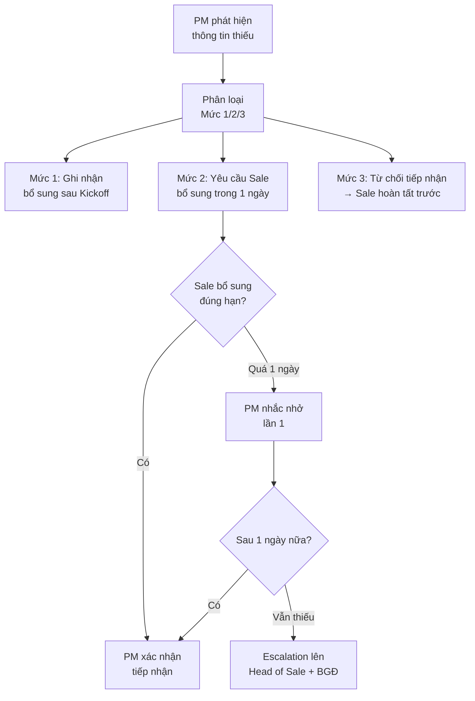

# Xử Lý Thông Tin Thiếu Khi Bàn Giao

> **Mã SOP:** SOP-01-004  
> **Phiên bản:** 1.0  
> **Ngày hiệu lực:** 2026-03-27  
> **Áp dụng:** Tất cả gói dịch vụ

---

## 1. Mục Đích

Quy trình xử lý khi Sale bàn giao hồ sơ KH nhưng **chưa đầy đủ thông tin bắt buộc**, đảm bảo:
- Không delay dự án không cần thiết
- Có trách nhiệm rõ ràng ai phải bổ sung, khi nào
- Có cơ chế escalation nếu tình trạng kéo dài

---

## 2. Phân Loại Thông Tin Thiếu

| Mức | Loại | Ví dụ | Impact |
|-----|------|-------|--------|
| **Mức 1** | Thiếu nhỏ, không ảnh hưởng Kickoff | Email KH, nghề nghiệp, mong muốn đặc biệt | Thấp — có thể bổ sung sau Kickoff |
| **Mức 2** | Thiếu vừa, ảnh hưởng kế hoạch | Ngân sách dự kiến, timeline, đã có TK/NT chưa | Trung bình — cần có trước Kickoff |
| **Mức 3** | Thiếu nghiêm trọng, chặn tiếp nhận | HĐ chưa ký, chưa thanh toán, thiếu thông tin CT | Cao — KHÔNG tiếp nhận cho đến khi đủ |

---

## 3. Quy Trình Xử Lý



---

## 4. Template Yêu Cầu Bổ Sung

```
⚠️ YÊU CẦU BỔ SUNG THÔNG TIN

Dự án: [Tên KH]
PM: [Tên PM]
Ngày kiểm tra: [DD/MM/YYYY]

Các mục cần Sale bổ sung:

| # | Mục thiếu | Mức | Deadline |
|---|----------|-----|----------|
| 1 | [Mô tả] | [1/2/3] | [DD/MM] |
| 2 | [Mô tả] | [1/2/3] | [DD/MM] |

Vui lòng bổ sung trước [deadline]. 
Nếu có khó khăn, liên hệ PM để thảo luận.

@[Sale phụ trách]
```

---

## 5. SLA Xử Lý Thiếu Thông Tin

| Mốc | Thời hạn | Hành động |
|-----|---------|----------|
| PM phát hiện thiếu | 0 | Gửi yêu cầu bổ sung cho Sale |
| Sale bổ sung lần 1 | ≤ 1 ngày | Sale liên hệ KH/tự bổ sung |
| Nhắc nhở lần 1 | Ngày 2 | PM nhắc Sale trên Larksuite |
| Nhắc nhở lần 2 + Escalation | Ngày 3 | PM escalation lên Head of Sale |
| Họp giải quyết (nếu cần) | Ngày 4-5 | Head of Sale + PM + BGĐ |

---

## 6. Trách Nhiệm

| Vai trò | Trách nhiệm |
|---------|-------------|
| **PM** | Kiểm tra, phân loại, yêu cầu bổ sung, theo dõi, escalation |
| **Account** | Hỗ trợ PM kiểm tra phần thông tin KH |
| **Sale** | Bổ sung đúng hạn, liên hệ KH lấy thông tin |
| **Head of Sale** | Nhận escalation, đảm bảo Sale thực hiện |
| **BGĐ** | Quyết định trong trường hợp tranh chấp |

---

## 7. Thống Kê & Cải Tiến

> Hàng tháng, PM tổng hợp:
> - Số lượng DA bàn giao thiếu thông tin
> - Loại thông tin hay bị thiếu nhất
> - Thời gian trung bình để bổ sung
> 
> → Gửi cho Head of Sale và BGĐ để cải thiện quy trình Sale.
