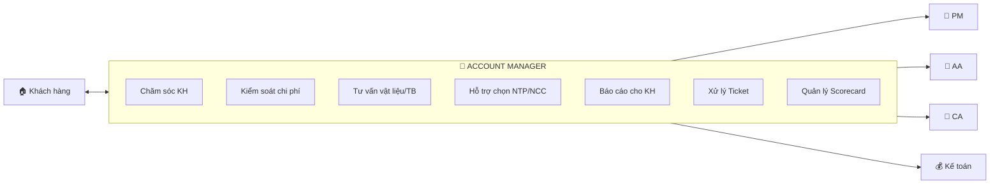

# 02 — SOP Account Manager

> Bộ SOP định nghĩa vai trò, quy trình và tiêu chuẩn vận hành cho vị trí **Account Manager** trong bộ phận QLDA.

---

## Vai trò Account trong Dự án

Account là **đầu mối quan hệ khách hàng** xuyên suốt vòng đời dự án, chịu trách nhiệm cho **trải nghiệm & sự hài lòng của KH**.

---

## Danh Sách SOP

| Mã SOP     | Tên tài liệu                              | File                                                                  |
| ---------- | ------------------------------------------ | --------------------------------------------------------------------- |
| SOP-02-001 | Vai trò, Chức năng & KPI                   | [vai-tro-trach-nhiem.md](./vai-tro-trach-nhiem.md)                    |
| SOP-02-002 | Quy trình Chăm sóc KH Xuyên suốt         | [cham-soc-khach-hang.md](./cham-soc-khach-hang.md)                    |
| SOP-02-003 | Kiểm soát Ngân sách & Chi phí cho KH      | [quan-ly-ngan-sach-chi-phi.md](./quan-ly-ngan-sach-chi-phi.md)        |
| SOP-02-004 | Tư vấn Vật liệu & Thiết bị               | [tu-van-vat-lieu-thiet-bi.md](./tu-van-vat-lieu-thiet-bi.md)          |
| SOP-02-005 | Hỗ trợ Lựa chọn Nhà thầu phụ & NCC       | [ho-tro-lua-chon-thau-phu-ncc.md](./ho-tro-lua-chon-thau-phu-ncc.md) |
| SOP-02-006 | Báo cáo Định kỳ cho KH                    | [bao-cao-dinh-ky-cho-kh.md](./bao-cao-dinh-ky-cho-kh.md)             |
| SOP-02-007 | Xử lý Ticket & Khiếu nại từ KH           | [xu-ly-ticket-khieu-nai.md](./xu-ly-ticket-khieu-nai.md)             |
| SOP-02-008 | Quản lý Scorecard & Đánh giá Dịch vụ      | [scorecard-danh-gia-dich-vu.md](./scorecard-danh-gia-dich-vu.md)     |
| SOP-02-009 | Phối hợp Bàn giao & Theo dõi Bảo hành    | [ban-giao-bao-hanh.md](./ban-giao-bao-hanh.md)                       |

---

## Tài Liệu Liên Quan

| Tài liệu                 | Link                                                                            |
| ------------------------- | ------------------------------------------------------------------------------- |
| Flow tổng thể dự án      | [../00-TONG-QUAN/flow-tong-the-du-an.md](../00-TONG-QUAN/flow-tong-the-du-an.md) |
| Ma trận RACI              | [../00-TONG-QUAN/ma-tran-RACI.md](../00-TONG-QUAN/ma-tran-RACI.md)               |
| Phối hợp Sale-QLDA       | [../01-PHOI-HOP-SALE-QLDA/](../01-PHOI-HOP-SALE-QLDA/)                           |
| Phối hợp Đối tác         | [../06-PHOI-HOP-DOI-TAC/](../06-PHOI-HOP-DOI-TAC/)                               |
