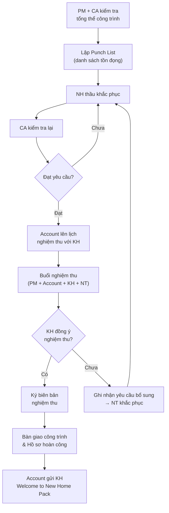
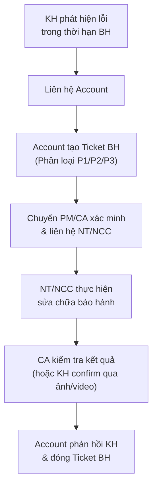

# Phối Hợp Bàn Giao & Theo Dõi Bảo Hành

> **Mã SOP:** SOP-02-009
> **Phiên bản:** 1.0
> **Ngày hiệu lực:** 2026-03-27
> **Áp dụng:** Tất cả gói dịch vụ (QTDA / TLXN / TLXN TX)

---

## 1. Mục Đích

Chuẩn hóa vai trò Account trong **Phase 5 (Nghiệm thu & Bàn giao)** và **Phase 6 (Bảo hành & Đóng dự án)**, đảm bảo KH nhận được công trình hoàn chỉnh, hồ sơ đầy đủ, và dịch vụ bảo hành đúng cam kết.

---

## 2. PHASE 5: Nghiệm Thu & Bàn Giao

### 2.1 Vai Trò Account Trong Nghiệm Thu

| Hoạt động                         | Vai trò Account | Phối hợp      |
| ----------------------------------- | --------------- | -------------- |
| Kiểm tra tổng thể công trình       | Thông báo KH lịch nghiệm thu | PM + CA + AA |
| Xử lý punch list                    | Theo dõi & phản hồi KH tiến độ sửa chữa | PM + CA |
| Nghiệm thu với KH                   | **R** — Tổ chức, điều phối buổi nghiệm thu | PM + KH + NT |
| Bàn giao công trình                 | **R** — Phối hợp PM bàn giao cho KH | PM + NT → KH |
| Bàn giao hồ sơ hoàn công            | Kiểm tra tính đầy đủ trước khi giao KH | AA |

### 2.2 Quy Trình Bàn Giao

### 2.3 Checklist Bàn Giao (Account Kiểm Tra)

| # | Hạng mục                                      | Kiểm tra | Ghi chú |
| - | ------------------------------------------------ | :------: | ------- |
| 1 | Biên bản nghiệm thu đã ký                        | ☐        |         |
| 2 | Hồ sơ bản vẽ hoàn công (as-built)                | ☐        |         |
| 3 | Hồ sơ bảo hành từ nhà thầu                       | ☐        |         |
| 4 | Hồ sơ bảo hành thiết bị (từng NCC)               | ☐        |         |
| 5 | Danh sách liên hệ nhà thầu/NCC                   | ☐        |         |
| 6 | Hướng dẫn sử dụng thiết bị (thang máy, smart home...) | ☐   |         |
| 7 | Chìa khóa, thẻ từ, remote                         | ☐        |         |
| 8 | Bảng tổng hợp chi phí cuối cùng                   | ☐        |         |
| 9 | Giấy phép hoàn công (nếu có)                      | ☐        |         |
| 10 | Ảnh/video công trình hoàn thiện                   | ☐        |         |

### 2.4 "Welcome to New Home" Pack

Sau bàn giao, Account gửi KH một gói chúc mừng:

| Nội dung                              | Hình thức         |
| --------------------------------------- | ------------------ |
| Tin nhắn chúc mừng từ team NCM          | Zalo/Email         |
| Tổng hợp hình ảnh trước — sau công trình | PDF/Album ảnh     |
| Hướng dẫn liên hệ bảo hành              | 1 trang A4/PDF     |
| Thông tin Account vẫn đồng hành trong BH | Card contact       |

---

## 3. PHASE 6: Bảo Hành & Đóng Dự Án

### 3.1 Vai Trò Account Trong Bảo Hành

Account là **R** (Responsible) cho **theo dõi bảo hành** — là người KH liên hệ khi cần bảo hành.

### 3.2 Thời Hạn Bảo Hành

| Hạng mục                   | Thời hạn BH (thông thường) | Ghi chú                      |
| ---------------------------- | -------------------------- | ----------------------------- |
| Kết cấu (móng, cột, dầm)    | 10 năm                     | Theo Luật Xây dựng            |
| Chống thấm                   | 5 năm                      | Theo HĐ thi công              |
| Hoàn thiện (sơn, ốp lát)    | 1-2 năm                    | Theo HĐ thi công              |
| Cơ điện (điện, nước)        | 1-2 năm                    | Theo HĐ + Bảo hành TB        |
| Thiết bị (điều hòa, thang máy) | Theo NCC                | Theo phiếu BH NCC             |
| Nội thất (tủ, bàn)          | 1-2 năm                    | Theo NCC/NTP                   |

> ⚠️ Account phải nắm rõ thời hạn BH từng hạng mục để tư vấn chính xác cho KH.

### 3.3 SLA Xử Lý Bảo Hành

| Mức       | Mô tả                                | SLA Phản hồi | SLA Xử lý      |
| --------- | -------------------------------------- | ------------ | --------------- |
| **P1 BH** | Ảnh hưởng sử dụng (rò nước, mất điện) | ≤ 4h         | ≤ 48h           |
| **P2 BH** | Lỗi thẩm mỹ (nứt sơn, ốp bong)       | ≤ 24h        | ≤ 7 ngày        |
| **P3 BH** | Kiến nghị, điều chỉnh nhỏ              | ≤ 48h        | ≤ 14 ngày       |

### 3.4 Tần Suất Liên Lạc Bảo Hành

| Thời điểm                  | Hành động Account                               |
| ---------------------------- | ------------------------------------------------- |
| Sau bàn giao 1 tuần          | Gọi KH hỏi thăm: "Ở vào nhà mới có ổn không?"   |
| Sau bàn giao 1 tháng         | Check-in: Có phát sinh lỗi gì không?              |
| Sau bàn giao 3 tháng         | Check-in + Thu thập Scorecard cuối                 |
| Sau bàn giao 6 tháng         | Check-in + Nhắc KH về thời hạn BH                 |
| Sau bàn giao 1 năm           | Check-in + Cảnh báo BH sắp hết hạn                |

---

## 4. Thu Thập Feedback & Đánh Giá

### 4.1 Scorecard Tổng Kết (Sau bàn giao 1 tháng)

- Account gửi form Scorecard tổng kết cho KH
- Nội dung: Đánh giá TOÀN BỘ quá trình dự án (không chỉ tháng cuối)
- Chi tiết: Xem [scorecard-danh-gia-dich-vu.md](./scorecard-danh-gia-dich-vu.md) - Mục 7

### 4.2 NPS (Net Promoter Score)

- Hỏi KH: *"Trên thang 0-10, anh/chị có sẵn lòng giới thiệu NCM cho người quen không?"*
- NPS = % (9-10) − % (0-6)
- Mục tiêu: NPS ≥ 50%

### 4.3 Testimonial & Case Study

- Nếu KH hài lòng → Xin phép KH:
  - Chụp ảnh công trình hoàn thiện
  - Quay video testimonial ngắn
  - Viết case study cho Marketing
- **Tuyệt đối tôn trọng quyền riêng tư KH** — chỉ sử dụng khi có đồng ý bằng văn bản

---

## 5. Đóng Dự Án

### 5.1 Checklist Đóng Dự Án (Account)

| # | Hạng mục                                     | Kiểm tra | Ghi chú |
| - | ----------------------------------------------- | :------: | ------- |
| 1 | Hồ sơ hoàn công đã giao KH đầy đủ               | ☐        |         |
| 2 | Tất cả Ticket đã đóng                            | ☐        |         |
| 3 | Scorecard tổng kết đã thu thập                    | ☐        |         |
| 4 | Feedback cuối dự án đã ghi nhận                   | ☐        |         |
| 5 | Đánh giá NTP/NCC đã cập nhật database              | ☐        |         |
| 6 | Chi phí cuối cùng đã đối soát với Kế toán         | ☐        |         |
| 7 | Quỹ Cam kết CL đã quyết toán                     | ☐        |         |
| 8 | Lesson Learned đã đóng góp                        | ☐        |         |
| 9 | Thông báo KH về kênh liên hệ BH dài hạn           | ☐        |         |
| 10 | Tài liệu dự án đã lưu trữ trên Larksuite        | ☐        |         |

### 5.2 Lesson Learned (Đóng góp từ Account)

Account đóng góp cho buổi Lesson Learned (do PM tổ chức):

| Nội dung đóng góp                        | Mô tả                                 |
| ------------------------------------------ | --------------------------------------- |
| Phản hồi tổng quan từ KH                  | KH hài lòng/không hài lòng ở điểm nào  |
| Hiệu quả chăm sóc KH                     | Quy trình nào hoạt động tốt/chưa tốt   |
| Chất lượng NTP/NCC                         | Đối tác nào nên dùng lại/tránh          |
| Đề xuất cải thiện quy trình               | Kiến nghị cho dự án sau                  |

---

## 6. Tài Liệu Liên Quan

| Tài liệu                  | Link                                                         |
| --------------------------- | ------------------------------------------------------------ |
| Scorecard                   | [scorecard-danh-gia-dich-vu.md](./scorecard-danh-gia-dich-vu.md) |
| Xử lý Ticket               | [xu-ly-ticket-khieu-nai.md](./xu-ly-ticket-khieu-nai.md)     |
| Chăm sóc KH                | [cham-soc-khach-hang.md](./cham-soc-khach-hang.md)            |
| Flow tổng thể dự án        | [../00-TONG-QUAN/flow-tong-the-du-an.md](../00-TONG-QUAN/flow-tong-the-du-an.md) |
