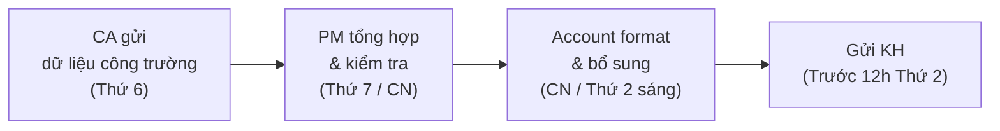

# Báo Cáo Định Kỳ Cho KH

> **Mã SOP:** SOP-02-006
> **Phiên bản:** 1.0
> **Ngày hiệu lực:** 2026-03-27
> **Áp dụng:** Tất cả gói dịch vụ (QTDA / TLXN / TLXN TX)

---

## 1. Mục Đích

Đảm bảo KH được cập nhật **đầy đủ, đúng hạn và chuyên nghiệp** về tình hình dự án thông qua hệ thống báo cáo chuẩn hóa. Account là **R** (Responsible) cho việc format, tổng hợp và gửi báo cáo đến KH.

---

## 2. Các Loại Báo Cáo

| Loại               | Tần suất   | Nội dung chính                                      | Kênh gửi                |
| ------------------- | ---------- | ---------------------------------------------------- | ------------------------ |
| **Báo cáo tuần**   | Hàng tuần  | Tiến độ thi công, vấn đề phát sinh, kế hoạch tuần tới | Zalo + Larksuite        |
| **Báo cáo tháng**  | Hàng tháng | Tiến độ + Chi phí + Scorecard + Tổng hợp Ticket     | Email/Larksuite (chính thức) |
| **Báo cáo mốc**    | Theo sự kiện | Khi đạt milestone quan trọng                        | Zalo + Larksuite         |
| **Báo cáo khẩn**   | Khi cần    | Sự cố, phát sinh lớn, rủi ro                        | Zalo/Điện thoại + Larksuite |

---

## 3. Quy Trình Tổng Hợp Báo Cáo Tuần



### SLA Gửi Báo Cáo

| Loại báo cáo    | Deadline                           |
| ---------------- | ---------------------------------- |
| Báo cáo tuần    | **Trước 12h thứ 2** hàng tuần     |
| Báo cáo tháng   | **Trước ngày 5** tháng sau         |
| Báo cáo mốc     | **Trong ngày** đạt milestone       |
| Báo cáo khẩn    | **Trong 2h** sau sự kiện           |

---

## 4. Template Báo Cáo Tuần

```markdown
# BÁO CÁO TUẦN — DỰ ÁN [TÊN KH]

📅 Tuần: [DD/MM] - [DD/MM/YYYY]
📍 Công trình: [Địa chỉ]
👤 Account: [Tên] | PM: [Tên]

---

## 1. Tóm Tắt Tiến Độ

| Hạng mục           | Kế hoạch      | Thực tế        | Trạng thái |
| ------------------- | -------------- | -------------- | ---------- |
| [Hạng mục 1]       | [Mô tả]       | [Mô tả]       | 🟢/🟡/🔴 |
| [Hạng mục 2]       | [Mô tả]       | [Mô tả]       | 🟢/🟡/🔴 |

**Tiến độ tổng thể:** xx% (Kế hoạch: xx%)

## 2. Hình Ảnh Tiến Độ

[Đính kèm 3-5 ảnh công trường có chú thích]

## 3. Vấn Đề Phát Sinh

| # | Vấn đề              | Ảnh hưởng    | Giải pháp           | Trạng thái   |
| - | --------------------- | ------------ | -------------------- | ------------ |
| 1 | [Mô tả]              | [Tiến độ/CP] | [Đề xuất]           | Đang xử lý  |

## 4. Kế Hoạch Tuần Tới

| Hạng mục             | Kế hoạch thực hiện              |
| ---------------------- | -------------------------------- |
| [Hạng mục]            | [Mô tả công việc]               |

## 5. Cần KH Quyết Định

- [ ] [Nội dung cần KH phản hồi/duyệt]

## 6. Ticket Trong Tuần

| # | Ngày tạo | Nội dung    | Mức ưu tiên | Trạng thái |
| - | -------- | ------------ | ----------- | ---------- |
| 1 | [Date]   | [...]        | P1/P2/P3    | [...]      |
```

---

## 5. Template Báo Cáo Tháng

```markdown
# BÁO CÁO THÁNG — DỰ ÁN [TÊN KH]

📅 Tháng: [MM/YYYY]
📍 Công trình: [Địa chỉ]

---

## 1. Tóm Tắt Tổng Quan

| Chỉ số                | Giá trị         |
| ----------------------- | ---------------- |
| Tiến độ tổng thể       | xx%              |
| So với kế hoạch         | Đúng/Chậm x ngày |
| Chi phí đã sử dụng     | xxx / xxx triệu  |
| % Ngân sách đã dùng    | xx%              |
| Số Ticket trong tháng   | x (P1: x, P2: x, P3: x) |
| Scorecard tháng trước   | x.x / 5.0        |

## 2. Tiến Độ Chi Tiết
[Bảng chi tiết theo hạng mục — tương tự BC tuần nhưng tổng hợp cả tháng]

## 3. Báo Cáo Chi Phí
[Trích từ SOP-02-003 — Template báo cáo chi phí]

## 4. Tổng Hợp Ticket
[Thống kê Ticket: tổng số, đã xử lý, đang mở, quá hạn SLA]

## 5. Scorecard & Đánh Giá
[Scorecard tháng trước + Action plan cải thiện nếu cần]

## 6. Kế Hoạch Tháng Tới
[Các mốc quan trọng sắp tới, VL/TB cần KH quyết định]

## 7. Rủi Ro & Kiến Nghị
[Cảnh báo sớm cho KH về rủi ro tiềm ẩn]
```

---

## 6. Hướng Dẫn Viết Báo Cáo

### Nguyên Tắc

| # | Nguyên tắc                                                     |
| - | ---------------------------------------------------------------- |
| 1 | **Rõ ràng, ngắn gọn:** KH là người bận rộn, không đọc văn dài   |
| 2 | **Có hình ảnh:** Mỗi BC tuần phải có ≥ 3 ảnh công trường        |
| 3 | **Dùng biểu tượng trạng thái:** 🟢 Tốt / 🟡 Cần chú ý / 🔴 Có vấn đề |
| 4 | **Highlight quyết định cần KH:** Đặt riêng phần "Cần KH quyết định" |
| 5 | **Không dùng thuật ngữ chuyên môn** mà không giải thích           |
| 6 | **Trung thực:** Không giấu vấn đề, báo cáo đúng thực tế          |

### Khác Biệt Theo Gói

| Hạng mục                  | QTDA / TLXN                   | TLXN TX                          |
| -------------------------- | ----------------------------- | -------------------------------- |
| Nguồn ảnh/video            | CA chụp tại công trường       | KH hoặc NT gửi qua HBSS/Zalo    |
| Phương thức gửi            | Larksuite + Zalo              | Larksuite + Email + Video call   |
| Báo cáo bổ sung video      | Không bắt buộc                | Bắt buộc (video progress)        |

---

## 7. Tài Liệu Liên Quan

| Tài liệu                  | Link                                                                    |
| --------------------------- | ----------------------------------------------------------------------- |
| Kiểm soát ngân sách       | [quan-ly-ngan-sach-chi-phi.md](./quan-ly-ngan-sach-chi-phi.md)          |
| Xử lý Ticket              | [xu-ly-ticket-khieu-nai.md](./xu-ly-ticket-khieu-nai.md)               |
| Scorecard                  | [scorecard-danh-gia-dich-vu.md](./scorecard-danh-gia-dich-vu.md)       |
| Báo cáo review định kỳ PM | [../03-PM/bao-cao-review-dinh-ky.md](../03-PM/bao-cao-review-dinh-ky.md) |
