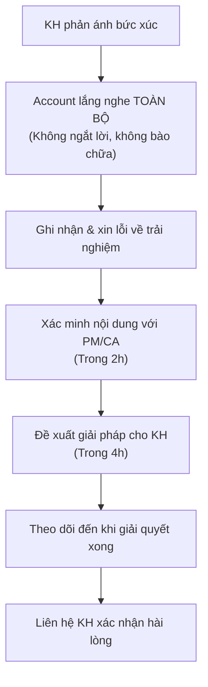

# Quy Trình Chăm Sóc Khách Hàng Xuyên Suốt

> **Mã SOP:** SOP-02-002
> **Phiên bản:** 1.0
> **Ngày hiệu lực:** 2026-03-27
> **Áp dụng:** Tất cả gói dịch vụ (QTDA / TLXN / TLXN TX)

---

## 1. Mục Đích

Đảm bảo Account duy trì mối quan hệ **chuyên nghiệp, chủ động và nhất quán** với KH từ lúc Kickoff đến khi đóng dự án. KH luôn cảm thấy được quan tâm, nắm rõ tình hình dự án, và có kênh liên lạc rõ ràng.

---

## 2. Sơ Đồ Hành Trình Chăm Sóc KH

```mermaid
flowchart LR
    subgraph P1["Phase 1: Kickoff"]
        O1["Onboarding KH"]
        O2["Welcome Pack"]
        O3["Setup kênh liên lạc"]
    end

    subgraph P2["Phase 2-3: TK & Chọn NT"]
        M1["Check-in hàng tuần"]
        M2["Cập nhật tiến độ TK"]
        M3["Hỗ trợ chọn NT/NCC"]
    end

    subgraph P4["Phase 4: Thi Công"]
        C1["Check-in tối thiểu 1 lần/tuần"]
        C2["Xử lý Ticket"]
        C3["Tư vấn VL/TB"]
        C4["Kiểm soát ngân sách"]
    end

    subgraph P56["Phase 5-6: BG & BH"]
        E1["Bàn giao công trình"]
        E2["Thu thập feedback"]
        E3["Theo dõi bảo hành"]
    end

    P1 --> P2 --> P4 --> P56
```

---

## 3. Quy Trình Onboarding KH (Sau Kickoff)

### Bước 1: Welcome Pack (Ngay sau Kickoff)

| Hạng mục                               | Nội dung                                            | Kênh           |
| ---------------------------------------- | ---------------------------------------------------- | --------------- |
| Tin nhắn chào mừng trong nhóm Zalo   | (Nhóm Zalo đã được Sale tạo trước Kickoff) Account gửi lời chào, giới thiệu SĐT và vai trò | Zalo            |
| Gửi tài liệu hướng dẫn             | Cách tạo Ticket, lịch báo cáo, kênh liên lạc | Larksuite/Email |
| Hướng dẫn cài đặt & sử dụng HBSS | Tài khoản KH trên HBSS                            | Zalo + HBSS     |
| Xác nhận lại thông tin liên lạc    | SĐT, email, kênh ưa thích của KH                | Zalo            |

### Bước 2: Thiết lập Kỳ vọng (Trong tuần đầu)

- Xác nhận lại phạm vi dịch vụ theo gói HĐ (QTDA/TLXN/TLXN TX)
- Thống nhất tần suất liên lạc và lịch báo cáo
- Hỏi KH về kênh liên lạc ưa thích (Zalo/Email/Gọi điện)
- Ghi nhận lưu ý đặc biệt về tính cách/giao tiếp KH (từ Sale)

### Bước 3: Giới thiệu Team (Khi AA/CA được bổ nhiệm)

- Thông báo cho KH về AA/CA được phân công
- Giải thích vai trò AA/CA cho KH hiểu
- Tạo kết nối (add vào nhóm Zalo nếu cần)

---

## 4. Tần Suất & Hình Thức Liên Lạc Theo Phase

| Phase                          | Tần suất liên lạc            | Hình thức             | Nội dung chính                                                  |
| ------------------------------ | -------------------------------- | ----------------------- | ----------------------------------------------------------------- |
| **Phase 2: Thiết kế**  | 1-2 lần/tuần                   | Zalo/Điện thoại      | Tiến độ TK, yêu cầu KH duyệt                                |
| **Phase 3: Chọn NT**    | 1-2 lần/tuần                   | Zalo/Họp               | Báo giá NT, hỗ trợ đánh giá                                |
| **Phase 4: Thi công**   | Tối thiểu 1 lần/tuần + sự kiện | Zalo + Điện thoại    | Cập nhật sự kiện thi công quan trọng, vấn đề phát sinh, Ticket |
| **Phase 5: Nghiệm thu** | Hàng ngày                      | Zalo/Gọi điện + Họp | Lịch nghiệm thu, punch list, bàn giao                          |
| **Phase 6: Bảo hành**  | 1 lần/6 tháng                 | Zalo/Điện thoại      | Tình trạng bảo hành, Scorecard, feedback                      |

> 📡 **TLXN TX:** Tăng tần suất gọi video/online vì không gặp trực tiếp. Họp online 1 lần/tuần theo HĐ.

---

## 5. Giao Tiếp Chủ Động (Proactive Communication)

### 5.1 Nguyên Tắc Vàng

> ⚠️ **Account KHÔNG BAO GIỜ đợi KH hỏi mới trả lời.** Luôn cập nhật trước, kể cả khi không có gì đặc biệt.

### 5.2 Milestone Communication

Tại các mốc quan trọng, Account phải **chủ động liên hệ KH** để thông báo:

| Milestone                        | Hành động Account                                   |
| -------------------------------- | ------------------------------------------------------ |
| Ký HĐ Thiết kế               | Thông báo KH, giới thiệu đơn vị TK              |
| KH duyệt thiết kế             | Chúc mừng, thông báo bước tiếp theo             |
| Ký HĐ Thi công                | Thông báo lịch khởi công, giới thiệu nhà thầu |
| Khởi công                      | Gửi ảnh/video khởi công, thông báo timeline      |
| Đổ bê tông sàn (mỗi tầng) | Gửi ảnh/video + cập nhật nhanh tiến độ          |
| Cất nóc                        | Chúc mừng KH, tổng hợp tiến độ Phase cấu trúc |
| Hoàn thiện & Bàn giao         | Lên lịch nghiệm thu + Chúc mừng hoàn thành      |

### 5.3 Giao Tiếp Khi Có Vấn Đề

| Tình huống               | Phản ứng Account                                                         |
| -------------------------- | -------------------------------------------------------------------------- |
| Tiến độ chậm           | Thông báo KH trước, giải thích nguyên nhân, đề xuất giải pháp |
| Phát sinh chi phí        | Báo KH ngay, làm rõ lý do, xin phê duyệt                             |
| Chất lượng không đạt | Thông báo KH, cam kết timeline sửa chữa                               |
| Nhà thầu có vấn đề   | Thông báo sớm, đề xuất phương án thay thế                        |
| Thời tiết ảnh hưởng   | Thông báo KH, điều chỉnh timeline                                     |

---

## 6. Xử Lý Tình Huống Khẩn Cấp

### 6.1 KH Bức Xúc / Khiếu nại nghiêm trọng

### 6.2 KH Muốn Dừng Dự Án

| Bước | Hành động                                                      | Thời hạn     |
| ------ | ----------------------------------------------------------------- | -------------- |
| 1      | Lắng nghe lý do, KHÔNG cam kết gì ngay                       | Ngay lập tức |
| 2      | Báo cáo PM + BGĐ ngay lập tức                                | Trong 1h       |
| 3      | PM + Account + BGĐ họp đánh giá tình hình                  | Trong 24h      |
| 4      | Liên hệ KH đề xuất giải pháp (điều chỉnh, không dừng) | Trong 48h      |
| 5      | Nếu KH vẫn muốn dừng → Chuyển BGĐ xử lý HĐ              | Theo HĐ       |

### 6.3 KH Muốn Đổi Nhân Sự QLDA

| Bước | Hành động                                             |
| ------ | -------------------------------------------------------- |
| 1      | Lắng nghe lý do từ KH, ghi nhận cụ thể             |
| 2      | Báo cáo PM + BGĐ (không tự quyết)                  |
| 3      | BGĐ đánh giá và quyết định                       |
| 4      | Nếu thay → Thực hiện hand-off theo SOP-02-001 mục 6 |
| 5      | Theo dõi KH 2 tuần sau khi thay để đảm bảo ổn    |

---

## 7. Check-in Giữa Tháng (Proactive Satisfaction Check)

Ngoài Scorecard cuối tháng, Account thực hiện **check-in giữa tháng** (informal):

| Nội dung hỏi KH                                  | Mục đích                         |
| -------------------------------------------------- | ----------------------------------- |
| "Anh/chị có hài lòng với tuần vừa qua?"     | Đánh giá sự hài lòng sớm     |
| "Có vấn đề gì anh/chị muốn chia sẻ?"       | Phát hiện vấn đề ẩn           |
| "Anh/chị cần team hỗ trợ thêm gì không?"    | Khám phá nhu cầu ẩn             |
| "Tần suất liên lạc hiện tại đã ổn chưa?" | Điều chỉnh nhịp độ chăm sóc |

> 📌 Ghi nhận feedback vào log trên Larksuite để theo dõi xu hướng hài lòng.

---

## 8. Tài Liệu Liên Quan

| Tài liệu                   | Link                                                                                        |
| ---------------------------- | ------------------------------------------------------------------------------------------- |
| Xử lý Ticket & Khiếu nại | [xu-ly-ticket-khieu-nai.md](./xu-ly-ticket-khieu-nai.md)                                       |
| Scorecard & Đánh giá DV   | [scorecard-danh-gia-dich-vu.md](./scorecard-danh-gia-dich-vu.md)                               |
| Báo cáo định kỳ cho KH  | [bao-cao-dinh-ky-cho-kh.md](./bao-cao-dinh-ky-cho-kh.md)                                       |
| Họp Kickoff dự án         | [../01-PHOI-HOP-SALE-QLDA/hop-kickoff-du-an.md](../01-PHOI-HOP-SALE-QLDA/hop-kickoff-du-an.md) |
