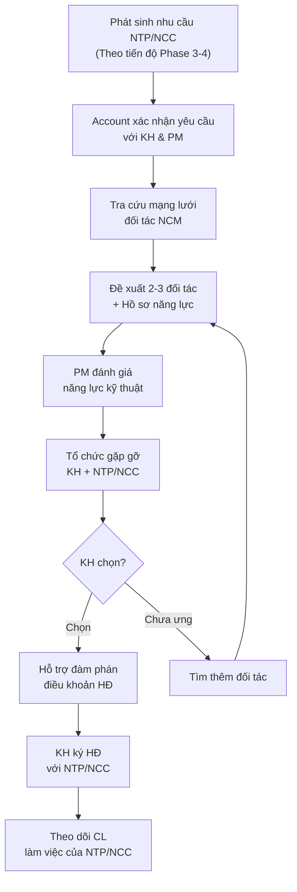

# Hỗ Trợ KH Lựa Chọn Nhà Thầu Phụ & NCC

> **Mã SOP:** SOP-02-005
> **Phiên bản:** 1.0
> **Ngày hiệu lực:** 2026-03-27
> **Áp dụng:** Tất cả gói dịch vụ (QTDA / TLXN / TLXN TX)

---

## 1. Mục Đích

Hỗ trợ KH tiếp cận mạng lưới đối tác uy tín của NCM, đánh giá và lựa chọn **nhà thầu phụ (NTP)** và **nhà cung cấp (NCC)** phù hợp, đảm bảo chất lượng — giá cả — tiến độ tối ưu cho dự án.

---

## 2. Phân Biệt Vai Trò

| Vai trò       | Trách nhiệm                                        |
| ------------- | ---------------------------------------------------- |
| **Account**   | Kết nối KH với mạng lưới đối tác NCM, hỗ trợ đánh giá, hỗ trợ đàm phán |
| **PM**        | Đánh giá năng lực kỹ thuật NTP, quyết định kỹ thuật |
| **CA**        | Góp ý từ thực tế công trường, đánh giá CL thi công của NTP |
| **KH**        | Quyết định cuối cùng lựa chọn NTP/NCC               |

> ⚠️ **Account KHÔNG tự ý ký HĐ hoặc cam kết với NTP/NCC.** Mọi HĐ do KH trực tiếp ký hoặc ủy quyền qua PM.

---

## 3. Sơ Đồ Quy Trình



---

## 4. Các Loại NTP/NCC Thường Gặp

### 4.1 Nhà Thầu Phụ (NTP)

| Lĩnh vực                | Ví dụ                                     | Thời điểm cần |
| ------------------------- | ------------------------------------------ | -------------- |
| Điện dân dụng             | Hệ thống điện âm tường, tủ điện, đèn     | Phase 4        |
| Cấp thoát nước            | Ống nước, thiết bị vệ sinh, bồn nước       | Phase 4        |
| PCCC                      | Hệ thống chữa cháy, báo cháy              | Phase 3-4      |
| Nhôm kính / Cửa           | Cửa nhôm, vách kính, lan can               | Phase 4        |
| Nội thất                  | Tủ bếp, tủ quần áo, bàn ghế               | Phase 4        |
| Sơn chuyên dụng           | Sơn chống thấm, sơn decorative             | Phase 4        |
| Smart home                | Hệ thống nhà thông minh, camera            | Phase 3-4      |
| Thang máy                 | Thang máy gia đình                          | Phase 2-3      |

### 4.2 Nhà Cung Cấp (NCC)

| Lĩnh vực                | Ví dụ                                     |
| ------------------------ | ------------------------------------------ |
| Gạch ốp lát              | Gạch ceramic, porcelain, đá tự nhiên       |
| Thiết bị vệ sinh         | TOTO, Inax, Kohler, American Standard      |
| Sơn                      | Jotun, Dulux, Kova                          |
| Đá nhân tạo / tự nhiên  | Mặt bàn bếp, bậc cầu thang, sân vườn     |
| Thiết bị điện            | Schneider, Panasonic, Legrand              |
| Điều hòa                 | Daikin, Mitsubishi, LG                      |

---

## 5. Tiêu Chí Đánh Giá NTP/NCC

| Tiêu chí                  | Trọng số | Người đánh giá      | Mô tả                              |
| -------------------------- | -------- | -------------------- | ------------------------------------ |
| Năng lực & Kinh nghiệm    | 25%      | PM                   | Portfolio, dự án đã thực hiện       |
| Giá cả cạnh tranh         | 25%      | Account + PM         | So sánh ≥ 3 báo giá                |
| Chất lượng sản phẩm/DV    | 20%      | CA + PM              | Mẫu thực tế, review KH cũ          |
| Tiến độ & Cam kết          | 15%      | PM                   | Lịch sử giao hàng/thi công đúng hạn |
| Bảo hành & Hậu mãi        | 10%      | Account              | Chính sách BH, phản hồi sau bán     |
| Rating từ NCM              | 5%       | PM (từ database)     | Đánh giá từ dự án trước của NCM     |

### Template Đánh Giá

```markdown
# ĐÁNH GIÁ NTP/NCC

**Lĩnh vực:** [VD: Nội thất]
**Dự án:** [Tên KH]

| Tiêu chí             | Đối tác A    | Đối tác B    | Đối tác C    |
| --------------------- | ------------ | ------------ | ------------ |
| Năng lực (25%)        | x/10         | x/10         | x/10         |
| Giá cả (25%)         | x/10         | x/10         | x/10         |
| Chất lượng (20%)     | x/10         | x/10         | x/10         |
| Tiến độ (15%)        | x/10         | x/10         | x/10         |
| Bảo hành (10%)       | x/10         | x/10         | x/10         |
| Rating NCM (5%)      | x/10         | x/10         | x/10         |
| **TỔNG ĐIỂM**        | x/10         | x/10         | x/10         |
| **Khuyến nghị**      | [...]        | [...]        | [...]        |

**Đề xuất:** Chọn [Đối tác X] vì [lý do]
**KH quyết định:** [KH ghi]
```

---

## 6. Quy Trình Đàm Phán HĐ

| Bước | Hành động                                          | Ai             |
| ---- | --------------------------------------------------- | -------------- |
| 1    | KH chọn NTP/NCC → Account thông báo đối tác         | Account        |
| 2    | PM review HĐ mẫu / điều khoản kỹ thuật              | PM             |
| 3    | Account hỗ trợ KH đàm phán giá & điều khoản         | Account + KH   |
| 4    | PM xác nhận phạm vi kỹ thuật trong HĐ hợp lý        | PM             |
| 5    | KH ký HĐ trực tiếp với NTP/NCC                      | KH + NTP/NCC   |
| 6    | Account lưu bản copy HĐ trên Larksuite              | Account        |

> ⚠️ **Account lưu ý:** Đảm bảo HĐ có điều khoản bảo hành, điều khoản thanh toán theo tiến độ, và điều khoản xử lý vi phạm.

---

## 7. Theo Dõi Sau Lựa Chọn

| Công việc                                        | Tần suất    | Ai              |
| ------------------------------------------------- | ----------- | --------------- |
| Theo dõi tiến độ NTP thi công                      | Hàng tuần   | CA + Account    |
| Kiểm tra CL sản phẩm NCC giao                     | Khi giao hàng | CA            |
| Thu thập feedback KH về NTP/NCC                    | Hàng tháng  | Account         |
| Đánh giá NTP/NCC sau hoàn thành (cập nhật rating)  | Sau bàn giao | PM + Account   |

---

## 8. Tài Liệu Liên Quan

| Tài liệu                    | Link                                                                                         |
| ----------------------------- | --------------------------------------------------------------------------------------------- |
| Tư vấn vật liệu & TB        | [tu-van-vat-lieu-thiet-bi.md](./tu-van-vat-lieu-thiet-bi.md)                                  |
| SOP lựa chọn NTP/NCC        | [../06-PHOI-HOP-DOI-TAC/nha-thau/lua-chon-nha-thau-phu-NCC.md](../06-PHOI-HOP-DOI-TAC/nha-thau/lua-chon-nha-thau-phu-NCC.md) |
| Phối hợp đối tác             | [../06-PHOI-HOP-DOI-TAC/](../06-PHOI-HOP-DOI-TAC/)                                          |
