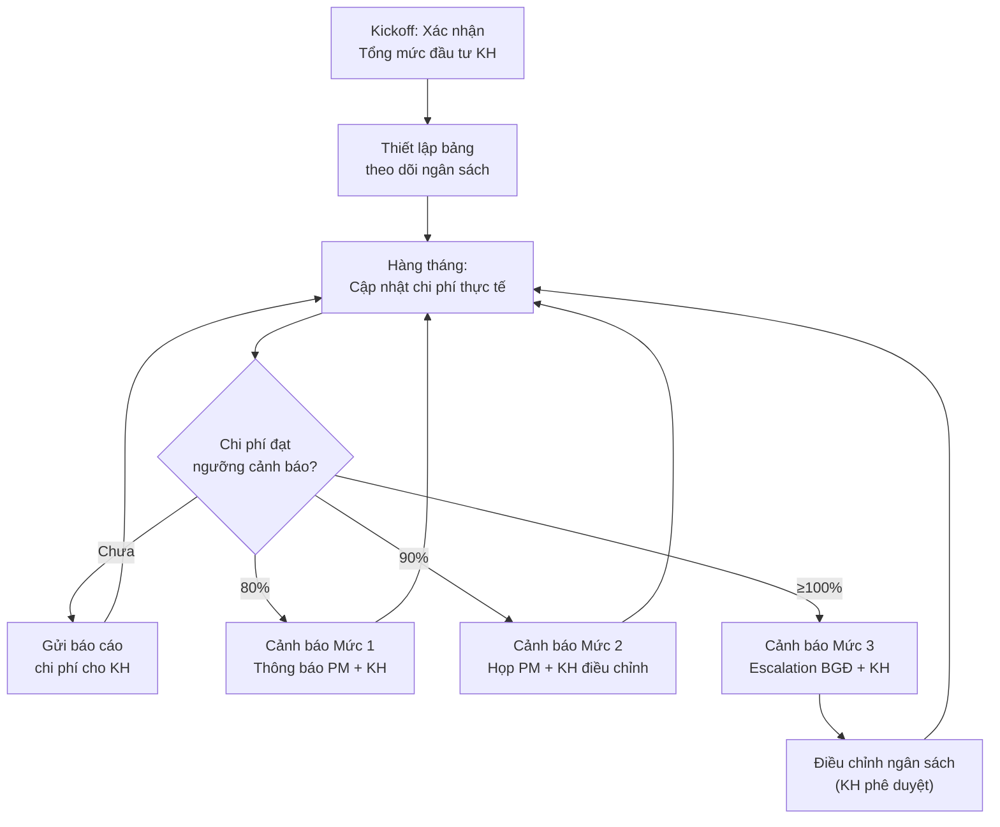
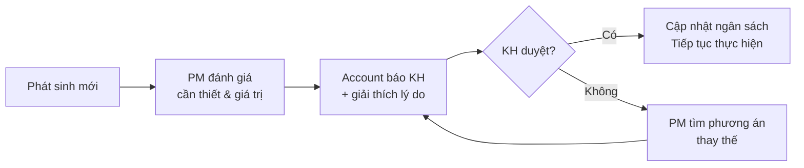

# Kiểm Soát Ngân Sách & Chi Phí Cho KH

> **Mã SOP:** SOP-02-003
> **Phiên bản:** 1.0
> **Ngày hiệu lực:** 2026-03-27
> **Áp dụng:** Tất cả gói dịch vụ (QTDA / TLXN / TLXN TX)

---

## 1. Mục Đích

Account chịu trách nhiệm chính (**R** theo RACI) trong việc **theo dõi, kiểm soát và báo cáo** ngân sách dự án cho KH, đảm bảo KH luôn nắm rõ tình hình tài chính và không bị bất ngờ về chi phí.

---

## 2. Phân Chia Trách Nhiệm Tài Chính

| Vai trò     | Trách nhiệm                                                   | RACI |
| ----------- | -------------------------------------------------------------- | :--: |
| **Account** | Theo dõi chi phí, báo cáo cho KH, cảnh báo vượt ngân sách    | **R** |
| **PM**      | Phê duyệt chi phí, quyết định kỹ thuật ảnh hưởng ngân sách   | **A** |
| **AA**      | Hỗ trợ nhập liệu, chuẩn bị dữ liệu thu chi                  | **S** |
| **Kế toán** | Xác nhận thanh toán, đối soát thu phí                          | **C** |
| **BGĐ**     | Phê duyệt khi vượt ngân sách hoặc phát sinh lớn               | **A** |

---

## 3. Sơ Đồ Quy Trình



---

## 4. Quy Trình Chi Tiết

### 4.1 Thiết Lập Ngân Sách Ban Đầu (Phase 1)

| Bước | Hành động                                               | Ai              |
| ---- | --------------------------------------------------------- | --------------- |
| 1    | Xác nhận Tổng mức đầu tư KH mong muốn từ hồ sơ Sale     | Account + PM    |
| 2    | Phân bổ ngân sách dự kiến theo hạng mục                   | PM              |
| 3    | Tạo bảng theo dõi ngân sách trên Larksuite/Excel          | Account + AA    |
| 4    | Thống nhất với KH về cách theo dõi & tần suất báo cáo     | Account         |

### 4.2 Theo Dõi Chi Phí Hàng Tháng (Phase 2-4)

| Bước | Hành động                                               | Ai              | Deadline       |
| ---- | --------------------------------------------------------- | --------------- | -------------- |
| 1    | Thu thập dữ liệu chi phí phát sinh trong tháng            | AA              | Ngày 1-3       |
| 2    | Đối soát với Kế toán (thanh toán NT, NCC)                  | Account + KT    | Ngày 3-4       |
| 3    | Cập nhật bảng theo dõi ngân sách                           | Account         | Ngày 4         |
| 4    | So sánh Thực tế vs. Kế hoạch, tính % sử dụng             | Account         | Ngày 4         |
| 5    | Gửi báo cáo chi phí cho KH kèm báo cáo tháng              | Account         | Trước ngày 5   |

### 4.3 Hệ Thống Cảnh Báo Ngân Sách

| Mức        | Ngưỡng | Hành động                                            | Ai quyết định |
| ---------- | ------ | ----------------------------------------------------- | ------------- |
| 🟢 Bình thường | < 80%  | Báo cáo thường kỳ                                    | Account       |
| 🟡 Mức 1   | 80%    | Thông báo PM + KH, rà soát hạng mục còn lại          | Account + PM  |
| 🟠 Mức 2   | 90%    | Họp PM + KH, đề xuất điều chỉnh/cắt giảm             | PM + KH       |
| 🔴 Mức 3   | ≥ 100% | Escalation BGĐ, họp khẩn với KH, tạm dừng phát sinh  | BGĐ + KH     |

### 4.4 Xử Lý Phát Sinh Chi Phí



> ⚠️ **Nguyên tắc:** Mọi phát sinh chi phí **PHẢI** được KH phê duyệt TRƯỚC khi thực hiện.

---

## 5. Template Báo Cáo Chi Phí

```markdown
# BÁO CÁO CHI PHÍ DỰ ÁN — THÁNG [MM/YYYY]

**Dự án:** [Tên KH] - [Địa chỉ CT]
**Tổng mức đầu tư KH:** [xxx] triệu đồng
**Ngày báo cáo:** [DD/MM/YYYY]

## Tổng Quan

| Chỉ số              | Giá trị             |
| -------------------- | -------------------- |
| Tổng ngân sách       | xxx triệu           |
| Đã chi               | xxx triệu           |
| Còn lại              | xxx triệu           |
| % Sử dụng            | xx%                  |
| Trạng thái            | 🟢/🟡/🟠/🔴       |

## Chi Tiết Theo Hạng Mục

| Hạng mục         | Ngân sách  | Đã chi     | Còn lại   | % |
| ----------------- | ---------- | ---------- | --------- | - |
| Thiết kế          | xxx        | xxx        | xxx       | % |
| Thi công (Kết cấu)| xxx       | xxx        | xxx       | % |
| Thi công (Hoàn thiện)| xxx    | xxx        | xxx       | % |
| Cơ điện           | xxx        | xxx        | xxx       | % |
| Nội thất          | xxx        | xxx        | xxx       | % |
| Thiết bị          | xxx        | xxx        | xxx       | % |
| Phát sinh         | xxx        | xxx        | xxx       | % |

## Thanh Toán Trong Tháng

| Nhà thầu/NCC | Nội dung       | Giá trị    | Ngày TT  |
| ------------- | -------------- | ---------- | -------- |
| ...           | ...            | ...        | ...      |

## Phát Sinh & Ghi Chú
- [Mô tả phát sinh nếu có]

## Dự Báo Tháng Tiếp Theo
- Chi phí dự kiến: xxx triệu
- Hạng mục thanh toán: [...]
```

---

## 6. Đối Soát Với Quỹ Cam Kết Chất Lượng

- **Quỹ Cam kết CL** là phụ lục đi kèm HĐ, liên kết với Scorecard
- Account theo dõi và đối soát hàng tháng:
  - Nếu Scorecard < ngưỡng → Quỹ CL bị trừ (theo HĐ)
  - Nếu Scorecard ≥ ngưỡng → Quỹ CL được giữ nguyên
- Phối hợp Kế toán để đối soát số liệu

---

## 7. Tài Liệu Liên Quan

| Tài liệu                    | Link                                                                          |
| ---------------------------- | ------------------------------------------------------------------------------ |
| Các gói dịch vụ              | [../00-TONG-QUAN/cac-goi-dich-vu.md](../00-TONG-QUAN/cac-goi-dich-vu.md)      |
| Quản lý thay đổi / phát sinh | [../03-PM/quan-ly-thay-doi-phat-sinh.md](../03-PM/quan-ly-thay-doi-phat-sinh.md) |
| Scorecard & Đánh giá DV      | [scorecard-danh-gia-dich-vu.md](./scorecard-danh-gia-dich-vu.md)               |
