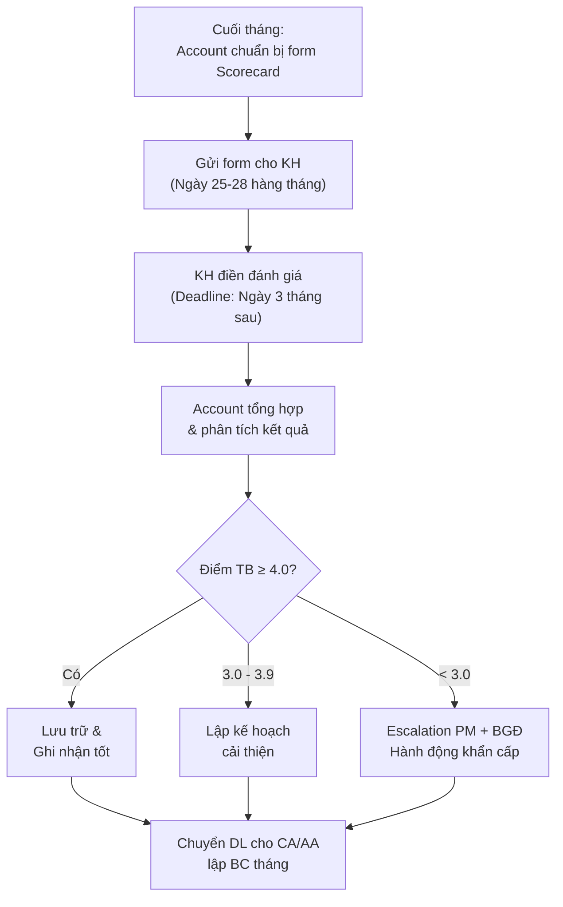

# Quản Lý Scorecard & Đánh Giá Dịch Vụ

> **Mã SOP:** SOP-02-008
> **Phiên bản:** 1.0
> **Ngày hiệu lực:** 2026-03-27
> **Áp dụng:** Tất cả gói dịch vụ (QTDA / TLXN / TLXN TX)

---

## 1. Mục Đích

Hệ thống hóa quy trình thu thập, phân tích và xử lý **Scorecard đánh giá dịch vụ** từ KH, nhằm đo lường chất lượng phục vụ và cải thiện liên tục. Account là **R** (Responsible) cho toàn bộ quy trình Scorecard.

---

## 2. Tổng Quan Scorecard

| Tiêu chí          | Chi tiết                                          |
| ------------------ | -------------------------------------------------- |
| **Tần suất**      | 1 lần/tháng                                         |
| **Người đánh giá** | Khách hàng (Chủ nhà)                               |
| **Người thu thập** | Account                                              |
| **Thang điểm**    | 1 — 5 (1 = Rất kém, 5 = Rất tốt)                   |
| **Hình thức**     | Online (form Larksuite) hoặc tại buổi họp review     |
| **Liên kết**      | Quỹ Cam kết Chất Lượng (theo phụ lục HĐ)            |

---

## 3. Các Tiêu Chí Đánh Giá

| # | Tiêu chí                        | Mô tả                                              | Trọng số |
| - | --------------------------------- | ---------------------------------------------------- | -------- |
| 1 | Thái độ phục vụ                   | Sự chuyên nghiệp, nhiệt tình, lịch sự của team QLDA | 20%      |
| 2 | Chất lượng báo cáo                | Đầy đủ, rõ ràng, đúng hạn                            | 15%      |
| 3 | Phản hồi & SLA Ticket             | Tiếp nhận nhanh, xử lý đúng thời hạn                | 15%      |
| 4 | Kiểm soát chi phí                 | Minh bạch, cập nhật kịp thời, cảnh báo đúng           | 15%      |
| 5 | Chất lượng giám sát thi công      | Phát hiện lỗi, yêu cầu sửa chữa kịp thời            | 15%      |
| 6 | Tư vấn vật liệu/thiết bị         | Đa phương án, minh bạch giá, phù hợp nhu cầu          | 10%      |
| 7 | Hỗ trợ lựa chọn NTP/NCC          | Kết nối nhanh, đánh giá chuyên nghiệp                 | 10%      |

---

## 4. Quy Trình Thu Thập Scorecard

---

## 5. Xử Lý Theo Mức Điểm

### 5.1 Điểm ≥ 4.0/5.0 — Tốt ✅

| Hành động                           | Ai          |
| ------------------------------------- | ----------- |
| Ghi nhận & cảm ơn KH                 | Account     |
| Chia sẻ kết quả tốt với team         | Account     |
| Duy trì & phát huy                    | Team        |

### 5.2 Điểm 3.0 — 3.9/5.0 — Cần Cải Thiện 🟡

| Bước | Hành động                                            | Ai           | Thời hạn   |
| ---- | ----------------------------------------------------- | ------------ | ---------- |
| 1    | Phân tích tiêu chí nào điểm thấp                       | Account      | 1 ngày     |
| 2    | Họp với PM xác định nguyên nhân                         | Account + PM | 2 ngày     |
| 3    | Lập kế hoạch cải thiện (action items cụ thể)            | PM           | 3 ngày     |
| 4    | Thực hiện cải thiện                                      | Team         | Trong tháng |
| 5    | Follow-up KH giữa tháng để đo mức cải thiện            | Account      | Giữa tháng |

### 5.3 Điểm < 3.0/5.0 — Khẩn Cấp 🔴

| Bước | Hành động                                            | Ai            | Thời hạn   |
| ---- | ----------------------------------------------------- | ------------- | ---------- |
| 1    | Báo cáo ngay PM + BGĐ                                  | Account       | Trong ngày |
| 2    | Liên hệ KH xin lỗi & tìm hiểu chi tiết                | Account + PM  | 1 ngày     |
| 3    | Họp khẩn team để phân tích nguyên nhân gốc              | PM + Team     | 2 ngày     |
| 4    | Trình BGĐ kế hoạch khắc phục                           | PM            | 3 ngày     |
| 5    | Gặp KH trình bày kế hoạch khắc phục                    | PM + Account  | 5 ngày     |
| 6    | Thực hiện & theo dõi sát                                | Team          | Liên tục   |
| 7    | Review lại sau 2 tuần                                   | Account       | 2 tuần     |

---

## 6. Đối Soát Quỹ Cam Kết Chất Lượng

> Quỹ Cam kết CL là cơ chế tài chính đi kèm HĐ, liên kết trực tiếp với Scorecard.

| Điều kiện                        | Xử lý Quỹ CL                                |
| ---------------------------------- | ---------------------------------------------- |
| Scorecard ≥ Ngưỡng (theo HĐ)     | Quỹ CL được giữ nguyên                        |
| Scorecard < Ngưỡng                | Trừ Quỹ CL theo công thức trong phụ lục HĐ    |
| KH không đánh giá (skip)          | Mặc định = Đạt (ghi nhận vào biên bản)        |

### Quy trình đối soát:

| Bước | Hành động                                          | Ai             |
| ---- | --------------------------------------------------- | -------------- |
| 1    | Account tổng hợp Scorecard tháng                    | Account        |
| 2    | Tính toán ảnh hưởng đến Quỹ CL (nếu có)             | Account        |
| 3    | Gửi Kế toán đối soát                                | Account → KT   |
| 4    | Kế toán xác nhận & xử lý tài chính                  | Kế toán        |
| 5    | Cung cấp DL cho CA/AA lập báo cáo tháng             | Account        |

---

## 7. Feedback Cuối Dự Án (Sau Bàn Giao)

Ngoài Scorecard hàng tháng, Account thu thập đánh giá tổng thể sau khi bàn giao:

| Nội dung đánh giá                    | Mô tả                                     |
| -------------------------------------- | ------------------------------------------- |
| Mức độ hài lòng tổng thể              | 1-5 điểm                                    |
| Điểm mạnh của dịch vụ NCM             | KH ghi nhận                                  |
| Điểm cần cải thiện                     | KH góp ý                                     |
| KH có giới thiệu NCM cho người khác?  | Có / Không / Đã giới thiệu                   |
| Lời nhắn cho team                      | Tự do                                         |

> 📌 Kết quả feedback cuối dự án được gửi BGĐ và dùng cho Lesson Learned (Phase 6).

---

## 8. Tài Liệu Liên Quan

| Tài liệu                  | Link                                                                 |
| --------------------------- | -------------------------------------------------------------------- |
| Xử lý Ticket & Khiếu nại  | [xu-ly-ticket-khieu-nai.md](./xu-ly-ticket-khieu-nai.md)            |
| Chăm sóc KH                | [cham-soc-khach-hang.md](./cham-soc-khach-hang.md)                    |
| Báo cáo định kỳ cho KH    | [bao-cao-dinh-ky-cho-kh.md](./bao-cao-dinh-ky-cho-kh.md)            |
| Kiểm soát ngân sách        | [quan-ly-ngan-sach-chi-phi.md](./quan-ly-ngan-sach-chi-phi.md)       |
