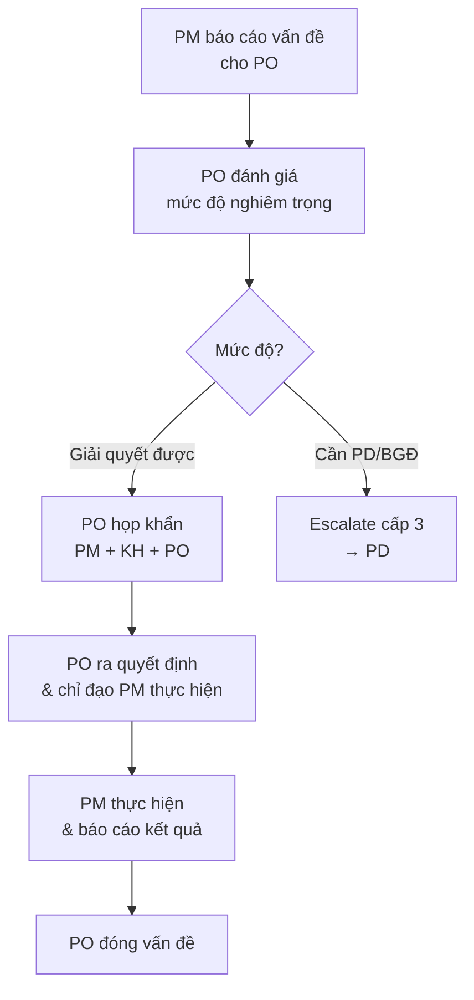

# Xử Lý Escalation Cấp 2 (PO)

> **Mã SOP:** SOP-05-004
> **Phiên bản:** 1.0
> **Ngày hiệu lực:** 2026-03-28

---

## 1. Mục Đích

Quy định cách PO tiếp nhận và xử lý Escalation cấp 2 — khi PM đã không giải quyết được vấn đề tại cấp 1 và cần sự can thiệp của PO.

---

## 2. Khi Nào Escalation Lên PO?

| Tình huống | SLA cấp 1 (PM) | Điều kiện escalate |
|-----------|----------------|-------------------|
| Sự cố P1 (nghiêm trọng) | 24h | PM không giải quyết được trong SLA |
| Sự cố P2 (trung bình) | 3 ngày | PM không giải quyết được trong SLA |
| KH yêu cầu gặp quản lý | — | KH không hài lòng với phương án PM |
| Tranh chấp với nhà thầu | — | Nhà thầu không hợp tác, cần quyền PO |
| Change Order > 20 triệu | — | Vượt quyền phê duyệt PM |

---

## 3. Quy Trình Xử Lý

| Bước | Hành động | Ai | SLA |
|------|----------|-----|-----|
| 1 | PM gửi báo cáo escalation (tóm tắt vấn đề, đã làm gì, đề xuất) | PM → PO | Ngay khi phát sinh |
| 2 | PO đánh giá và quyết định hướng xử lý | PO | 4h (P1) / 1 ngày (P2) |
| 3 | PO họp khẩn với PM + KH (nếu cần) | PO | Trong ngày |
| 4 | PO ra quyết định & chỉ đạo PM thực hiện | PO | Tại cuộc họp |
| 5 | PM thực hiện và báo cáo kết quả | PM → PO | Theo deadline PO đặt |
| 6 | PO đóng vấn đề hoặc escalate tiếp lên PD | PO | Sau khi hoàn tất |

---

## 4. Escalate Lên Cấp 3 (PD/BGĐ)

PO escalate lên PD khi:
- Rủi ro pháp lý (tranh chấp HĐ, kiện tụng)
- Yêu cầu chấm dứt dự án
- Change Order > 50 triệu
- Vấn đề ảnh hưởng uy tín công ty

---

## 5. Tài Liệu Liên Quan

| Tài liệu | Link |
|----------|------|
| Escalation nội bộ | [../09-PHOI-HOP-NOI-BO/escalation-noi-bo.md](../09-PHOI-HOP-NOI-BO/escalation-noi-bo.md) |
| Ticket & SLA | [../11-PHU-LUC/ticket-scorecard-escalation.md](../11-PHU-LUC/ticket-scorecard-escalation.md) |
