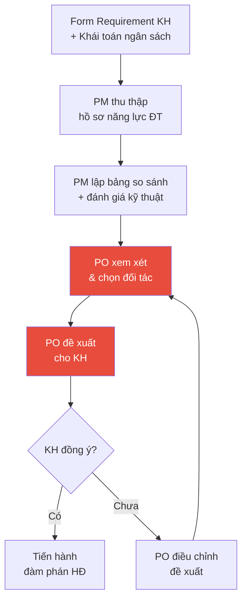
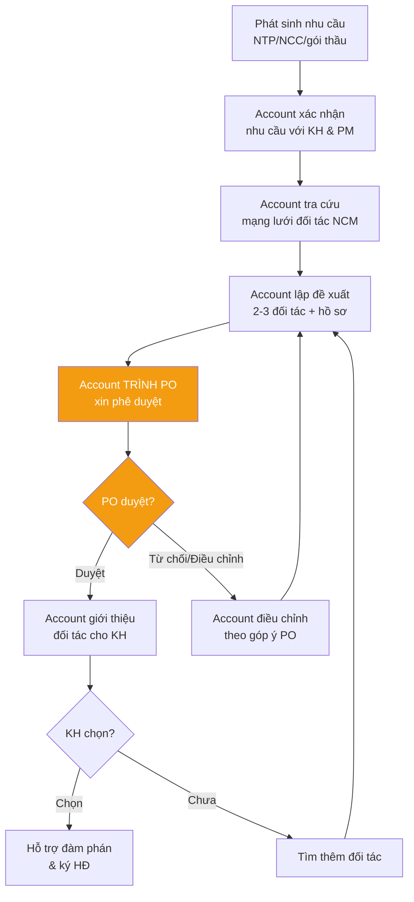

# Quy Trình PO Phê Duyệt Đối Tác Cho Công Trình

> **Mã SOP:** SOP-05-003
> **Phiên bản:** 1.0
> **Ngày hiệu lực:** 2026-03-28

---

## 1. Mục Đích

Quy định rõ quyền hạn và quy trình PO xét duyệt cuối cùng mọi đề xuất đối tác (nhà thầu chính, nhà thầu phụ, nhà cung cấp, đơn vị thiết kế) vào công trình của khách hàng. Đảm bảo **đúng người, đúng vật tư, đúng thời gian**.

---

## 2. Nguyên Tắc Cốt Lõi

> 🔴 **PO là người có quyền xét duyệt cuối cùng** (trên cả Account) về việc đề xuất các đối tác vào công trình của khách hàng.

| Loại đối tác | Ai chọn | Vai trò Account | Vai trò PM |
|-------------|---------|-----------------|-----------|
| **Đơn vị Thiết kế** | **PO trực tiếp chọn** | Phối hợp, hỗ trợ. **KHÔNG** tham gia quyết định | Hỗ trợ kỹ thuật, cung cấp dữ liệu |
| **Nhà thầu thi công chính** | **PO trực tiếp chọn** | Phối hợp, hỗ trợ. **KHÔNG** tham gia quyết định | Hỗ trợ kỹ thuật, sơ tuyển, lập bảng so sánh |
| Nhà thầu phụ | Account giới thiệu → **PO duyệt** | Đề xuất sau khi trình PO | Góp ý kỹ thuật |
| Nhà cung cấp | Account giới thiệu → **PO duyệt** | Đề xuất sau khi trình PO | Góp ý kỹ thuật |
| Gói thầu hạng mục khác | Account giới thiệu → **PO duyệt** | Đề xuất sau khi trình PO | Cung cấp số liệu vật tư, thời điểm |

---

## 3. Quy Trình Chọn 2 Đối Tác Chiến Lược (TK + NT Chính)

### Chi tiết từng bước

| Bước | Hành động | Ai | Deadline |
|------|----------|-----|---------|
| 1 | Thu thập hồ sơ năng lực các đối tác tiềm năng | PM + AA | Theo tiến độ DA |
| 2 | Lập bảng đánh giá kỹ thuật & so sánh | PM | 2-3 ngày |
| 3 | Trình bảng đánh giá cho PO | PM → PO | Ngay sau bước 2 |
| 4 | **PO xem xét & chọn đối tác** | **PO** | 1-2 ngày |
| 5 | PO đề xuất đối tác cho KH | PO (Account phối hợp) | Ngay sau bước 4 |
| 6 | KH xem xét & quyết định | KH | Tùy KH |
| 7 | Đàm phán & ký HĐ | PM (kỹ thuật) + Account (phối hợp) | Theo tiến độ |

> ⚠️ **Account chỉ phối hợp, hỗ trợ PO và KHÔNG được tham gia vào việc quyết định đề xuất các đối tác chiến lược này cho khách hàng.**

---

## 4. Quy Trình Account Giới Thiệu Đối Tác Khác

### Chi tiết từng bước

| Bước | Hành động | Ai | Lưu ý |
|------|----------|-----|-------|
| 1 | Xác nhận nhu cầu NTP/NCC với KH & PM | Account | PM cung cấp yêu cầu kỹ thuật |
| 2 | Tra cứu mạng lưới đối tác NCM | Account | Ưu tiên đối tác đã có rating tốt |
| 3 | Lập đề xuất 2-3 đối tác + hồ sơ năng lực | Account | PM góp ý kỹ thuật |
| 4 | **Trình PO xin phê duyệt** | **Account → PO** | Bắt buộc trước khi giới thiệu cho KH |
| 5 | PO duyệt / từ chối / yêu cầu điều chỉnh | **PO** | Có quyền thay đổi danh sách |
| 6 | Giới thiệu đối tác đã được PO duyệt cho KH | Account | Chỉ sau khi PO duyệt |
| 7 | Hỗ trợ KH đánh giá & chọn | Account + PM | KH quyết định cuối cùng |

---

## 5. PM Hỗ Trợ Account Với Số Liệu

PM có vai trò cung cấp **dữ liệu kỹ thuật** cho **Account** — Account cần thông tin này để đưa đối tác vào công trình cho phù hợp:

| Dữ liệu PM cung cấp | Mục đích | Account dùng để |
|----------------------|---------|------------------|
| Số liệu vật tư cần dùng | Xác định scope cho NCC/NTP | Tìm đối tác phù hợp về năng lực |
| Thời điểm cần vật tư | Lên lịch đặt hàng/thi công | Đưa đối tác vào đúng thời điểm |
| Yêu cầu kỹ thuật chi tiết | Tiêu chí kỹ thuật đối tác cần đáp ứng | Lọc và giới thiệu đối tác phù hợp |
| Tiến độ thi công liên quan | Phối hợp thời gian NTP vào công trình | Phối hợp đối tác kịp tiến độ |

> Mục tiêu: **Đúng người — Đúng vật tư — Đúng thời gian cần thiết**

---

## 6. Tài Liệu Liên Quan

| Tài liệu | Link |
|----------|------|
| Lựa chọn nhà thầu (PM) | [../04-PM/lua-chon-nha-thau.md](../04-PM/lua-chon-nha-thau.md) |
| Hỗ trợ chọn NTP/NCC (Account) | [../05-ACCOUNT/ho-tro-lua-chon-thau-phu-ncc.md](../05-ACCOUNT/ho-tro-lua-chon-thau-phu-ncc.md) |
| Ma trận RACI | [../00-TONG-QUAN/ma-tran-RACI.md](../00-TONG-QUAN/ma-tran-RACI.md) |
