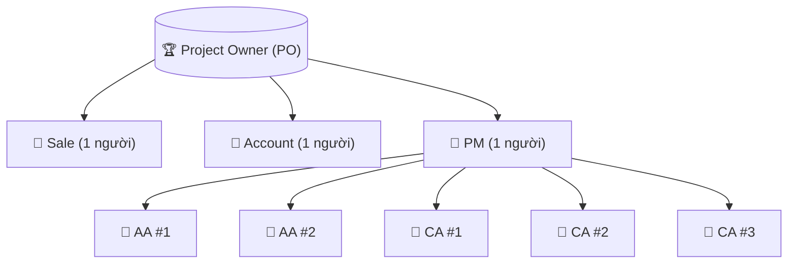
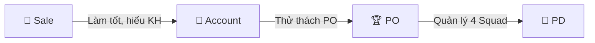
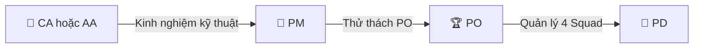
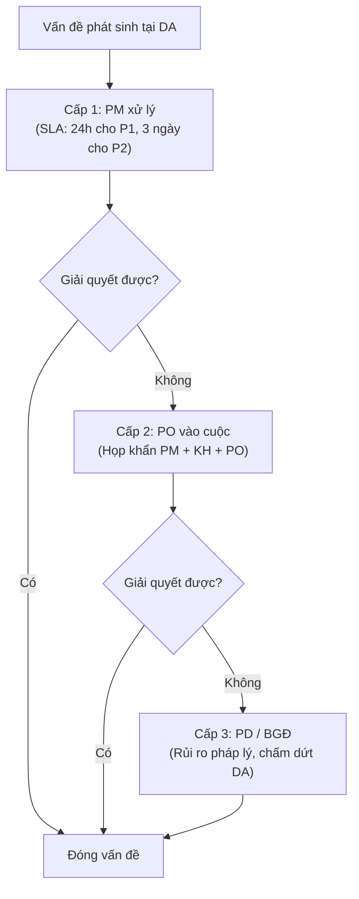

# Vai Trò, Chức Năng & KPI của Project Owner

> **Mã SOP:** SOP-05-001
> **Phiên bản:** 1.0
> **Ngày hiệu lực:** 2026-03-28

---

## 1. Định Nghĩa Vai Trò

**Project Owner (PO)** là **người đứng đầu một Squad** — đơn vị vận hành độc lập nhỏ nhất của NCM. PO được trao toàn bộ quyền hạn về nhân sự, vận hành và chịu trách nhiệm về doanh số của Squad trước **Project Director (PD)**.

> ⚠️ **Tại sao PO cần được vun đắp cẩn thận:** PO được trao quyền con người và tài chính — đây là điều kiện đủ để một PO có thể tách ra lập công ty riêng. Vì vậy, việc lên PO đòi hỏi quá trình cống hiến, thử thách và tin tưởng lâu dài với NCM.

---

## 2. Cấu Trúc Squad

| Thành phần Squad | Số lượng | Báo cáo cho  |
| ------------------ | :---------: | -------------- |
| Sale               |      1      | PO trực tiếp |
| Account            |      1      | PO trực tiếp |
| PM                 |      1      | PO trực tiếp |
| AA hoặc CA        |     ~5     | PM             |

**Mục tiêu doanh số:** ~500 triệu VND/tháng (~25 công trình đang vận hành đồng thời)

---

## 3. Trách Nhiệm & Quyền Hạn

### 3.1 Trách Nhiệm

| Nhóm | Chi tiết |
| ---- | -------- |
| **Doanh số** | Chịu Target 500M/tháng cho Squad; báo cáo KPI cho PD hàng tháng |
| **Nhân sự** | Tuyển dụng, đào tạo, phân công, đánh giá thưởng phạt trong Squad |
| **Vận hành** | Đảm bảo PM + Account + Sale vận hành đúng SOP; giải quyết Escalation cấp 2 |
| **Chất lượng DV** | Chịu trách nhiệm Scorecard trung bình của Squad ≥ ngưỡng cam kết |
| **Phát triển Squad** | Onboard nhân sự mới, review SOP nội bộ, đề xuất cải tiến |
| **Phê duyệt đối tác** | Xét duyệt cuối cùng mọi đề xuất đối tác vào công trình KH (xem chi tiết bên dưới) |

### 3.2 Quyền Hạn Phê Duyệt Đối Tác

> 🔴 **Nguyên tắc cốt lõi:** PO là người có quyền xét duyệt cuối cùng (trên cả Account) về việc đề xuất các đối tác vào công trình của khách hàng.

#### 2 Đối Tác Chiến Lược (PO Trực Tiếp Chọn)

| Đối tác | Lý do PO chọn | Vai trò Account |
|---------|---------------|-----------------|
| **Đơn vị Thiết kế** | Quyết định thành công về mặt kiến trúc/thẩm mỹ | Chỉ phối hợp, hỗ trợ PO. **KHÔNG được tham gia quyết định** |
| **Nhà thầu thi công chính** | Quyết định thành công về chất lượng xây dựng | Chỉ phối hợp, hỗ trợ PO. **KHÔNG được tham gia quyết định** |

#### Các Đối Tác Khác (Account Giới Thiệu → PO Duyệt)

| Loại | Ví dụ | Quy trình |
|------|-------|-----------|
| Nhà thầu phụ | Điện, nước, PCCC, nhôm kính, nội thất | Account trình đề xuất → PO duyệt → Đề xuất cho KH |
| Nhà cung cấp | Gạch, thiết bị VS, sơn, đá | Account trình đề xuất → PO duyệt → Đề xuất cho KH |
| Gói thầu hạng mục | Smart home, thang máy, điều hòa | Account trình đề xuất → PO duyệt → Đề xuất cho KH |

### 3.3 Quyền Hạn Tổng Hợp

| Quyền | PO được làm | Phải xin PD/BGĐ |
| ----- | :---------: | :--------------: |
| Tuyển/thôi việc trong Squad | ✅ | Thông báo PD |
| **Chọn ĐV Thiết kế & NT thi công chính** | **✅ Trực tiếp** | — |
| **Duyệt đề xuất đối tác khác từ Account** | **✅** | — |
| Phê duyệt Change Order 20-50 triệu | ✅ | — |
| Phê duyệt Change Order > 50 triệu | — | ✅ PD |
| Quyết định Escalation cấp 2 (PM→PO) | ✅ | PD nếu không giải quyết được |
| Chấm dứt HĐ nhà thầu trong DA | ✅ (với PM) | PD nếu tranh chấp pháp lý |
| Điều phối nhân sự giữa DA trong Squad | ✅ | — |
| Đề xuất KPI/thưởng phạt cho team | ✅ | PD phê duyệt thưởng vượt mức |

---

## 4. Vai Trò PM Trong Squad

PM là **đầu não kỹ thuật**, thuần túy quản lý kỹ thuật:

| Chức năng PM | Chi tiết |
|-------------|---------|
| Quản lý CA/AA | Phân công, giám sát, đánh giá hiệu suất CA/AA |
| Hỗ trợ Account về dữ liệu | Cung cấp số liệu vật tư, thời điểm sử dụng vật tư cho Account |
| Đảm bảo đúng 3 yếu tố | **Đúng người** — **Đúng vật tư** — **Đúng thời gian** |
| Quản lý kỹ thuật dự án | Tiến độ, chất lượng, an toàn |

> PM hỗ trợ **Account** có số liệu vật tư, thời điểm sử dụng vật tư để Account đưa đối tác vào công trình cho phù hợp — đúng người, đúng vật tư, đúng thời gian cần thiết.

---

## 5. KPI Đo Lường

| KPI | Mục tiêu | Tần suất | Nguồn |
|-----|---------|----------|-------|
| Doanh số Squad | ≥ 500M/tháng | Hàng tháng | Kế toán |
| Scorecard trung bình Squad | ≥ 4.0/5.0 | Hàng tháng | Scorecard KH |
| Tỷ lệ dự án hoàn thành đúng hạn | ≥ 85% | Hàng quý | PM report |
| Số Escalation cấp 3 | 0 | Hàng quý | PD tracking |
| Tỷ lệ KH giới thiệu (NPS) | ≥ 50% | Hàng quý | Survey |
| Nhân sự nghỉ việc | ≤ 1/quý | Hàng quý | HR |

---

## 6. Họp Định Kỳ PO

| Họp | Tần suất | Thành phần | Nội dung |
| ---- | -------- | ---------- | -------- |
| Giao ban Squad | Hàng tuần | PO + PM + Account | Tiến độ DA, vấn đề, kế hoạch tuần |
| Review KPI Squad | Hàng tháng | PO + toàn Squad | Doanh số, Scorecard, Lesson Learned |
| Báo cáo PD | Hàng tháng | PO + PD | KPI Squad, nhân sự, escalation |
| Review chiến lược | Hàng quý | PO + PD + BGĐ | Định hướng, target quý mới |

---

## 7. Con Đường Thăng Tiến Lên PO

### Hướng 1: Sale → Account → PO

### Hướng 2: CA/AA → PM → PO

### Điều Kiện Chung

| Tiêu chí | Mô tả |
| -------- | ------ |
| Thâm niên | Tối thiểu 2 năm ở vai trò hiện tại |
| Kết quả KPI | ≥ 24 tháng liên tiếp đạt mục tiêu KPI |
| Không vi phạm | Không có vụ tranh chấp KH, không leak thông tin nội bộ |
| Năng lực lãnh đạo | Chứng minh khả năng đào tạo và dẫn dắt 1-2 nhân viên |
| Vượt qua thử thách PO | Hoàn thành chương trình thử thách nội bộ do PD/BGĐ thiết lập |

---

## 8. Quy Trình Escalation (3 Cấp)

---

## 9. Tài Liệu Liên Quan

| Tài liệu | Link |
| --------- | ---- |
| Quản lý Squad | [quan-ly-squad.md](./quan-ly-squad.md) |
| Phê duyệt đối tác | [phe-duyet-doi-tac.md](./phe-duyet-doi-tac.md) |
| Escalation cấp 2 | [escalation-cap-2.md](./escalation-cap-2.md) |
| Ma trận RACI | [../00-TONG-QUAN/ma-tran-RACI.md](../00-TONG-QUAN/ma-tran-RACI.md) |
| SOP PM | [../04-PM/README.md](../04-PM/README.md) |
| SOP Account | [../05-ACCOUNT/README.md](../05-ACCOUNT/README.md) |
| SOP PD | [../03-PD/README.md](../03-PD/README.md) |
