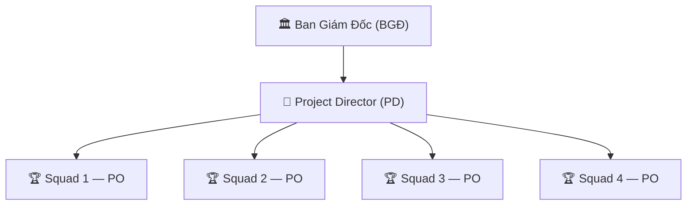

# Vai Trò, Chức Năng & KPI của Project Director

> **Mã SOP:** SOP-04-001
> **Phiên bản:** 1.0
> **Ngày hiệu lực:** 2026-03-28

---

## 1. Định Nghĩa Vai Trò

**Project Director (PD)** quản lý **4 Squad (4 PO)**, chịu trách nhiệm tổng doanh số và chất lượng dịch vụ của toàn bộ đơn vị trước **Ban Giám Đốc (BGĐ)**.

---

## 2. Cấu Trúc Quản Lý

**Mục tiêu doanh số PD:** ~2 tỷ VND/tháng (4 Squad × 500M)

---

## 3. Trách Nhiệm & Quyền Hạn

### 3.1 Trách Nhiệm

| Nhóm | Chi tiết |
| ---- | -------- |
| **Doanh số** | Chịu target ~2 tỷ/tháng; báo cáo BGĐ hàng tháng |
| **Quản lý PO** | Đánh giá, coaching, phát triển 4 PO |
| **Chất lượng tổng** | Đảm bảo Scorecard trung bình toàn đơn vị ≥ ngưỡng |
| **Chiến lược** | Đề xuất định hướng phát triển, mở rộng Squad |
| **Escalation cấp 3** | Xử lý rủi ro pháp lý, chấm dứt dự án, tranh chấp nghiêm trọng |
| **Nhân sự cấp PO** | Đề xuất bổ nhiệm/miễn nhiệm PO cho BGĐ |

### 3.2 Quyền Hạn

| Quyền | PD được làm | Phải xin BGĐ |
| ----- | :---------: | :-----------: |
| Phê duyệt Change Order > 50 triệu | ✅ | BGĐ nếu > 100 triệu |
| Xử lý Escalation cấp 3 | ✅ | BGĐ nếu pháp lý |
| Phê duyệt thưởng vượt mức cho PO | ✅ | — |
| Bổ nhiệm/miễn nhiệm PO | Đề xuất | ✅ BGĐ phê duyệt |
| Chấm dứt HĐ dự án | ✅ (với PO) | BGĐ nếu tranh chấp |
| Điều phối nhân sự giữa các Squad | ✅ | Thông báo BGĐ |
| Quyết định lương/thưởng PO | ✅ | BGĐ phê duyệt mức cao |

---

## 4. KPI Đo Lường

| KPI | Mục tiêu | Tần suất |
|-----|---------|----------|
| Tổng doanh số 4 Squad | ≥ 2 tỷ/tháng | Hàng tháng |
| Scorecard trung bình toàn đơn vị | ≥ 4.0/5.0 | Hàng tháng |
| Tỷ lệ PO đạt target | ≥ 75% (3/4 PO) | Hàng quý |
| Số Escalation cấp 3 | ≤ 2/quý | Hàng quý |
| Tỷ lệ nhân sự nghỉ việc toàn đơn vị | ≤ 5%/quý | Hàng quý |

---

## 5. Họp Định Kỳ

| Họp | Tần suất | Thành phần | Nội dung |
| ---- | -------- | ---------- | -------- |
| Nhận báo cáo PO | Hàng tháng | PD + từng PO | KPI Squad, nhân sự, escalation |
| Review chiến lược | Hàng quý | PD + 4 PO + BGĐ | Định hướng, target quý mới |
| Báo cáo BGĐ | Hàng tháng | PD + BGĐ | Tổng KPI, chiến lược, đề xuất |
| Đánh giá PO | Hàng năm | PD + BGĐ | Hiệu suất, thăng tiến, khen thưởng |

---

## 6. Tài Liệu Liên Quan

| Tài liệu | Link |
|----------|------|
| Quản lý các Squad | [quan-ly-cac-squad.md](./quan-ly-cac-squad.md) |
| Escalation cấp 3 | [escalation-cap-3.md](./escalation-cap-3.md) |
| SOP PO | [../02-PO/README.md](../02-PO/README.md) |
| Tổ chức Squad | [../00-TONG-QUAN/to-chuc-squad-po-pd.md](../00-TONG-QUAN/to-chuc-squad-po-pd.md) |
