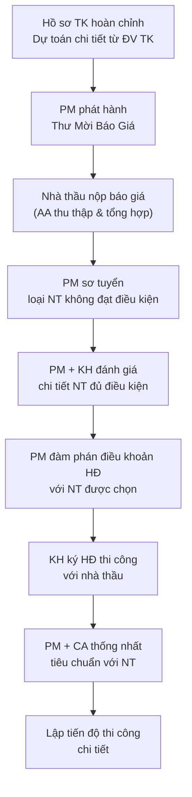

# Lựa Chọn Nhà Thầu

> **Mã SOP:** SOP-03-004
> **Phiên bản:** 1.0
> **Ngày hiệu lực:** 2026-03-27
> **Áp dụng:** Tất cả gói dịch vụ (QTDA / TLXN / TLXN TX)

---

## 1. Mục Đích

Đảm bảo KH chọn được **nhà thầu thi công phù hợp** — có năng lực, giá hợp lý, và ký HĐ với điều khoản bảo vệ quyền lợi KH. PM dẫn dắt toàn bộ quy trình, KH có tiếng nói trong quyết định cuối.

---

## 2. Sơ Đồ Quy Trình

---

## 3. Chi Tiết Từng Bước

### 3.1 Phát Hành Thư Mời Báo Giá (TMBG)

TMBG phải kèm đầy đủ tài liệu kỹ thuật để NT báo giá chính xác:

| Tài liệu đính kèm TMBG           | Người chuẩn bị | Ghi chú                         |
| ---------------------------------- | -------------- | -------------------------------- |
| Dự toán chi tiết từ ĐV TK         | ĐV TK → AA    | Làm căn cứ so sánh báo giá      |
| Bộ hồ sơ thiết kế đã duyệt        | AA             | Bản vẽ kỹ thuật + kiến trúc     |
| Yêu cầu kỹ thuật & tiêu chuẩn    | PM             | Tiêu chuẩn CL, vật liệu        |
| Điều khoản HĐ dự kiến             | PM             | Phương thức thanh toán, BH     |
| Thời hạn nộp báo giá              | PM             | Thường 7-14 ngày                |

> ⚠️ **Nguyên tắc:** Mời tối thiểu **3 nhà thầu** để có cơ sở so sánh.

### 3.2 Tiêu Chí Sơ Tuyển Nhà Thầu

PM loại ngay những NT không đáp ứng điều kiện tối thiểu:

| Tiêu chí                               | Mức tối thiểu                     |
| --------------------------------------- | ---------------------------------- |
| Pháp lý                                | Đăng ký kinh doanh, GPXD còn hạn |
| Năng lực nhân sự                       | Có KS công trình & đội thợ chính |
| Kinh nghiệm tương tự                   | ≥ 3 công trình cùng loại hình    |
| Tình hình tài chính                    | Không có nợ xấu, không tranh chấp|
| Sức chịu tải công việc                 | Không đang quá tải DA khác        |

### 3.3 Đánh Giá Chi Tiết & Lựa Chọn

Với NH vượt sơ tuyển, AA lập **Bảng So Sánh Báo Giá**:

| Tiêu chí đánh giá             | Trọng số | Cách tính điểm          |
| ------------------------------- | :------: | ----------------------- |
| Tổng giá trị báo giá           | 35%      | Điểm nghịch chiều với giá |
| Kinh nghiệm & Hồ sơ năng lực  | 25%      | 1-5 điểm                |
| Tiến độ cam kết                 | 20%      | Sát với yêu cầu KH      |
| Điều khoản bảo hành            | 10%      | Thời gian & phạm vi BH  |
| Uy tín & Tham chiếu            | 10%      | Phản hồi từ DA cũ        |

Sau khi tổng hợp, PM trình bày **Top 2-3 NT** cho KH xem xét và quyết định cuối.

> ⚠️ **Nguyên tắc minh bạch:** PM không nhận hoa hồng hay lợi ích vật chất từ nhà thầu. Quyết định cuối thuộc về KH.

### 3.4 Đàm Phán HĐ Thi Công

Các điều khoản bắt buộc PM kiểm tra trước khi ký:

| Điều khoản                          | Yêu cầu                                                     |
| ------------------------------------ | ------------------------------------------------------------ |
| **Phạm vi công việc**               | Liệt kê chi tiết công việc & vật liệu NT cung cấp           |
| **Đơn giá & Tổng giá trị**          | Tách rõ vật tư + nhân công; có điều khoản thay đổi giá      |
| **Tiến độ thi công**                | Milestone chi tiết, penalty khi trễ tiến độ                 |
| **Phương thức thanh toán**          | Theo milestone nghiệm thu (không trả 100% trước)            |
| **Tạm giữ bảo hành**               | Giữ lại 5-10% giá trị HĐ đến hết bảo hành                  |
| **Thời hạn bảo hành**              | Tối thiểu 12 tháng (phần kết cấu dài hơn)                  |
| **Quyền đình chỉ thi công**        | KH/PM có quyền yêu cầu dừng nếu NT vi phạm chất lượng      |
| **Phạt vi phạm tiến độ**           | Rõ mức phạt/ngày trễ                                         |
| **Giải quyết tranh chấp**          | Phương án hòa giải, sau đó Tòa án                            |

### 3.5 Thống Nhất Tiêu Chuẩn Thi Công với NT

Sau khi ký HĐ, **PM + CA** tổ chức buổi thống nhất với đại diện NT:

**Nội dung bắt buộc thống nhất:**
- [ ] Tiêu chuẩn chất lượng vật liệu cho từng hạng mục
- [ ] Quy trình kiểm tra trước khi đổ bê tông / che khuất
- [ ] Yêu cầu nhật ký công trình (ghi chép hàng ngày)
- [ ] Quy định báo cáo cho CA: tần suất, format, kênh
- [ ] Quy định về an toàn lao động trên công trường
- [ ] Quy trình xử lý phát sinh: báo PM trước, không tự làm
- [ ] Phân quyền: chỉ CA/PM mới có quyền chấp thuận thay đổi

> 📌 Sau buổi thống nhất, AA lập **Biên Bản Thống Nhất** được ký bởi PM + Đại diện NT.

### 3.6 Lập Tiến Độ Thi Công Chi Tiết

| Bước | Hành động                                              | Ai        |
| ---- | ------------------------------------------------------- | --------- |
| 1    | NT nộp tiến độ chi tiết theo mẫu yêu cầu             | NT        |
| 2    | PM + CA review tiến độ (tính khả thi, đủ thông tin)  | PM + CA   |
| 3    | Điều chỉnh tiến độ nếu cần                            | NT + PM   |
| 4    | PM xác nhận tiến độ chính thức                         | PM        |
| 5    | AA upload tiến độ lên Larksuite + HBSS                 | AA        |

---

## 4. Quy Trình Áp Dụng Cho Nhà Thầu Phụ & NCC

Quy trình này áp dụng tương tự cho NT phụ (nội thất, điện, nước, PCCC...) và NCC thiết bị. Lưu ý:

- Account hỗ trợ KH đánh giá NCC theo yêu cầu riêng của KH
- PM quyết định kỹ thuật; KH quyết định thương mại/lựa chọn

> 📡 **TLXN TX:** PM/Account hướng dẫn KH tự tìm NT địa phương. PM cung cấp checklist đánh giá & kiểm tra HĐ từ xa.

---

## 5. Tài Liệu Liên Quan

| Tài liệu                       | Link                                                             |
| ------------------------------- | ---------------------------------------------------------------- |
| Quản lý thi công               | [quan-ly-thi-cong.md](./quan-ly-thi-cong.md)                    |
| Quản lý thanh toán             | [quan-ly-thanh-toan.md](./quan-ly-thanh-toan.md)                |
| Hỗ trợ chọn NT/NCC (Account)  | [../02-ACCOUNT/ho-tro-lua-chon-thau-phu-ncc.md](../02-ACCOUNT/ho-tro-lua-chon-thau-phu-ncc.md) |
