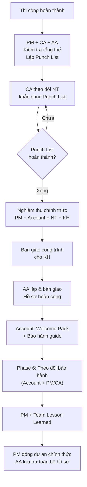

# Nghiệm Thu, Bàn Giao & Đóng Dự Án

> **Mã SOP:** SOP-03-009
> **Phiên bản:** 1.0
> **Ngày hiệu lực:** 2026-03-27
> **Áp dụng:** Tất cả gói dịch vụ (QTDA / TLXN / TLXN TX)

---

## 1. Mục Đích

Đảm bảo giai đoạn kết thúc dự án diễn ra **bài bản, đầy đủ thủ tục**, KH hài lòng khi nhận bàn giao, và team rút ra bài học để cải thiện. PM chủ trì toàn bộ giai đoạn này.

---

## 2. Sơ Đồ Tổng Quan Phase 5-6



---

## 3. Nghiệm Thu Tổng Thể

### 3.1 Kiểm Tra Tổng Thể Trước Nghiệm Thu Chính Thức

PM + CA + AA đi kiểm tra toàn bộ công trình và lập **Punch List** (danh sách tồn đọng):

**Các hạng mục kiểm tra:**

| Hạng mục                   | Người kiểm tra | Tiêu chí                                   |
| --------------------------- | -------------- | ------------------------------------------- |
| Phần kết cấu (tường, sàn)  | CA             | Không nứt, không thấm, đúng kích thước    |
| Hoàn thiện (sơn, ốp lát)   | CA + AA        | Đồng đều màu sắc, không bong tróc, sạch sẽ|
| Hệ thống điện              | CA             | Đủ ổ cắm, đèn hoạt động, MCB đúng vị trí |
| Hệ thống nước              | CA             | Không rò rỉ, áp lực đủ, thoát nước OK    |
| Cửa, lan can, cầu thang    | CA + AA        | Đóng mở trơn, chắc chắn, đúng thiết kế   |
| Nội thất (nếu có)          | AA             | Đúng chủng loại, không trầy xước          |
| Vệ sinh công trường        | CA             | Sạch sẽ, không còn vật liệu thi công      |

### 3.2 Punch List

**Template Punch List:**

```
PUNCH LIST — DỰ ÁN [TÊN KH]
Ngày kiểm tra: [DD/MM/YYYY] | PM: [Tên] | CA: [Tên]
━━━━━━━━━━━━━━━━━━━━━━━━━━━━━━━━━━━━━
| STT | Hạng mục | Mô tả tồn đọng | Mức độ | Deadline | Trạng thái |
|-----|----------|----------------|--------|----------|------------|
| 1   | Tầng 2   | Sơn bị ố vàng góc phòng ngủ | Nhẹ | 3 ngày | Chưa sửa |
| 2   | Toilet   | Vòi nước bị nhỏ giọt | Trung bình | 2 ngày | Đang sửa |
...

Phân loại mức độ:
- 🔴 Nghiêm trọng: ảnh hưởng an toàn hoặc chức năng → Sửa trước NT-BG
- 🟡 Trung bình: ảnh hưởng thẩm mỹ/chức năng → Sửa trong 7 ngày
- 🟢 Nhẹ: thẩm mỹ nhỏ → Sửa trong 14 ngày
```

> ⚠️ **Không tổ chức nghiệm thu chính thức khi còn tồn đọng mức độ 🔴 Nghiêm trọng.**

### 3.3 Nghiệm Thu Chính Thức

**Thành phần:** PM + CA + Account + KH + Đại diện NT

**Agenda nghiệm thu:**
1. PM dẫn KH đi kiểm tra từng tầng, từng hạng mục
2. KH nêu ý kiến, phát sinh thêm (ghi vào Punch List bổ sung)
3. PM + NT giải quyết thắc mắc kỹ thuật
4. Ký **Biên Bản Nghiệm Thu** chính thức

---

## 4. Bàn Giao Công Trình

### 4.1 Bàn Giao Thực Tế

| Bàn giao                    | Người thực hiện  | Ghi chú                          |
| ---------------------------- | ---------------- | -------------------------------- |
| Chìa khóa + mã cửa          | NT → KH (PM chứng kiến) | Đủ bộ chìa khóa mọi cửa |
| Thẻ điều hòa, remote        | NT → KH          | Đủ thiết bị + hướng dẫn         |
| Tài liệu kỹ thuật thiết bị  | AA → KH          | Hướng dẫn SD, số serial         |
| Hướng dẫn vận hành CT      | CA (thuyết minh) | Vị trí CB điện, van nước, PCCC  |

### 4.2 Bàn Giao Hồ Sơ Hoàn Công (AA)

AA chuẩn bị và bàn giao bộ hồ sơ cho KH:

| Tài liệu                         | Định dạng     | Ghi chú                          |
| --------------------------------- | ------------- | -------------------------------- |
| Bộ bản vẽ hoàn công (as-built)   | PDF + DWG    | Bản vẽ sau thi công thực tế      |
| Giấy phép xây dựng               | Bản gốc       | Nếu có                           |
| Hồ sơ nghiệm thu điện/nước/PCCC  | Bản gốc/scan | Từ đơn vị cơ điện               |
| HĐ các nhà thầu + phụ lục       | Scan          | Lưu để đối chiếu bảo hành       |
| Biên bản nghiệm thu tổng thể    | Bản gốc       | Được ký đầy đủ                  |
| Danh sách nhà thầu + SĐT        | PDF           | Để KH liên hệ khi cần bảo hành  |

---

## 5. Phase 6: Theo Dõi Bảo Hành

### 5.1 Phân Chia Trách Nhiệm Bảo Hành

| Trách nhiệm                         | Thực hiện         |
| ------------------------------------ | ------------------ |
| Tiếp nhận yêu cầu bảo hành từ KH  | Account            |
| Đánh giá nguyên nhân (kỹ thuật)    | PM / CA (nếu cần) |
| Liên hệ NT yêu cầu bảo hành        | PM                 |
| Theo dõi NT thực hiện bảo hành      | Account + CA       |
| Xác nhận KH hài lòng sau BH        | Account            |

### 5.2 Quy Trình Xử Lý Bảo Hành

| Bước | Hành động                                            | Thời hạn    |
| ---- | ----------------------------------------------------- | ----------- |
| 1    | KH báo lỗi qua Ticket hoặc Zalo (Account tiếp nhận) | —           |
| 2    | Account + PM đánh giá: Lỗi bảo hành hay hư hỏng mới?| Trong ngày  |
| 3    | Nếu lỗi bảo hành: PM liên hệ NT yêu cầu khắc phục   | Trong 24h   |
| 4    | CA kiểm tra sau khi NT sửa (QTDA/TLXN)               | Sau khi NT sửa |
| 5    | Account xác nhận KH hài lòng, đóng Ticket            | Sau khi sửa xong |

---

## 6. Lesson Learned & Đánh Giá Dự Án

### 6.1 Đánh Giá Nhà Thầu / NCC

PM lập **Bảng Đánh Giá Nhà Thầu** sau bàn giao 1 tháng:

| Tiêu chí                   | Trọng số | Điểm (1-5) |
| --------------------------- | :------: | :---------: |
| Tiến độ hoàn thành         | 25%      | ...         |
| Chất lượng thi công        | 35%      | ...         |
| Thái độ hợp tác            | 20%      | ...         |
| Xử lý phát sinh            | 10%      | ...         |
| Năng lực kỹ thuật          | 10%      | ...         |
| **Tổng điểm**              | **100%** | **...**     |

> 📌 Kết quả đánh giá được lưu vào Database NT của NCM để làm cơ sở chọn lựa dự án tiếp theo.

### 6.2 Họp Lesson Learned

PM tổ chức họp nội bộ (PM + AA + CA + Account) trong 2 tuần sau bàn giao:

| Câu hỏi thảo luận                          | Mục đích                      |
| ------------------------------------------- | ----------------------------- |
| Điều gì đã làm tốt trong dự án này?       | Nhân rộng best practice       |
| Điều gì cần cải thiện?                     | Cập nhật SOP                  |
| Vấn đề nào phát sinh mà SOP chưa có?       | Bổ sung SOP                   |
| KH feedback gì đặc biệt cần ghi nhớ?      | Cải thiện chất lượng dịch vụ |

> 📌 **Output của Lesson Learned** phải dẫn đến ít nhất 1 action item cụ thể (cập nhật SOP, training, hoặc cải tiến quy trình).

---

## 7. Đóng Dự Án Chính Thức

| Bước | Hành động                                              | Ai         | Thời hạn         |
| ---- | ------------------------------------------------------- | ---------- | ---------------- |
| 1    | Account thu thập Scorecard cuối cùng từ KH              | Account    | Sau bàn giao     |
| 2    | PM xác nhận hoàn tất tất cả Ticket & Punch List         | PM         | Trước đóng DA    |
| 3    | Đảm bảo đã thu đủ phí dịch vụ và giải phóng Quỹ CL    | KT + PM    | Trước đóng DA    |
| 4    | AA lưu trữ toàn bộ hồ sơ dự án lên Larksuite (cuối)    | AA         | Trong 2 tuần     |
| 5    | PM gửi thông báo **Đóng dự án** chính thức cho BGĐ     | PM         | Sau hoàn tất     |
| 6    | Account gửi thư cảm ơn và hỏi thăm KH sau 1 tháng      | Account    | 1 tháng sau BG   |

---

## 8. Tài Liệu Liên Quan

| Tài liệu                       | Link                                                              |
| ------------------------------- | ----------------------------------------------------------------- |
| Báo cáo & Review định kỳ      | [bao-cao-review-dinh-ky.md](./bao-cao-review-dinh-ky.md)         |
| Bàn giao & Bảo hành (Account) | [../02-ACCOUNT/ban-giao-bao-hanh.md](../02-ACCOUNT/ban-giao-bao-hanh.md) |
| Scorecard dịch vụ (Account)   | [../02-ACCOUNT/scorecard-danh-gia-dich-vu.md](../02-ACCOUNT/scorecard-danh-gia-dich-vu.md) |
