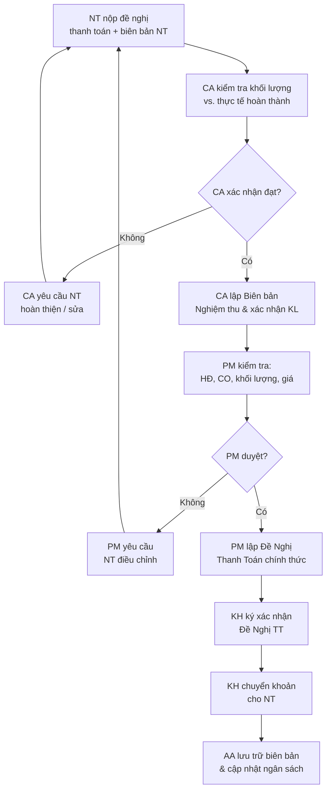

# Quản Lý Thanh Toán

> **Mã SOP:** SOP-03-007
> **Phiên bản:** 1.0
> **Ngày hiệu lực:** 2026-03-27
> **Áp dụng:** Tất cả gói dịch vụ (QTDA / TLXN / TLXN TX)

---

## 1. Mục Đích

Đảm bảo **đề nghị thanh toán cho nhà thầu và NCC** luôn gắn với kết quả nghiệm thu thực tế, đúng điều khoản HĐ, và được kiểm soát chặt chẽ để bảo vệ quyền lợi tài chính của KH.

> ⚠️ **Nguyên tắc cốt lõi:** Chỉ đề nghị thanh toán sau khi CA đã nghiệm thu và PM đã xác nhận khối lượng thực tế hoàn thành.

---

## 2. Phân Loại Thanh Toán

| Loại thanh toán                | Thời điểm                           | Người đề nghị |
| ------------------------------- | ------------------------------------ | -------------- |
| Tạm ứng khởi công              | Sau ký HĐ thi công                 | PM             |
| Thanh toán theo giai đoạn/mốc  | Sau NT hoàn thành milestone nghiệm thu | PM          |
| Thanh toán phát sinh (CO)      | Sau KH duyệt Change Order          | PM             |
| Giải phóng tạm giữ bảo hành   | Sau hết thời gian bảo hành          | PM             |

---

## 3. Sơ Đồ Quy Trình Thanh Toán



---

## 4. Chi Tiết Quy Trình

### 4.1 CA Nghiệm Thu Trước Thanh Toán

CA phải xác nhận các nội dung sau trước khi PM lập đề nghị thanh toán:

- [ ] Khối lượng hoàn thành đúng với đề nghị của NT
- [ ] Chất lượng đạt yêu cầu (không còn tồn đọng punch list từ lần này)
- [ ] Vật liệu đưa vào công trình đúng chủng loại đã thỏa thuận
- [ ] Nhật ký công trình ghi chép đầy đủ giai đoạn tương ứng
- [ ] Không có sự cố chưa xử lý xong

### 4.2 PM Kiểm Tra Đề Nghị Thanh Toán

| Nội dung kiểm tra                     | Căn cứ đối chiếu                    |
| -------------------------------------- | ------------------------------------ |
| Khối lượng & giá trị đề nghị TT      | Biên bản CA + Phụ lục HĐ           |
| Điều khoản thanh toán theo HĐ         | HĐ thi công, milestone              |
| Khấu trừ tạm giữ bảo hành (5-10%)    | Điều khoản HĐ                       |
| Khấu trừ Change Order (nếu NT nợ)    | Change Order Log                    |
| Tổng đã thanh toán trước đó           | Bảng theo dõi ngân sách (Account)  |

### 4.3 Template Đề Nghị Thanh Toán

```
ĐỀ NGHỊ THANH TOÁN — PT-[Số]
━━━━━━━━━━━━━━━━━━━━━━━━━━━━━━━━━━━━━
Dự án: [Tên KH] | Ngày: [DD/MM/YYYY]

Người đề nghị: PM [Tên]
Nhà thầu/NCC: [Tên NT]
HĐ số: [Số HĐ] | Giai đoạn thanh toán: [Đợt X]

KHỐI LƯỢNG NGHIỆM THU:
[Liệt kê hạng mục + khối lượng + đơn giá + thành tiền]

TỔNG GIÁ TRỊ ĐỀ NGHỊ:          xxx triệu đồng
Trừ tạm giữ bảo hành (X%):    -xx  triệu đồng
Tổng đã thanh toán trước:      -xxx triệu đồng
━━━━━━━━━━━━━━━━━━━━━━━━━━━━━━━
SỐ TIỀN THANH TOÁN ĐỢT NÀY:    xxx triệu đồng

Chứng từ đính kèm:
[ ] Biên bản nghiệm thu (CA ký)
[ ] Nhật ký công trình giai đoạn tương ứng
[ ] Hóa đơn / phiếu giao hàng (nếu có)

Phê duyệt:
KH (Chủ đầu tư): ________ Ngày: ________
PM (Đề nghị):   ________ Ngày: ________
```

### 4.4 Kiểm Soát Tổng Thanh Toán

Account theo dõi tổng thanh toán theo HĐ để tránh thanh toán vượt:

| Chỉ số theo dõi               | Cảnh báo khi          |
| ------------------------------ | --------------------- |
| % đã thanh toán / Tổng HĐ     | > 90% — báo PM        |
| Tổng CO đã phát sinh           | > 15% — báo BGĐ       |
| Còn lại tạm giữ bảo hành      | Kiểm tra trước giải ngân|

---

## 5. Tài Liệu Liên Quan

| Tài liệu                       | Link                                                                 |
| ------------------------------- | -------------------------------------------------------------------- |
| Quản lý thay đổi/phát sinh     | [quan-ly-thay-doi-phat-sinh.md](./quan-ly-thay-doi-phat-sinh.md)    |
| Quản lý ngân sách (Account)   | [../02-ACCOUNT/quan-ly-ngan-sach-chi-phi.md](../02-ACCOUNT/quan-ly-ngan-sach-chi-phi.md) |
| Nghiệm thu bàn giao            | [nghiem-thu-ban-giao-dong-du-an.md](./nghiem-thu-ban-giao-dong-du-an.md) |
