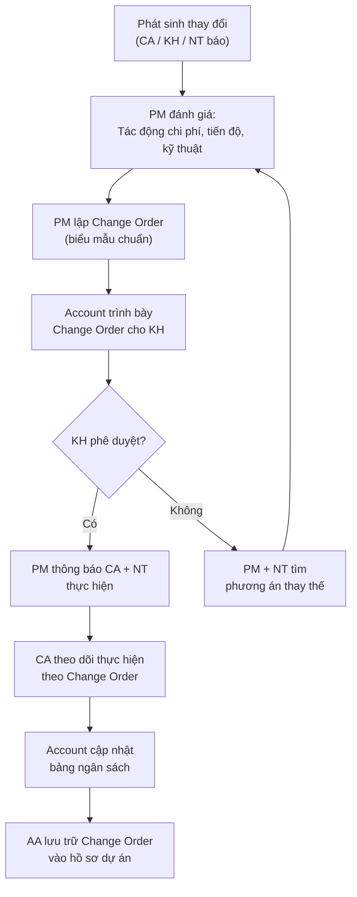

# Quản Lý Thay Đổi & Phát Sinh

> **Mã SOP:** SOP-03-006
> **Phiên bản:** 1.0
> **Ngày hiệu lực:** 2026-03-27
> **Áp dụng:** Tất cả gói dịch vụ (QTDA / TLXN / TLXN TX)

---

## 1. Mục Đích

Đảm bảo **mọi thay đổi và phát sinh** trong dự án đều được đánh giá tác động, có sự phê duyệt của KH trước khi thực hiện, và được ghi chép đầy đủ. Không có thay đổi nào được tự ý thực hiện mà không có Change Order được duyệt.

> ⚠️ **Nguyên tắc cốt lõi:** Không thực hiện bất kỳ thay đổi nào trước khi có phê duyệt bằng văn bản từ KH.

---

## 2. Phân Loại Thay Đổi & Phát Sinh

| Loại                          | Ví dụ                                                                   | Ai phát hiện         |
| ------------------------------ | ----------------------------------------------------------------------- | -------------------- |
| **Thay đổi thiết kế**         | KH muốn đổi vật liệu, thêm phòng, thay đổi mặt đứng                  | KH / Account         |
| **Phát sinh kỹ thuật**        | Đất yếu cần gia cố móng, kết cấu cũ cần thay, ẩn họa phát hiện khi đào| CA / NT              |
| **Phát sinh từ NT**           | NT báo giá thiếu hạng mục, chênh lệch vật liệu                        | NT / CA              |
| **Thay đổi yêu cầu kỹ thuật** | Thêm thiết bị điện, đổi hệ thống nước, thêm PCCC...                   | PM / CA / Account    |

---

## 3. Sơ Đồ Quy Trình



---

## 4. Quy Trình Chi Tiết

### 4.1 Đánh Giá Tác Động (PM)

Khi nhận được thông tin phát sinh, PM đánh giá:

| Câu hỏi đánh giá                          | Mục đích                              |
| ------------------------------------------ | ------------------------------------- |
| Chi phí tăng/giảm bao nhiêu?              | Cập nhật ngân sách                    |
| Tiến độ bị ảnh hưởng bao nhiêu ngày?      | Điều chỉnh Master Schedule            |
| Có ảnh hưởng đến an toàn kết cấu không?  | Quyết định ưu tiên xử lý             |
| Có phụ thuộc vào hạng mục khác không?    | Điều phối thi công                    |
| Nguyên nhân do ai? (KH / NT / khách quan)| Phân trách nhiệm chi phí              |

### 4.2 Lập Change Order

**Template Change Order bắt buộc:**

```
LỆNH THAY ĐỔI (CHANGE ORDER) — CO-[Số]
━━━━━━━━━━━━━━━━━━━━━━━━━━━━━━━━━━━━━
Dự án: [Tên KH] | Ngày: [DD/MM/YYYY]
PM: [Tên] | CA: [Tên]

MÔ TẢ THAY ĐỔI:
[Mô tả cụ thể công việc cần thêm/bớt/thay]

NGUYÊN NHÂN:
[ ] Yêu cầu từ KH
[ ] Phát sinh kỹ thuật tại CT
[ ] Lỗi thiết kế
[ ] Điều kiện địa chất bất thường
[ ] Khác: [...]

TÁC ĐỘNG TÀI CHÍNH:
- Chi phí tăng thêm: +[xxx] triệu đồng
- Chi phí giảm bớt: -[xxx] triệu đồng
- **TỔNG TÁC ĐỘNG: ± [xxx] triệu đồng**

TÁC ĐỘNG TIẾN ĐỘ:
- Tiến độ thi công: Không ảnh hưởng / Trễ [X] ngày
- Ngày bàn giao mới (nếu có): [DD/MM/YYYY]

PHÊ DUYỆT:
Chủ đầu tư (KH): ________ Ngày: ________
PM: ________ Ngày: ________
```

### 4.3 Phân Quyền Phê Duyệt Change Order

| Giá trị phát sinh      | KH phê duyệt | PM phê duyệt | BGĐ phê duyệt |
| ----------------------- | :----------: | :----------: | :-----------: |
| ≤ 5 triệu đồng         | ✅           | ✅           | —             |
| 5 - 20 triệu đồng      | ✅           | **Bắt buộc** | Thông báo     |
| > 20 triệu đồng        | ✅           | Đề nghị      | **Bắt buộc** |

> ⚠️ **Lưu ý:** Dù giá trị bao nhiêu, **KH luôn phải ký phê duyệt** trước khi thực hiện.

### 4.4 Nguyên Tắc Phân Chia Chi Phí

| Nguyên nhân phát sinh              | Ai chịu chi phí                          |
| ----------------------------------- | ----------------------------------------- |
| KH thay đổi ý muốn                 | KH chịu 100%                             |
| Lỗi thiết kế của ĐV TK             | ĐV TK chịu (theo HĐ thiết kế)           |
| Phát sinh kỹ thuật bất khả kháng   | KH chịu, NT được tính thêm              |
| Lỗi thi công của NT                 | NT chịu 100%, không tính vào CO         |
| Thay đổi theo yêu cầu pháp lý      | KH chịu                                  |

---

## 5. Theo Dõi Tất Cả Change Orders

AA duy trì **Change Order Log** trên Larksuite:

| CO số | Ngày | Mô tả | Chi phí | Trạng thái | KH ký ngày |
| ----- | ---- | ------ | ------- | ---------- | ---------- |
| CO-01 | ...  | ...    | +x tr.  | Đã duyệt   | DD/MM      |
| CO-02 | ...  | ...    | +x tr.  | Chờ KH     | —          |

> 📌 Account dùng Change Order Log này để cập nhật bảng ngân sách hàng tháng.

---

## 6. Tài Liệu Liên Quan

| Tài liệu                       | Link                                                            |
| ------------------------------- | --------------------------------------------------------------- |
| Quản lý thi công               | [quan-ly-thi-cong.md](./quan-ly-thi-cong.md)                   |
| Quản lý ngân sách (Account)   | [../02-ACCOUNT/quan-ly-ngan-sach-chi-phi.md](../02-ACCOUNT/quan-ly-ngan-sach-chi-phi.md) |
| Quản lý thanh toán             | [quan-ly-thanh-toan.md](./quan-ly-thanh-toan.md)               |
