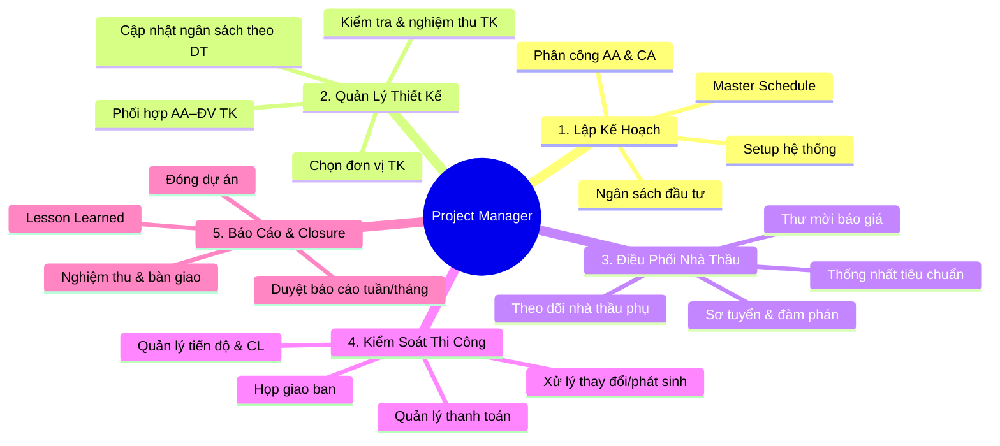

# Vai Trò, Chức Năng & KPI của Project Manager

> **Mã SOP:** SOP-03-001
> **Phiên bản:** 1.0
> **Ngày hiệu lực:** 2026-03-27
> **Áp dụng:** Tất cả gói dịch vụ (QTDA / TLXN / TLXN TX)

---

## 1. Định Nghĩa Vai Trò

**Project Manager (PM)** là người **chịu trách nhiệm vận hành tổng thể dự án**, từ khi tiếp nhận KH sau Kickoff cho đến khi đóng dự án. PM là đầu não kỹ thuật và quản lý, điều phối toàn bộ đội AA, CA và các đối tác bên ngoài (đơn vị thiết kế, nhà thầu, NCC).

> **Sứ mệnh:** Giao công trình đúng tiến độ — đúng chất lượng — đúng ngân sách. Đồng thời phối hợp với Account đảm bảo trải nghiệm KH ở mức tốt nhất.

---

## 2. Năm Nhóm Chức Năng Chính

### 2.1 Lập Kế Hoạch Dự Án

- Lập **Khái Toán Ngân Sách Xây Nhà** trong 1-2 ngày sau Kickoff
- Lập **Master Schedule** (tiến độ tổng thể) với các milestone rõ ràng
- Bổ nhiệm AA và CA phù hợp với quy mô và loại hình dự án
- Setup dự án trên Larksuite, HBSS

> 👉 Chi tiết: [lap-ke-hoach-du-an.md](./lap-ke-hoach-du-an.md)

### 2.2 Quản Lý Thiết Kế

- Lựa chọn và đàm phán HĐ với đơn vị thiết kế
- Phối hợp với AA để giám sát quá trình thiết kế
- Kiểm tra và nghiệm thu hồ sơ thiết kế
- Cập nhật ngân sách KH dựa trên dự toán ĐV TK lập

> 👉 Chi tiết: [quan-ly-thiet-ke.md](./quan-ly-thiet-ke.md)

### 2.3 Điều Phối Nhà Thầu & NCC

- Phát hành thư mời báo giá, sơ tuyển nhà thầu
- Đàm phán điều khoản HĐ thi công, bảo vệ quyền lợi KH
- Thống nhất tiêu chuẩn và quy trình kiểm tra với NT
- Điều phối nhà thầu phụ và NCC trong suốt Phase 4

> 👉 Chi tiết: [lua-chon-nha-thau.md](./lua-chon-nha-thau.md)

### 2.4 Kiểm Soát Thi Công

- Chủ trì họp giao ban công trường hàng tuần
- Theo dõi tiến độ qua báo cáo của CA, xử lý lệch tiến độ
- Phê duyệt mọi thay đổi/phát sinh (Change Order)
- Quản lý đề nghị thanh toán nhà thầu theo điều kiện nghiệm thu

> 👉 Chi tiết: [quan-ly-thi-cong.md](./quan-ly-thi-cong.md), [quan-ly-thay-doi-phat-sinh.md](./quan-ly-thay-doi-phat-sinh.md), [quan-ly-thanh-toan.md](./quan-ly-thanh-toan.md)

### 2.5 Báo Cáo & Đóng Dự Án

- **Duyệt** báo cáo tuần/tháng do CA/AA soạn trước khi gửi KH
- Tổ chức họp nội bộ review tháng với team
- Nghiệm thu công trình, xử lý punch list, bàn giao KH
- Thực hiện Lesson Learned và đóng dự án chính thức

> 👉 Chi tiết: [bao-cao-review-dinh-ky.md](./bao-cao-review-dinh-ky.md), [nghiem-thu-ban-giao-dong-du-an.md](./nghiem-thu-ban-giao-dong-du-an.md)

---

## 3. Ranh Giới Trách Nhiệm PM vs Các Bộ Phận

| Lĩnh vực              | PM                                        | Account                          | AA                           | CA                             |
| ---------------------- | ----------------------------------------- | -------------------------------- | ---------------------------- | ------------------------------ |
| **Giao tiếp KH**      | Kỹ thuật & quyết định vận hành           | Quan hệ & cảm xúc KH           | —                            | —                              |
| **Ngân sách**          | Phê duyệt & kiểm soát tổng (**A**)       | Theo dõi & cung cấp DL (**R**)  | Hỗ trợ nhập liệu (**S**)   | —                              |
| **Báo cáo KH**        | Duyệt nội dung (**A**)                   | Cung cấp DL (**I**)             | Soạn & gửi (**R**)          | Cung cấp DL công trường (**R**)|
| **Thiết kế**           | Phê duyệt lựa chọn ĐV TK, nghiệm thu TK | —                                | Phối hợp, kiểm tra (**R**)  | —                              |
| **Thi công**           | Điều phối tổng thể (**R**)               | —                                | Hỗ trợ hành chính            | Giám sát hiện trường (**R**)  |
| **Thay đổi/PS**        | Đánh giá & phê duyệt (**R**)             | Informed (**I**)                 | Cập nhật hồ sơ (**S**)      | Báo cáo phát sinh (**R**)     |
| **Chất lượng CL**     | Accountable (**A**)                       | —                                | Kiểm tra hồ sơ               | Kiểm tra hiện trường (**R**)  |
| **Nhà thầu/NCC**      | Chọn lựa & quản lý HĐ (**R**)           | Hỗ trợ KH chọn lọc (**S**)     | —                            | Điều phối hàng ngày (**S**)   |

---

## 4. Ma Trận RACI PM Theo Phase

| Phase                | PM Role      | Hoạt động chính                                                       |
| -------------------- | :----------: | ---------------------------------------------------------------------- |
| **Phase 1: Kickoff** | **R**        | Tiếp nhận dự án, Kickoff, lập ngân sách + kế hoạch, phân công AA/CA   |
| **Phase 2: TK**      | **A/R**      | Chọn ĐV TK, giám sát phối hợp, nghiệm thu TK, cập nhật ngân sách     |
| **Phase 3: Chọn NT** | **R**        | Thư mời BG, sơ tuyển, đàm phán, ký HĐ, thống nhất tiêu chuẩn         |
| **Phase 4: TC**      | **A/R**      | Họp giao ban, theo dõi CL/TD, Change Order, thanh toán NT, escalation |
| **Phase 5: NTBG**    | **R**        | Nghiệm thu tổng thể, punch list, bàn giao công trình + hồ sơ          |
| **Phase 6: BH**      | **R/C**      | Đánh giá NT, Lesson Learned, đóng dự án                               |

> 📌 Chi tiết đầy đủ: [../00-TONG-QUAN/ma-tran-RACI.md](../00-TONG-QUAN/ma-tran-RACI.md)

---

## 5. KPI Đo Lường Hiệu Suất PM

| KPI                                    | Mục tiêu           | Tần suất đo  | Nguồn dữ liệu             |
| --------------------------------------- | ------------------- | ------------- | -------------------------- |
| Tỷ lệ dự án bàn giao đúng hạn         | ≥ 90%              | Mỗi DA        | Larksuite milestone        |
| Sai lệch ngân sách tổng               | ≤ 10%              | Hàng tháng    | Bảng ngân sách             |
| Số lần escalation lên BGĐ/tháng       | ≤ 1                | Hàng tháng    | Log escalation             |
| Báo cáo tuần gửi KH đúng hạn         | 100%               | Hàng tuần     | Log gửi báo cáo            |
| Tỷ lệ Change Order được KH duyệt      | ≥ 95%              | Mỗi DA        | Log Change Order           |
| Scorecard KH trung bình (nội bộ)      | ≥ 4.0 / 5.0        | Hàng tháng    | Scorecard từ Account       |
| Số sự cố chất lượng nghiêm trọng      | 0                  | Mỗi DA        | Báo cáo CA                 |
| Thời gian giải quyết Ticket P1         | ≤ 24h              | Realtime      | Larksuite Ticket           |

---

## 6. Quyền Hạn của PM

| Quyết định                         | PM có quyền       | Phải xin phép BGĐ              |
| ----------------------------------- | :----------------: | :-----------------------------: |
| Bổ nhiệm/thay đổi AA/CA            | ✅                 | —                               |
| Phê duyệt Change Order ≤ 20 triệu  | ✅                 | —                               |
| Phê duyệt Change Order > 20 triệu  | —                  | ✅ BGĐ + KH                    |
| Yêu cầu NT dừng thi công           | ✅                 | Thông báo BGĐ trong 1h         |
| Chấm dứt HĐ nhà thầu               | —                  | ✅ BGĐ + Pháp lý               |
| Phê duyệt đề nghị thanh toán NT    | ✅ (đề nghị)      | BGĐ ký duyệt cuối              |
| Escalation vấn đề KH               | ✅                 | —                               |

---

## 7. Tài Liệu Liên Quan

| Tài liệu              | Link                                                               |
| ---------------------- | ------------------------------------------------------------------ |
| Flow tổng thể dự án  | [../00-TONG-QUAN/flow-tong-the-du-an.md](../00-TONG-QUAN/flow-tong-the-du-an.md) |
| Ma trận RACI          | [../00-TONG-QUAN/ma-tran-RACI.md](../00-TONG-QUAN/ma-tran-RACI.md) |
| SOP Account Manager   | [../02-ACCOUNT/vai-tro-trach-nhiem.md](../02-ACCOUNT/vai-tro-trach-nhiem.md) |
| Escalation nội bộ     | [../07-PHOI-HOP-NOI-BO/escalation-noi-bo.md](../07-PHOI-HOP-NOI-BO/escalation-noi-bo.md) |
