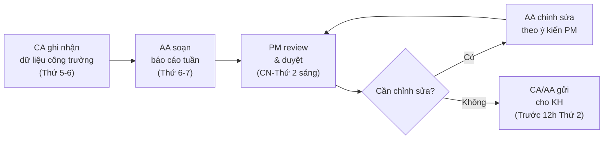

# Báo Cáo & Review Định Kỳ

> **Mã SOP:** SOP-04-008
> **Phiên bản:** 1.0
> **Ngày hiệu lực:** 2026-03-27
> **Áp dụng:** Tất cả gói dịch vụ (QTDA / TLXN / TLXN TX)

---

## 1. Mục Đích

Đảm bảo KH được cập nhật **đúng hạn, đầy đủ và chuyên nghiệp**. PM chịu trách nhiệm **duyệt nội dung** tất cả báo cáo trước khi gửi KH. CA/AA là người soạn và gửi.

> **Phân chia trách nhiệm rõ ràng:**
> - **CA:** Cung cấp dữ liệu thi công thực tế từ công trường
> - **AA:** Soạn báo cáo tuần/tháng theo template chuẩn
> - **PM:** Duyệt nội dung, chỉnh sửa nếu cần và ký duyệt
> - **CA/AA:** Gửi báo cáo đến KH sau khi PM duyệt
> - **Account:** Cung cấp dữ liệu chi phí, Ticket, Scorecard để AA bổ sung vào báo cáo tháng

---

## 2. Hệ Thống Báo Cáo

| Loại          | Tần suất       | Soạn bởi | Duyệt bởi | Gửi bởi | Deadline gửi KH |
| -------------- | -------------- | --------- | ---------- | -------- | ---------------- |
| Báo cáo tuần  | Hàng tuần      | AA (dữ liệu từ CA) | PM | CA/AA  | Trước 12h Thứ 2 |
| Báo cáo tháng | Hàng tháng     | AA (tổng hợp) | PM      | CA/AA    | Trước ngày 5/tháng |
| Báo cáo mốc  | Khi có sự kiện | AA        | PM         | CA/AA    | Trong ngày sự kiện |
| Báo cáo khẩn  | Khi sự cố     | PM/CA     | PM         | PM       | Trong 2h sự kiện |

---

## 3. Quy Trình Báo Cáo Tuần



### Template Báo Cáo Tuần:

```
BÁO CÁO TUẦN — DỰ ÁN [TÊN KH]
Tuần: [Số] | Từ [DD] đến [DD/MM/YYYY]
━━━━━━━━━━━━━━━━━━━━━━━━━━━━━━━━━━━━━

📊 TIẾN ĐỘ TỔNG THỂ
- Tiến độ theo kế hoạch: [X]%
- Tiến độ thực tế: [X]%
- Trạng thái: ✅ Đúng hạn / ⚠️ Trễ X ngày / 🔴 Nguy cơ cao

🔨 CÔNG VIỆC HOÀN THÀNH TRONG TUẦN
- [Hạng mục 1]: Hoàn thành [X]% — Chi tiết: [...]
- [Hạng mục 2]: [...]

📅 KẾ HOẠCH TUẦN TỚI
- [Hạng mục 1]: [Mô tả công việc dự kiến]
- [Hạng mục 2]: [...]

⚠️ VẤN ĐỀ PHÁT SINH (nếu có)
- [Vấn đề]: [Hành động đã/sẽ xử lý]

🖼 HÌNH ẢNH CÔNG TRÌNH TUẦN NÀY
[Đính kèm 3-5 ảnh đại diện]

Báo cáo bởi: CA [Tên] | Duyệt: PM [Tên]
```

---

## 4. Quy Trình Báo Cáo Tháng

Báo cáo tháng toàn diện hơn, bao gồm:
- Tất cả nội dung của báo cáo tuần (tổng hợp tháng)
- Chi phí thực tế tháng & tổng lũy kế (Account cung cấp)
- Scorecard & Ticket tháng (Account cung cấp)
- Kế hoạch tháng tới
- Cập nhật Change Order (nếu có)

### Template Báo Cáo Tháng — Phần Bổ Sung:

```
BÁO CÁO THÁNG [MM/YYYY] — DỰ ÁN [TÊN KH]
━━━━━━━━━━━━━━━━━━━━━━━━━━━━━━━━━━━━━

[... (nội dung báo cáo tuần mở rộng) ...]

💰 TÌNH HÌNH TÀI CHÍNH THÁNG [MM]
- Ngân sách đầu tư KH: xxx triệu
- Đã giải ngân lũy kế: xxx triệu (xx%)
- Giải ngân trong tháng: +xx triệu
- Còn lại ước tính: xxx triệu
- Trạng thái ngân sách: 🟢/🟡/🟠/🔴

📋 TICKET & PHẢN HỒI THÁNG [MM]
- Tổng Ticket phát sinh: [X]
- Đã giải quyết: [X] | Đang xử lý: [X]
- Thời gian xử lý TB: [X]h

⭐ SCORECARD THÁNG (nếu có kết quả)
- Điểm tháng: [X.X/5.0]
- Tiêu chí thấp nhất: [...]
- Hành động cải thiện: [...]

Báo cáo bởi: AA [Tên] | Duyệt: PM [Tên]
```

---

## 5. Họp Review Nội Bộ Tháng (PM + AA + CA)

Cuối mỗi tháng thi công, PM tổ chức họp nội bộ để review:

| Nội dung                         | Mục đích                                  |
| --------------------------------- | ----------------------------------------- |
| Review tiến độ tháng qua         | Phát hiện nguyên nhân trễ/vấn đề CL      |
| Review Scorecard & Ticket        | Cải thiện chất lượng dịch vụ             |
| Review ngân sách                | Kiểm soát rủi ro tài chính               |
| Lesson Learned tháng            | Chia sẻ kinh nghiệm giữa team            |
| Kế hoạch tháng tới              | Phân công rõ ràng cho AA + CA            |

---

## 6. Tài Liệu Liên Quan

| Tài liệu                     | Link                                                             |
| ----------------------------- | ---------------------------------------------------------------- |
| Báo cáo định kỳ (Account)   | [../05-ACCOUNT/bao-cao-dinh-ky-cho-kh.md](../05-ACCOUNT/bao-cao-dinh-ky-cho-kh.md) |
| Quản lý thi công             | [quan-ly-thi-cong.md](./quan-ly-thi-cong.md)                   |
| Nghiệm thu bàn giao          | [nghiem-thu-ban-giao-dong-du-an.md](./nghiem-thu-ban-giao-dong-du-an.md) |
