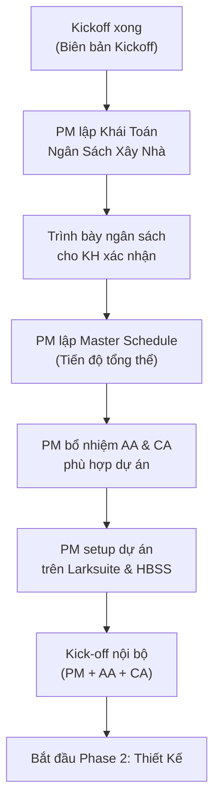

# Lập Kế Hoạch Dự Án

> **Mã SOP:** SOP-04-002
> **Phiên bản:** 1.0
> **Ngày hiệu lực:** 2026-03-27
> **Áp dụng:** Tất cả gói dịch vụ (QTDA / TLXN / TLXN TX)

---

## 1. Mục Đích

Đảm bảo sau Kickoff, PM thiết lập ngay **nền tảng vận hành dự án**: ngân sách khái toán, kế hoạch tổng thể, nhân sự và hệ thống theo dõi — giúp toàn bộ team và KH có cùng một bức tranh rõ ràng từ ngày đầu tiên.

---

## 2. Sơ Đồ Quy Trình

---

## 3. Các Bước Chi Tiết

### 3.1 Lập Khái Toán Ngân Sách Xây Nhà (1-2 ngày sau Kickoff)

PM lập bảng Khái Toán để KH biết rõ **tổng mức đầu tư** cần chuẩn bị. Đây là tài liệu tài chính quan trọng nhất ở giai đoạn đầu.

> 🔴 **Nguyên tắc bắt buộc:**
> 1. Khái toán phải **bám theo dữ liệu từ Form Requirement** khách hàng đã cung cấp trước đó (loại hình nhà, diện tích, số tầng, phong cách, ngân sách dự kiến, yêu cầu đặc biệt...)
> 2. Sử dụng **Form Khái Toán chuẩn của công ty** — xem [form-khai-toan-ngan-sach.md](../10-BIEU-MAU-TEMPLATE/form-khai-toan-ngan-sach.md)

| Bước | Hành động                                                    | Ai            | Deadline           |
| ---- | ------------------------------------------------------------- | ------------- | ------------------ |
| 1    | **Đọc kỹ Form Requirement** của KH — đối chiếu từng mục yêu cầu | PM            | Ngay sau Kickoff   |
| 2    | Điền vào **Form Khái Toán chuẩn** — bám sát thông tin từ Form Requirement + kinh nghiệm PM | PM            | 1 ngày sau Kickoff |
| 3    | Account review để bổ sung mong muốn/lo ngại của KH, đối chiếu ngân sách KH dự kiến | PM + Account  | 1 ngày sau Kickoff |
| 4    | Trình bày Khái Toán cho KH (qua Zalo hoặc họp nhanh)        | PM + Account  | 2 ngày sau Kickoff |
| 5    | KH xác nhận ngân sách ban đầu                                | KH            | Trong tuần đầu     |
| 6    | Account + AA tạo bảng theo dõi ngân sách trên Larksuite/Excel| Account + AA  | Trong tuần đầu     |

> **Cấu trúc bảng Khái Toán Ngân Sách Xây Nhà** (theo Form chuẩn công ty):
>
> | Phần | Ví dụ các hạng mục | Nguồn dữ liệu |
> |------|-------------------|----------------|
> | **A. Trước khi khởi công** | Trợ Lý Xây Nhà, Thiết kế, Dự toán, Khảo sát địa chất, Giấy phép XD, Bảo hiểm CT, ... | Gói DV KH chọn, loại hình CT |
> | **B. Trong khi xây nhà** | Xây thô, Hoàn thiện GĐ1, Nội thất, Thang máy, Thiết bị điện tử, Công nghệ thông minh, ... | Diện tích sàn, số tầng, phong cách, yêu cầu đặc biệt từ Form |
> | **C. Sau khi xây nhà** | Hoàn công, Hoạt động tâm linh, Cảnh quan, ... | Yêu cầu KH |
>
> 👉 **Form chi tiết:** [form-khai-toan-ngan-sach.md](../10-BIEU-MAU-TEMPLATE/form-khai-toan-ngan-sach.md)

> ⚠️ **Lưu ý:** Đây là con số **ước tính ban đầu** dựa trên Form Requirement + kinh nghiệm PM. Sẽ được cập nhật chính xác hơn sau khi đơn vị thiết kế lập Dự Toán chi tiết (Phase 2). Mục "So Sánh Với Ngân Sách KH" trong Form giúp PM phát hiện sớm nếu kỳ vọng KH chênh lệch quá lớn so với thực tế.

---

### 3.2 Lập Master Schedule — Tiến Độ Tổng Thể

| Bước | Hành động                                               | Ai    | Output                |
| ---- | --------------------------------------------------------- | ----- | --------------------- |
| 1    | Xác nhận timeline tổng thể dự án (ngày KH muốn hoàn thành)| PM  | Timeline mong muốn    |
| 2    | Lập các milestone chính theo 6 Phase                     | PM    | Master Schedule draft |
| 3    | Tính ngược từ ngày hoàn thành để biết cần bắt đầu TK khi nào | PM | Ngày bắt đầu TK      |
| 4    | Xác nhận với KH về Master Schedule                        | PM    | KH ký xác nhận        |
| 5    | Upload lên Larksuite, share với toàn team                 | AA    | Schedule trên LS      |

**Các milestone bắt buộc trong Master Schedule:**

| Milestone                  | Phase    | Ví dụ tham chiếu    |
| -------------------------- | -------- | ------------------- |
| Ký HĐ Thiết kế            | Phase 2  | Tuần 2              |
| KH duyệt TK hoàn chỉnh    | Phase 2  | Tuần 12             |
| Ký HĐ Thi công            | Phase 3  | Tuần 14             |
| Khởi công                  | Phase 4  | Tuần 16             |
| Cất nóc (xong phần khung) | Phase 4  | Tuần 30             |
| Hoàn thiện xong            | Phase 4  | Tuần 48             |
| Bàn giao công trình        | Phase 5  | Tuần 52             |

> 📡 **TLXN TX:** Master Schedule cần bổ sung các mốc kiểm tra từ xa, tần suất họp online.

---

### 3.3 Bổ Nhiệm AA & CA

PM chọn nhân sự phù hợp dựa trên:

| Tiêu chí                          | Ghi chú                                              |
| ---------------------------------- | ---------------------------------------------------- |
| Quy mô công trình (nhỏ/vừa/lớn)  | CT lớn cần AA + CA có kinh nghiệm                   |
| Loại hình (nhà phố/biệt thự/...)  | Phân loại theo loại CA chuyên hóa                   |
| Gói dịch vụ (QTDA/TLXN/TLXN TX)  | TLXN TX không cần CA hiện trường                    |
| Tải công việc hiện tại của AA/CA  | Tránh quá tải (tối đa 3-4 DA/người)                 |

Sau khi bổ nhiệm:

| Bước | Hành động                                     | Thời hạn       |
| ---- | --------------------------------------------- | -------------- |
| 1    | Thông báo chính thức cho AA & CA được chọn   | Trong ngày     |
| 2    | Gửi hồ sơ dự án để AA/CA đọc trước           | Trong ngày     |
| 3    | Account giới thiệu AA/CA với KH qua Zalo     | Trong ngày     |
| 4    | Họp kick-off nội bộ: PM + AA + CA            | Trong 2 ngày   |

---

### 3.4 Họp Kick-off Nội Bộ (PM + AA + CA)

Agenda bắt buộc:

- [ ] Tổng quan dự án: KH là ai, công trình như thế nào, timeline
- [ ] Phân công trách nhiệm cụ thể cho AA và CA
- [ ] Thống nhất tiêu chuẩn chất lượng áp dụng
- [ ] Thống nhất quy trình báo cáo (CA → PM, tần suất, format)
- [ ] Thống nhất quy trình xử lý phát sinh (ai báo ai, trong bao lâu)
- [ ] Cài đặt HBSS và hướng dẫn sử dụng (nếu chưa)

---

### 3.5 Setup Dự Án Trên Hệ Thống (PM thực hiện)

Ngay sau khi Kickoff, PM là người trực tiếp xây dựng cấu trúc hệ thống lưu trữ ban đầu để các bộ phận khác (AA, CA, Account) có một nơi chuẩn xác để upload/cập nhật biên bản, hồ sơ. PM có chức năng định kỳ kiểm tra (Audit) mức độ đầy đủ của những dữ liệu này.

| Hạng mục              | Công cụ         | Nội dung                                               |
| ---------------------- | --------------- | ------------------------------------------------------- |
| Folder hồ sơ dự án   | Larksuite Docs  | PM tạo cấu trúc folder chuẩn theo template. Sau đó báo cho AA/CA/Account vào upload tài liệu. |
| Bảng theo dõi ngân sách | Larksuite Sheet | Bảng Khái toán + base để Account theo dõi chi phí thực tế. |
| Master Schedule        | Larksuite/Excel | Timeline milestone toàn dự án                          |
| HBSS (nếu dùng)       | HBSS            | Tạo tài khoản KH, nhà thầu; setup checklist 69 CV     |
| Nhóm Zalo nội bộ      | Zalo            | PM + AA + CA (tách riêng với nhóm KH)                  |
| Log Ticket nội bộ     | Larksuite       | Sheet theo dõi Ticket, SLA, trạng thái xử lý          |

---

## 4. Checklist Hoàn Thành Giai Đoạn Lập Kế Hoạch

- [ ] Khái Toán Ngân Sách đã trình bày và KH xác nhận
- [ ] Master Schedule đã lập và upload Larksuite
- [ ] AA & CA đã được bổ nhiệm và thông báo
- [ ] KH đã được giới thiệu với AA/CA
- [ ] Họp kick-off nội bộ đã diễn ra
- [ ] Folder Larksuite đã setup đầy đủ
- [ ] HBSS đã cài đặt và hướng dẫn KH (nếu áp dụng)

---

## 5. Tài Liệu Liên Quan

| Tài liệu                    | Link                                                                             |
| ---------------------------- | -------------------------------------------------------------------------------- |
| Quản lý ngân sách (Account) | [../05-ACCOUNT/quan-ly-ngan-sach-chi-phi.md](../05-ACCOUNT/quan-ly-ngan-sach-chi-phi.md) |
| Họp Kickoff                  | [../01-PHOI-HOP-SALE-QLDA/hop-kickoff-du-an.md](../01-PHOI-HOP-SALE-QLDA/hop-kickoff-du-an.md) |
| Quản lý thiết kế            | [quan-ly-thiet-ke.md](./quan-ly-thiet-ke.md)                                    |
