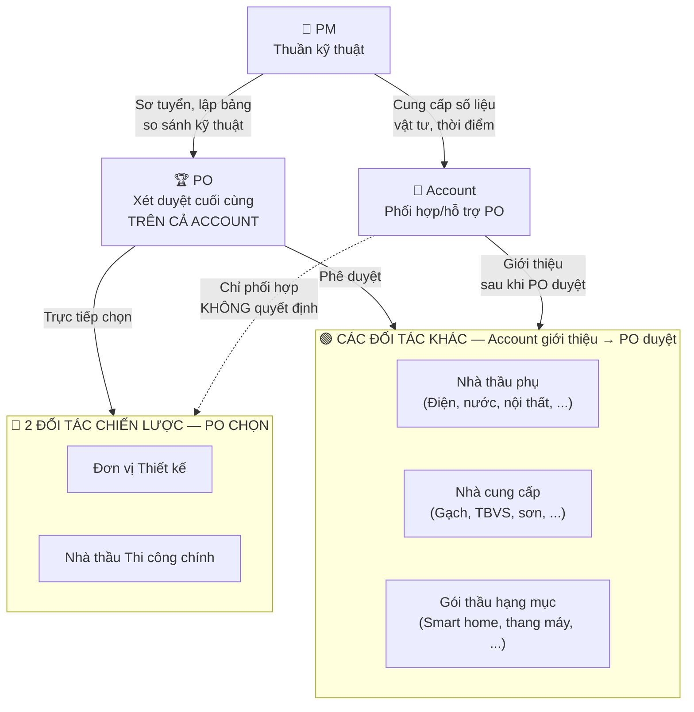
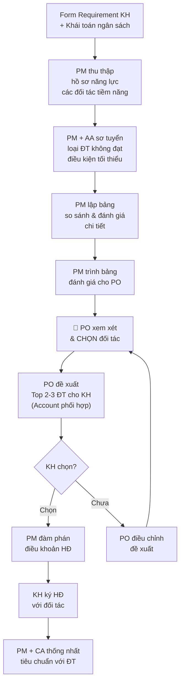
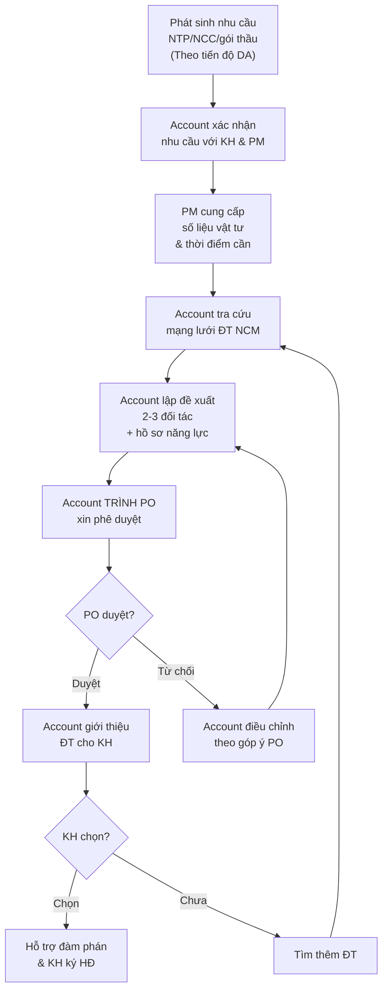

# Lựa Chọn Nhà Thầu & Đối Tác Cho Công Trình

> **Mã SOP:** SOP-04-004
> **Phiên bản:** 2.0
> **Ngày hiệu lực:** 2026-03-28
> **Áp dụng:** Tất cả gói dịch vụ (QTDA / TLXN / TLXN TX)

---

## 1. Mục Đích

Đảm bảo công trình KH được đề xuất **đối tác phù hợp nhất** — từ đơn vị thiết kế, nhà thầu thi công chính, đến nhà thầu phụ và NCC. Quy trình lựa chọn đảm bảo:
- **PO xét duyệt cuối cùng** mọi đề xuất đối tác cho KH
- **2 đối tác chiến lược** (Thiết kế + Nhà thầu TC chính) do **PO trực tiếp chọn**
- **PM hỗ trợ kỹ thuật** thuần túy: sơ tuyển, so sánh, cung cấp số liệu cho Account
- **Account phối hợp, hỗ trợ PO** — không tham gia quyết định 2 đối tác chiến lược

---

## 2. Phân Quyền Rõ Ràng

| Vai trò | 2 ĐT Chiến lược (TK + NT chính) | Đối tác khác (NTP, NCC, gói thầu) |
|---------|--------------------------------|----------------------------------|
| **PO** | **Trực tiếp chọn & đề xuất KH** | **Phê duyệt** đề xuất từ Account |
| **Account** | Phối hợp, hỗ trợ PO. **KHÔNG tham gia quyết định** | Giới thiệu đối tác — **SAU KHI PO duyệt** mới đề xuất KH |
| **PM** | Sơ tuyển, lập bảng so sánh, đánh giá kỹ thuật | Cung cấp số liệu vật tư, thời điểm cần cho **Account**. Góp ý kỹ thuật |
| **KH** | Quyết định cuối cùng (ký HĐ) | Quyết định cuối cùng (ký HĐ) |

> ⚠️ **Nguyên tắc cốt lõi:** Việc chọn đơn vị thiết kế và nhà thầu thi công chính **quyết định thành công của công trình**. Đây là lý do PO phải trực tiếp chọn — Account chỉ phối hợp, hỗ trợ.

---

## 3. Quy Trình Chọn 2 Đối Tác Chiến Lược

### 3.1 Sơ Đồ Quy Trình

### 3.2 Chi Tiết Từng Bước

#### Bước 1: Thu Thập Hồ Sơ Năng Lực

PM phối hợp AA thu thập hồ sơ từ mạng lưới đối tác NCM + nguồn bên ngoài:

| Tài liệu cần thu thập | Người chuẩn bị | Ghi chú |
|----------------------|---------------|---------|
| Hồ sơ năng lực (portfolio) | Đối tác cung cấp | ≥ 3 đối tác để so sánh |
| Bảng giá tham khảo | Đối tác cung cấp | Dựa trên scope công trình |
| Lịch sử dự án tương tự | PM tra cứu + Đối tác | Rating từ DA cũ của NCM |
| Đánh giá tài chính | PM | Kiểm tra nợ xấu, tranh chấp |

#### Bước 2: Sơ Tuyển

PM loại ngay những ĐT không đáp ứng điều kiện tối thiểu:

| Tiêu chí | Mức tối thiểu |
|---------|--------------|
| Pháp lý | Đăng ký kinh doanh, GPXD còn hạn |
| Năng lực nhân sự | Có KS công trình & đội thợ chính |
| Kinh nghiệm tương tự | ≥ 3 công trình cùng loại hình |
| Tình hình tài chính | Không có nợ xấu, không tranh chấp |
| Sức chịu tải | Không đang quá tải DA khác |

#### Bước 3: Đánh Giá Chi Tiết

AA lập **Bảng So Sánh** theo tiêu chí:

| Tiêu chí đánh giá | Trọng số | Cách tính điểm |
|-------------------|:--------:|----------------|
| Tổng giá trị báo giá | 35% | Điểm nghịch chiều với giá |
| Kinh nghiệm & Hồ sơ năng lực | 25% | 1-5 điểm |
| Tiến độ cam kết | 20% | Sát với yêu cầu KH |
| Điều khoản bảo hành | 10% | Thời gian & phạm vi BH |
| Uy tín & Tham chiếu | 10% | Phản hồi từ DA cũ |

#### Bước 4: PO Chọn & Đề Xuất KH

| Hành động | Ai | Ghi chú |
|----------|-----|---------|
| PM trình bảng đánh giá + khuyến nghị kỹ thuật | PM → PO | Kèm phân tích ưu/nhược |
| **PO xem xét & chọn đối tác** | **PO** | Có quyền chọn khác khuyến nghị PM |
| PO đề xuất Top 2-3 ĐT cho KH | PO → KH | Account phối hợp truyền đạt |
| KH xem xét & quyết định | KH | KH có tiếng nói cuối cùng |

> ⚠️ **Account KHÔNG được tham gia vào việc quyết định đề xuất 2 đối tác chiến lược này cho KH.** Account chỉ phối hợp, hỗ trợ PO trong quá trình truyền đạt thông tin.

### 3.3 Đàm Phán HĐ (Sau Khi KH Chọn)

Các điều khoản bắt buộc PM kiểm tra trước khi ký:

| Điều khoản | Yêu cầu |
|-----------|---------|
| **Phạm vi công việc** | Liệt kê chi tiết công việc & vật liệu ĐT cung cấp |
| **Đơn giá & Tổng giá trị** | Tách rõ vật tư + nhân công; có điều khoản thay đổi giá |
| **Tiến độ** | Milestone chi tiết, penalty khi trễ tiến độ |
| **Phương thức thanh toán** | Theo milestone nghiệm thu (không trả 100% trước) |
| **Tạm giữ bảo hành** | Giữ lại 5-10% giá trị HĐ đến hết bảo hành |
| **Thời hạn bảo hành** | Tối thiểu 12 tháng (phần kết cấu dài hơn) |
| **Quyền đình chỉ** | KH/PM có quyền yêu cầu dừng nếu vi phạm CL |
| **Phạt vi phạm** | Rõ mức phạt/ngày trễ |
| **Giải quyết tranh chấp** | Phương án hòa giải, sau đó Tòa án |

> ⚠️ **Nguyên tắc minh bạch:** PM không nhận hoa hồng hay lợi ích vật chất từ đối tác. Quyết định cuối thuộc về KH.

### 3.4 Thống Nhất Tiêu Chuẩn (Sau Ký HĐ)

**PM + CA** tổ chức buổi thống nhất với đại diện đối tác:

- [ ] Tiêu chuẩn chất lượng vật liệu cho từng hạng mục
- [ ] Quy trình kiểm tra trước khi đổ bê tông / che khuất
- [ ] Yêu cầu nhật ký công trình (ghi chép hàng ngày)
- [ ] Quy định báo cáo cho CA: tần suất, format, kênh
- [ ] Quy định về an toàn lao động trên công trường
- [ ] Quy trình xử lý phát sinh: báo PM trước, không tự làm
- [ ] Phân quyền: chỉ CA/PM mới có quyền chấp thuận thay đổi

> 📌 Sau buổi thống nhất, AA lập **Biên Bản Thống Nhất** được ký bởi PM + Đại diện ĐT.

---

## 4. Quy Trình Chọn Đối Tác Khác (NTP, NCC, Gói Thầu)

### 4.1 Sơ Đồ

### 4.2 Vai Trò PM Hỗ Trợ Account

PM cung cấp dữ liệu kỹ thuật cho **Account** — Account cần thông tin này để đưa đối tác vào công trình cho phù hợp:

| Dữ liệu PM cung cấp | Account dùng để |
|----------------------|------------------|
| Số liệu vật tư cần dùng | Tìm đối tác phù hợp scope |
| Thời điểm cần vật tư | Đưa đối tác vào đúng thời điểm |
| Yêu cầu kỹ thuật chi tiết | Lọc đối tác đáp ứng yêu cầu |
| Tiến độ thi công liên quan | Phối hợp đối tác kịp tiến độ |

> Mục tiêu: **Đúng người — Đúng vật tư — Đúng thời gian cần thiết**

---

## 5. Lập Tiến Độ Thi Công Chi Tiết (Sau Ký HĐ)

| Bước | Hành động | Ai |
|------|----------|-----|
| 1 | NT nộp tiến độ chi tiết theo mẫu yêu cầu | NT |
| 2 | PM + CA review tiến độ (tính khả thi, đủ thông tin) | PM + CA |
| 3 | Điều chỉnh tiến độ nếu cần | NT + PM |
| 4 | PM xác nhận tiến độ chính thức | PM |
| 5 | AA upload tiến độ lên Larksuite + HBSS | AA |

---

## 6. Tài Liệu Liên Quan

| Tài liệu | Link |
|----------|------|
| Phê duyệt đối tác (PO) | [../02-PO/phe-duyet-doi-tac.md](../02-PO/phe-duyet-doi-tac.md) |
| Hỗ trợ chọn NTP/NCC (Account) | [../05-ACCOUNT/ho-tro-lua-chon-thau-phu-ncc.md](../05-ACCOUNT/ho-tro-lua-chon-thau-phu-ncc.md) |
| Quản lý thi công | [quan-ly-thi-cong.md](./quan-ly-thi-cong.md) |
| Quản lý thanh toán | [quan-ly-thanh-toan.md](./quan-ly-thanh-toan.md) |
