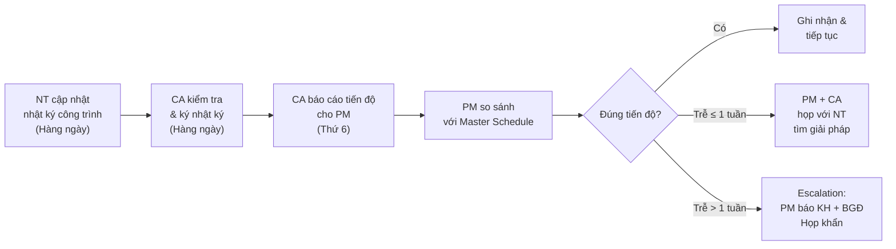
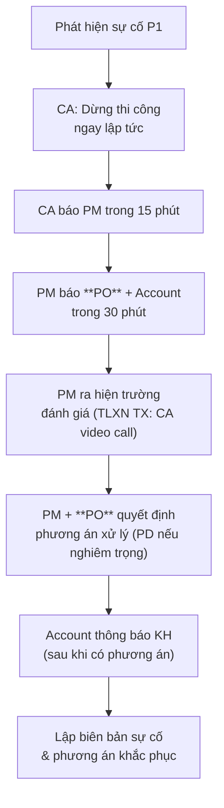

# Quản Lý Thi Công

> **Mã SOP:** SOP-04-005
> **Phiên bản:** 1.0
> **Ngày hiệu lực:** 2026-03-27
> **Áp dụng:** Tất cả gói dịch vụ (QTDA / TLXN / TLXN TX)

---

## 1. Mục Đích

Đảm bảo PM kiểm soát hiệu quả **tiến độ, chất lượng và nhân sự thi công** trong toàn bộ giai đoạn xây dựng. PM điều phối qua CA (trực tiếp tại công trường) và họp giao ban hàng tuần.

---

## 2. Lịch Vận Hành Hàng Tuần của PM

| Ngày        | Hoạt động của PM                                                    |
| ------------ | -------------------------------------------------------------------- |
| **Thứ 2**   | Nhận báo cáo tuần trước từ CA; review và assign công việc tuần mới |
| **Thứ 3-4** | Xử lý Change Order, đàm phán phát sinh, theo dõi kỹ thuật          |
| **Thứ 5**   | Họp giao ban công trường (với CA + NT)                              |
| **Thứ 6**   | CA tổng hợp báo cáo tuần → gửi cho CA/AA soạn để PM duyệt          |
| **Thứ 7/CN**| PM duyệt báo cáo → CA/AA chỉnh sửa → gửi KH trước 12h thứ 2       |

---

## 3. Họp Giao Ban Công Trường (Hàng Tuần)

### Thành phần tham dự
- **Bắt buộc:** PM + CA
- **Khi cần:** Đại diện Nhà thầu chính, Nhà thầu phụ, Account

### Quy Trình Họp Giao Ban

| Bước | Nội dung                                          | Thời gian |
| ---- | -------------------------------------------------- | --------- |
| 1    | CA báo cáo tiến độ thực tế vs. kế hoạch          | 10 phút   |
| 2    | CA báo cáo chất lượng: hạng mục nghiệm thu trong tuần | 10 phút |
| 3    | Thảo luận vấn đề phát sinh, thay đổi             | 15 phút   |
| 4    | PM quyết định xử lý các vấn đề                   | 10 phút   |
| 5    | PM giao nhiệm vụ tuần tiếp theo cho CA + NT      | 10 phút   |
| 6    | AA ghi biên bản, phân công theo dõi               | 5 phút    |

> 📡 **TLXN TX:** Họp online qua video call. CA mang tablet vào công trường cho PM thấy thực tế. Biên bản ghi đầy đủ.

### Agenda Mẫu

```
BIÊN BẢN HỌP GIAO BAN CÔNG TRƯỜNG
Dự án: [Tên KH] | Tuần: [số tuần] | Ngày: [DD/MM/YYYY]
Thành phần: PM - CA - [NT nếu có]

1. TIẾN ĐỘ:
   - Tuần này hoàn thành: [...]
   - Kế hoạch tuần tới: [...]
   - Tình trạng so với Master Schedule: Đúng hạn / Trễ X ngày

2. CHẤT LƯỢNG:
   - Hạng mục nghiệm thu trong tuần: [...]
   - Kết quả: Đạt / Không đạt / Cần sửa
   
3. VẤN ĐỀ PHÁT SINH:
   - [Liệt kê các phát sinh, người xử lý, deadline]

4. QUYẾT ĐỊNH:
   - [PM ra quyết định cụ thể]

5. PHÂN CÔNG:
   - CA: [...]
   - NT: [...]
   
Ký: PM [ký]    CA [ký]    NT [ký nếu có]
```

---

## 4. Theo Dõi Tiến Độ

### 4.1 Quy Trình Theo Dõi Hàng Tuần



### 4.2 Xử Lý Khi Tiến Độ Bị Chậm

| Mức độ chậm | Hành động PM                                                        |
| ------------ | -------------------------------------------------------------------- |
| < 3 ngày    | CA nhắc nhở NT; theo dõi ngày hôm sau                              |
| 3-7 ngày    | PM họp trực tiếp với NT, yêu cầu kế hoạch bù tiến độ              |
| 7-14 ngày   | PM thông báo chính thức cho **PO** + Account; Account báo KH      |
| > 14 ngày   | PM đề xuất penalty theo HĐ; PO quyết định tiếp theo (PD nếu cần)|

---

## 5. Điều Phối Nhà Thầu Phụ & NCC

### Nguyên Tắc
- PM chịu trách nhiệm điều phối tổng thể giữa các NT phụ
- CA theo dõi hàng ngày để tránh xung đột trên công trường
- **Mọi thay đổi với NT phụ phải qua PM phê duyệt**

### Quy Trình Khi Phát Sinh Vấn Đề Giữa Các Nhà Thầu

| Tình huống                              | Hành động                                       |
| ---------------------------------------- | ------------------------------------------------ |
| Tranh chấp phạm vi công việc            | PM phán quyết dựa trên HĐ, lập biên bản         |
| NT phụ làm hỏng công việc NT chính      | PM đánh giá lỗi, xử lý chi phí theo HĐ          |
| Chậm bàn giao mặt bằng giữa NT         | PM lập lịch bàn giao rõ ràng, ký xác nhận       |

---

## 6. Xử Lý Sự Cố Công Trường

### Phân Loại Sự Cố

| Mức | Loại sự cố                                      | Ví dụ                                            |
| --- | ------------------------------------------------ | ------------------------------------------------ |
| P1  | Nguy hiểm đến tính mạng / Tài sản lớn           | TNLĐ, sập đổ, cháy nổ                           |
| P2  | Chất lượng nghiêm trọng                          | BT không đạt mác, sai kết cấu, thấm, nứt lớn   |
| P3  | Sự cố thông thường ảnh hưởng tiến độ            | Máy móc hỏng, NT thiếu nhân lực, vật liệu trễ   |

### Quy Trình Xử Lý Sự Cố P1



> ⚠️ **Quy tắc vàng:** Dừng thi công trước khi điều tra. Không ép tiếp tục khi chưa rõ nguyên nhân.

---

## 7. Quản Lý Nhật Ký Công Trình

**CA có trách nhiệm đảm bảo NT ghi nhật ký đầy đủ hàng ngày:**

| Thông tin bắt buộc trong nhật ký | Ghi chú                       |
| ---------------------------------- | ----------------------------- |
| Ngày tháng, thời tiết              | Mỗi ngày                      |
| Số lượng nhân công                 | Chia theo loại thợ            |
| Công việc thực hiện trong ngày     | Chi tiết theo hạng mục        |
| Khối lượng hoàn thành              | Để đối chiếu thanh toán       |
| Vật liệu đưa vào công trình        | Loại, số lượng, nguồn gốc    |
| Sự cố / vấn đề phát sinh           | Nếu có                        |
| Chữ ký CA (xác nhận)              | CA ký hàng ngày               |

> 📌 Nhật ký công trình là tài liệu pháp lý quan trọng khi có tranh chấp.

---

## 8. Tài Liệu Liên Quan

| Tài liệu                       | Link                                                                 |
| ------------------------------- | -------------------------------------------------------------------- |
| Quản lý thay đổi/phát sinh     | [quan-ly-thay-doi-phat-sinh.md](./quan-ly-thay-doi-phat-sinh.md)    |
| Quản lý thanh toán             | [quan-ly-thanh-toan.md](./quan-ly-thanh-toan.md)                    |
| Báo cáo định kỳ               | [bao-cao-review-dinh-ky.md](./bao-cao-review-dinh-ky.md)            |
| Escalation nội bộ             | [../09-PHOI-HOP-NOI-BO/escalation-noi-bo.md](../09-PHOI-HOP-NOI-BO/escalation-noi-bo.md) |
