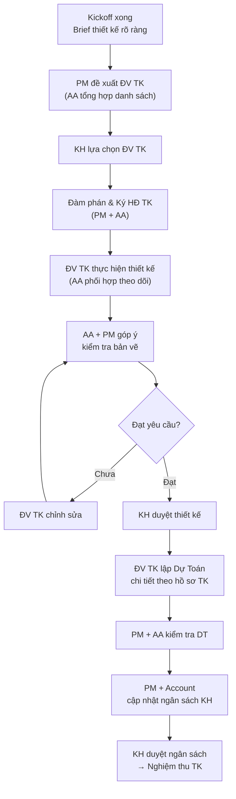

# Quản Lý Thiết Kế

> **Mã SOP:** SOP-04-003
> **Phiên bản:** 1.0
> **Ngày hiệu lực:** 2026-03-27
> **Áp dụng:** Tất cả gói dịch vụ (QTDA / TLXN / TLXN TX)

---

## 1. Mục Đích

Đảm bảo giai đoạn thiết kế diễn ra **đúng tiến độ, đúng yêu cầu KH, và bộ hồ sơ thiết kế đủ điều kiện để thi công**. PM giám sát toàn bộ quá trình thông qua AA và phối hợp trực tiếp với đơn vị thiết kế (ĐV TK).

---

## 2. Sơ Đồ Quy Trình

---

## 3. Chi Tiết Từng Bước

### 3.1 Tổng Hợp Yêu Cầu Thiết Kế

Trước khi tìm ĐV TK, AA phối hợp Account + PM để lập **Brief Thiết Kế** đầy đủ:

- Số tầng, diện tích xây dựng, loại hình công trình
- Phong cách thiết kế KH mong muốn (hình tham khảo, ý tưởng)
- Các yêu cầu đặc biệt: phòng thờ, thang máy, sân thượng, hầm...
- Ngân sách thiết kế KH muốn đầu tư
- Timeline KH mong muốn hoàn thành bản vẽ

### 3.2 Tìm Kiếm & Lựa Chọn ĐV TK

| Bước | Hành động                                                | Ai          |
| ---- | --------------------------------------------------------- | ----------- |
| 1    | AA tổng hợp danh sách ĐV TK trong mạng lưới NCM         | AA          |
| 2    | PM đánh giá phù hợp theo quy mô/phong cách CT            | PM          |
| 3    | Đề xuất 2-3 đơn vị cho KH lựa chọn (kèm hồ sơ năng lực)| PM + AA     |
| 4    | KH gặp gỡ & lựa chọn đơn vị (PM hỗ trợ tư vấn)          | KH + PM     |

> ⚠️ **Nguyên tắc minh bạch:** PM không nhận hoa hồng từ ĐV TK. Quyết định chọn ĐV TK thuộc về KH.

### 3.3 Đàm Phán & Ký HĐ Thiết Kế

**Điều khoản bắt buộc trong HĐ TK cần kiểm tra:**

| Điều khoản                      | Nội dung cần có                                    |
| -------------------------------- | -------------------------------------------------- |
| Phạm vi thiết kế                | Liệt kê rõ: KTS, ME, PCCC, nội thất (nếu có)     |
| Số lần chỉnh sửa miễn phí      | Tối thiểu 3 lần                                   |
| Tiến độ nộp bản vẽ             | Cụ thể theo từng giai đoạn (concept, TK kỹ thuật) |
| Điều kiện thanh toán            | Theo milestone, không trả 100% trước              |
| Quyền sở hữu bản vẽ            | Thuộc về KH sau khi thanh toán đủ                |
| Trách nhiệm lập dự toán        | ĐV TK chịu trách nhiệm lập DT theo hồ sơ TK      |

### 3.4 Phối Hợp Thực Hiện Thiết Kế

AA là đầu mối theo dõi hàng ngày với ĐV TK. PM review định kỳ hàng tuần.

| Trách nhiệm AA                       | Trách nhiệm PM                          |
| ------------------------------------- | --------------------------------------- |
| Liên lạc hàng ngày với ĐV TK         | Review bản vẽ hàng tuần (thứ Sáu)     |
| Theo dõi tiến độ nộp bản vẽ          | Quyết định yêu cầu chỉnh sửa lớn       |
| Ghi nhận yêu cầu bổ sung từ KH       | Thông báo PM khi phát sinh vượt phạm vi|
| Kiểm tra sơ bộ bản vẽ trước khi trình| Escalation nếu ĐV TK không đạt         |

### 3.5 Kiểm Tra Bản Vẽ & Bóc Tách Xung Đột

Do AA là nhân sự có thâm niên (≈ 5 năm kinh nghiệm), **AA chịu trách nhiệm trực tiếp bóc tách hồ sơ, soát xét chéo (cross-check)** để phát hiện mọi xung đột kỹ thuật giữa các bộ môn (Kiến trúc, Kết cấu, MEP, Nội thất). **PM là người kiểm duyệt và đưa ra quyết định cuối cùng.**

Các tiêu chí kiểm tra bao gồm:

**Về nội dung:**
- [ ] Đúng số tầng, diện tích, công năng theo brief
- [ ] Đáp ứng yêu cầu đặc biệt của KH (phòng thờ, thang máy, ...)
- [ ] Phong cách nhất quán với mong muốn KH
- [ ] Không có xung đột giữa kiến trúc và kết cấu/ME

**Về kỹ thuật:**
- [ ] Bản vẽ có đủ các hạng mục: mặt bằng, mặt cắt, mặt đứng
- [ ] Kích thước rõ ràng, không thiếu kích thước
- [ ] Hệ thống điện, nước, PCCC đã được thể hiện
- [ ] Đúng yêu cầu pháp lý (nếu cần xin phép XD)

**Về pháp lý:**
- [ ] Số hiệu bản vẽ, tên dự án, tên KH đúng
- [ ] Chữ ký và con dấu ĐV TK

### 3.6 Dự Toán Chi Tiết Từ ĐV TK

Sau khi KH duyệt thiết kế, **ĐV TK chịu trách nhiệm lập Dự Toán chi tiết** cho toàn bộ ngôi nhà theo hồ sơ thiết kế của họ. Đây là cơ sở để cập nhật ngân sách.

| Bước | Hành động                                               | Ai              |
| ---- | --------------------------------------------------------- | --------------- |
| 1    | ĐV TK lập dự toán chi tiết theo hồ sơ TK đã duyệt      | ĐV TK          |
| 2    | PM + AA kiểm tra dự toán (hợp lý, đầy đủ hạng mục)     | PM + AA         |
| 3    | PM + Account so sánh DT với Khái Toán ban đầu            | PM + Account    |
| 4    | Account cập nhật bảng ngân sách theo số liệu DT          | Account         |
| 5    | PM + Account trình bày ngân sách cập nhật cho KH         | PM + Account    |
| 6    | KH xác nhận ngân sách cập nhật                           | KH              |

> ⚠️ **Quan trọng:** Nếu DT vượt Khái Toán ban đầu, PM + Account phải báo KH ngay và thảo luận giải pháp (điều chỉnh TK, gia tăng ngân sách, hoặc cắt giảm hạng mục).

### 3.7 Nghiệm Thu Thiết Kế

Nghiệm thu chính thức được thực hiện sau khi ĐV TK nộp bộ hồ sơ TK đầy đủ:

| Hạng mục kiểm tra                     | Người kiểm tra |
| -------------------------------------- | -------------- |
| Đầy đủ các loại bản vẽ theo HĐ       | AA             |
| Đúng yêu cầu KH đã thống nhất        | PM + AA        |
| Dự toán chi tiết đầy đủ và hợp lý   | PM             |
| KH ký xác nhận duyệt TK              | KH             |
| AA lưu trữ toàn bộ hồ sơ TK          | AA             |

> 📌 Sau nghiệm thu TK: thanh toán phần còn lại cho ĐV TK (theo HĐ), và chuyển sang Phase 3 — Lựa chọn nhà thầu.

---

## 4. Xử Lý Tình Huống Phát Sinh

| Tình huống                          | Hành động                                             |
| ------------------------------------ | ----------------------------------------------------- |
| ĐV TK bị chậm tiến độ               | AA nhắc sau 3 ngày; PM họp sau 1 tuần trễ             |
| KH liên tục thay đổi yêu cầu        | PM ghi nhận, đánh giá tác động phí & tiến độ, báo KH |
| ĐV TK vượt phạm vi HĐ               | PM xem xét phụ lục HĐ hoặc đàm phán                  |
| Bản vẽ sai kỹ thuật nghiêm trọng    | PM yêu cầu ĐV TK chỉnh sửa & giải trình               |
| KH không hài lòng với ĐV TK         | PM làm trung gian; nếu nghiêm trọng → escalation BGĐ |

---

## 5. Tài Liệu Liên Quan

| Tài liệu                    | Link                                                                          |
| ---------------------------- | ----------------------------------------------------------------------------- |
| Lập kế hoạch dự án          | [lap-ke-hoach-du-an.md](./lap-ke-hoach-du-an.md)                             |
| Quản lý ngân sách           | [../05-ACCOUNT/quan-ly-ngan-sach-chi-phi.md](../05-ACCOUNT/quan-ly-ngan-sach-chi-phi.md) |
| Lựa chọn nhà thầu           | [lua-chon-nha-thau.md](./lua-chon-nha-thau.md)                               |
