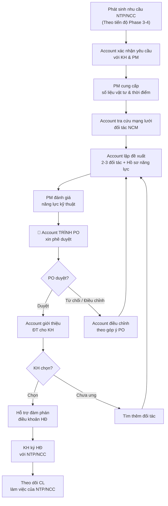

# Hỗ Trợ KH Lựa Chọn Nhà Thầu Phụ & NCC

> **Mã SOP:** SOP-05-005
> **Phiên bản:** 2.0
> **Ngày hiệu lực:** 2026-03-28
> **Áp dụng:** Tất cả gói dịch vụ (QTDA / TLXN / TLXN TX)

---

## 1. Mục Đích

Hỗ trợ KH tiếp cận mạng lưới đối tác uy tín của NCM, đánh giá và lựa chọn **nhà thầu phụ (NTP)** và **nhà cung cấp (NCC)** phù hợp. Đảm bảo chất lượng — giá cả — tiến độ tối ưu cho dự án.

> 🔴 **Lưu ý quan trọng:** SOP này chỉ áp dụng cho **NTP, NCC, và các gói thầu hạng mục khác** — KHÔNG áp dụng cho 2 đối tác chiến lược (Đơn vị Thiết kế & Nhà thầu Thi công chính). 2 đối tác chiến lược do **PO trực tiếp chọn** — xem [SOP Phê duyệt đối tác (PO)](../02-PO/phe-duyet-doi-tac.md).

---

## 2. Phân Biệt Vai Trò

| Vai trò | Trách nhiệm |
|---------|-------------|
| **Account** | Giới thiệu đối tác từ mạng lưới NCM. **Phải trình PO duyệt** trước khi đề xuất cho KH |
| **PO** | **Phê duyệt cuối cùng** mọi đề xuất đối tác trước khi giới thiệu cho KH |
| **PM** | Cung cấp số liệu vật tư, thời điểm cần, yêu cầu kỹ thuật. Đánh giá năng lực kỹ thuật NTP |
| **CA** | Góp ý từ thực tế công trường, đánh giá CL thi công của NTP |
| **KH** | Quyết định cuối cùng lựa chọn NTP/NCC |

> ⚠️ **Account KHÔNG tự ý ký HĐ hoặc cam kết với NTP/NCC.** Mọi HĐ do KH trực tiếp ký hoặc ủy quyền qua PM.

---

## 3. Sơ Đồ Quy Trình (Có Bước PO Duyệt)



### Bước quan trọng: Account Trình PO Duyệt

| Bước | Hành động | Ai | Lưu ý |
|------|----------|-----|-------|
| 1 | Account chuẩn bị đề xuất (2-3 ĐT + hồ sơ + PM đánh giá KT) | Account | Đầy đủ thông tin |
| 2 | **Account trình PO xin phê duyệt** | Account → PO | **BẮT BUỘC** trước khi giới thiệu KH |
| 3 | PO xem xét: duyệt / từ chối / yêu cầu điều chỉnh | PO | PO có quyền thay đổi danh sách |
| 4 | Sau khi PO duyệt → Account giới thiệu cho KH | Account | **Chỉ sau khi PO duyệt** |

> ⚠️ **Account KHÔNG ĐƯỢC giới thiệu bất kỳ đối tác nào cho KH trước khi được PO phê duyệt.**

---

## 4. Các Loại NTP/NCC Thường Gặp

### 4.1 Nhà Thầu Phụ (NTP)

| Lĩnh vực | Ví dụ | Thời điểm cần |
|----------|-------|--------------|
| Điện dân dụng | Hệ thống điện âm tường, tủ điện, đèn | Phase 4 |
| Cấp thoát nước | Ống nước, thiết bị vệ sinh, bồn nước | Phase 4 |
| PCCC | Hệ thống chữa cháy, báo cháy | Phase 3-4 |
| Nhôm kính / Cửa | Cửa nhôm, vách kính, lan can | Phase 4 |
| Nội thất | Tủ bếp, tủ quần áo, bàn ghế | Phase 4 |
| Sơn chuyên dụng | Sơn chống thấm, sơn decorative | Phase 4 |
| Smart home | Hệ thống nhà thông minh, camera | Phase 3-4 |
| Thang máy | Thang máy gia đình | Phase 2-3 |

### 4.2 Nhà Cung Cấp (NCC)

| Lĩnh vực | Ví dụ |
|----------|-------|
| Gạch ốp lát | Gạch ceramic, porcelain, đá tự nhiên |
| Thiết bị vệ sinh | TOTO, Inax, Kohler, American Standard |
| Sơn | Jotun, Dulux, Kova |
| Đá nhân tạo / tự nhiên | Mặt bàn bếp, bậc cầu thang, sân vườn |
| Thiết bị điện | Schneider, Panasonic, Legrand |
| Điều hòa | Daikin, Mitsubishi, LG |

---

## 5. Tiêu Chí Đánh Giá NTP/NCC

| Tiêu chí | Trọng số | Người đánh giá | Mô tả |
|---------|:--------:|---------------|-------|
| Năng lực & Kinh nghiệm | 25% | PM | Portfolio, dự án đã thực hiện |
| Giá cả cạnh tranh | 25% | Account + PM | So sánh ≥ 3 báo giá |
| Chất lượng sản phẩm/DV | 20% | CA + PM | Mẫu thực tế, review KH cũ |
| Tiến độ & Cam kết | 15% | PM | Lịch sử giao hàng/thi công đúng hạn |
| Bảo hành & Hậu mãi | 10% | Account | Chính sách BH, phản hồi sau bán |
| Rating từ NCM | 5% | PM (từ database) | Đánh giá từ dự án trước của NCM |

### Template Đánh Giá

```markdown
# ĐÁNH GIÁ NTP/NCC

**Lĩnh vực:** [VD: Nội thất]
**Dự án:** [Tên KH]
**Trạng thái PO duyệt:** [ ] Chưa trình / [ ] Đã duyệt / [ ] Cần điều chỉnh

| Tiêu chí | Đối tác A | Đối tác B | Đối tác C |
|---------|----------|----------|----------|
| Năng lực (25%) | x/10 | x/10 | x/10 |
| Giá cả (25%) | x/10 | x/10 | x/10 |
| Chất lượng (20%) | x/10 | x/10 | x/10 |
| Tiến độ (15%) | x/10 | x/10 | x/10 |
| Bảo hành (10%) | x/10 | x/10 | x/10 |
| Rating NCM (5%) | x/10 | x/10 | x/10 |
| **TỔNG ĐIỂM** | x/10 | x/10 | x/10 |
| **Khuyến nghị** | [...] | [...] | [...] |

**Đề xuất Account:** Chọn [Đối tác X] vì [lý do]
**PO phê duyệt:** [PO ghi]
**KH quyết định:** [KH ghi]
```

---

## 6. Quy Trình Đàm Phán HĐ

| Bước | Hành động | Ai |
|------|----------|-----|
| 1 | KH chọn NTP/NCC → Account thông báo đối tác | Account |
| 2 | PM review HĐ mẫu / điều khoản kỹ thuật | PM |
| 3 | Account hỗ trợ KH đàm phán giá & điều khoản | Account + KH |
| 4 | PM xác nhận phạm vi kỹ thuật trong HĐ hợp lý | PM |
| 5 | KH ký HĐ trực tiếp với NTP/NCC | KH + NTP/NCC |
| 6 | Account lưu bản copy HĐ trên Larksuite | Account |

> ⚠️ **Account lưu ý:** Đảm bảo HĐ có điều khoản bảo hành, thanh toán theo tiến độ, và xử lý vi phạm.

---

## 7. Theo Dõi Sau Lựa Chọn

| Công việc | Tần suất | Ai |
|----------|----------|-----|
| Theo dõi tiến độ NTP thi công | Hàng tuần | CA + Account |
| Kiểm tra CL sản phẩm NCC giao | Khi giao hàng | CA |
| Thu thập feedback KH về NTP/NCC | Hàng tháng | Account |
| Đánh giá NTP/NCC sau hoàn thành (cập nhật rating) | Sau bàn giao | PM + Account |

---

## 8. Tài Liệu Liên Quan

| Tài liệu | Link |
|----------|------|
| Phê duyệt đối tác (PO) | [../02-PO/phe-duyet-doi-tac.md](../02-PO/phe-duyet-doi-tac.md) |
| Lựa chọn nhà thầu (PM) | [../04-PM/lua-chon-nha-thau.md](../04-PM/lua-chon-nha-thau.md) |
| Tư vấn vật liệu & TB | [tu-van-vat-lieu-thiet-bi.md](./tu-van-vat-lieu-thiet-bi.md) |
| Phối hợp đối tác | [../08-PHOI-HOP-DOI-TAC/](../08-PHOI-HOP-DOI-TAC/) |
