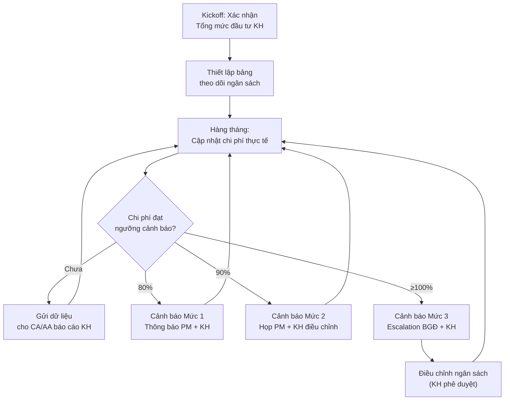
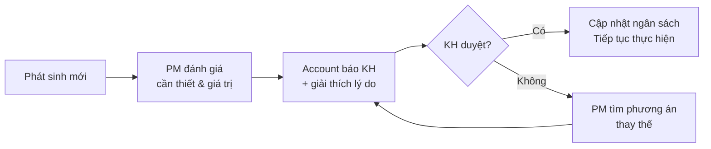

# Kiểm Soát Ngân Sách & Chi Phí Cho KH

> **Mã SOP:** SOP-05-003
> **Phiên bản:** 1.0
> **Ngày hiệu lực:** 2026-03-27
> **Áp dụng:** Tất cả gói dịch vụ (QTDA / TLXN / TLXN TX)

---

## 1. Mục Đích

Account phối hợp PM trong việc **theo dõi, kiểm soát và cập nhật** ngân sách dự án cho KH, đảm bảo KH luôn nắm rõ tình hình tài chính và không bị bất ngờ về chi phí.

> ⚠️ **Lưu ý:** PM chịu trách nhiệm lập **Khái toán Ngân sách Xây Nhà** ngay sau Kickoff. Sau đó, trong giai đoạn thiết kế, **Đơn vị Thiết Kế sẽ lập Dự toán chi tiết** theo hồ sơ thiết kế — đây là cơ sở để Account + PM cập nhật lại bảng ngân sách.

---

## 2. Phân Chia Trách Nhiệm Tài Chính

| Vai trò     | Trách nhiệm                                                   | RACI |
| ----------- | -------------------------------------------------------------- | :--: |
| **Account** | Theo dõi chi phí, cung cấp DL cho CA/AA báo cáo, cảnh báo vượt ngân sách | **R** |
| **PM**      | Phê duyệt chi phí, quyết định kỹ thuật ảnh hưởng ngân sách   | **A** |
| **AA**      | Hỗ trợ nhập liệu, chuẩn bị dữ liệu thu chi                  | **S** |
| **Kế toán** | Xác nhận thanh toán phí dịch vụ công ty trợ lý                 | **C** |
| **BGĐ**     | Phê duyệt khi vượt ngân sách hoặc phát sinh lớn               | **A** |

---

## 3. Sơ Đồ Quy Trình



---

## 4. Quy Trình Chi Tiết

### 4.1 Bước 0: PM Lập Khái Toán Ngân Sách Xây Nhà (Phase 1 — Sau Kickoff)

Ngay sau Kickoff, PM lập **Bảng Khái Toán Ngân Sách** cho KH biết mình cần chuẩn bị bao nhiêu tiền.

| Bước | Hành động                                               | Ai              |
| ---- | --------------------------------------------------------- | --------------- |
| 1    | PM dựa vào requirement + kinh nghiệm để lập khái toán     | PM              |
| 2    | Khái toán chia 3 phần: A. Trước khi khởi công, B. Trong khi xây nhà, C. Sau khi xây nhà | PM |
| 3    | Trình bày khái toán cho KH để KH biết tổng mức đầu tư dự kiến | PM + Account   |
| 4    | KH xác nhận ngân sách ban đầu                              | KH              |
| 5    | Tạo bảng theo dõi ngân sách trên Larksuite/Excel          | Account + AA    |

> **Cấu trúc bảng Khái Toán Ngân Sách Xây Nhà:**
>
> | Phần | Ví dụ các hạng mục |
> |------|-------------------|
> | **A. Trước khi khởi công** | Trợ Lý Xây Nhà, Thiết kế, Dự toán, Khảo sát địa chất, Giấy phép XD, Bảo hiểm CT, ... |
> | **B. Trong khi xây nhà** | Xây thô, Hoàn thiện GĐ1, Nội thất, Thang máy, Thiết bị điện tử, Công nghệ thông minh, ... |
> | **C. Sau khi xây nhà** | Hoàn công, Hoạt động tâm linh, ... |

### 4.2 Bước 1: Cập Nhật Ngân Sách Theo Dự Toán Thiết Kế (Phase 2)

Khi ĐV Thiết kế hoàn thành hồ sơ TK, họ sẽ lập **Dự toán chi tiết** cho toàn bộ ngôi nhà. Đây là cơ sở để cập nhật bảng ngân sách đã lập ở Phase 1.

| Bước | Hành động                                               | Ai              |
| ---- | --------------------------------------------------------- | --------------- |
| 1    | ĐV Thiết kế lập dự toán chi tiết theo hồ sơ TK          | ĐV Thiết kế   |
| 2    | PM + AA kiểm tra dự toán (hợp lý, đầy đủ)                | PM + AA         |
| 3    | PM + Account so sánh dự toán TK với khái toán ban đầu      | PM + Account    |
| 4    | Cập nhật bảng ngân sách: Thay số ước tính bằng số dự toán thực tế | Account       |
| 5    | Trình bày ngân sách cập nhật cho KH để duyệt              | PM + Account    |
| 6    | KH xác nhận ngân sách cập nhật                             | KH              |

> ⚠️ **Quan trọng:** Nếu dự toán TK vượt khái toán ban đầu, PM + Account phải báo KH ngay và thảo luận giải pháp (điều chỉnh TK, gia tăng ngân sách, hoặc cắt giảm hạng mục).

### 4.3 Thiết Lập Ngân Sách Ban Đầu (Phase 1)

| Bước | Hành động                                               | Ai              |
| ---- | --------------------------------------------------------- | --------------- |
| 1    | Xác nhận Tổng mức đầu tư KH mong muốn từ hồ sơ Sale     | Account + PM    |
| 2    | Phân bổ ngân sách dự kiến theo hạng mục                   | PM              |
| 3    | Tạo bảng theo dõi ngân sách trên Larksuite/Excel          | Account + AA    |
| 4    | Thống nhất với KH về cách theo dõi chi phí                | Account         |

### 4.4 Theo Dõi Chi Phí Hàng Tháng (Phase 2-4)

| Bước | Hành động                                               | Ai              | Deadline       |
| ---- | --------------------------------------------------------- | --------------- | -------------- |
| 1    | Thu thập dữ liệu chi phí phát sinh trong tháng            | AA              | Ngày 1-3       |
| 2    | Cập nhật biên lai/xác nhận thanh toán từ NT, NCC            | Account + AA    | Ngày 3-4       |
| 3    | Cập nhật bảng theo dõi ngân sách                           | Account         | Ngày 4         |
| 4    | So sánh Thực tế vs. Kế hoạch, tính % sử dụng             | Account         | Ngày 4         |
| 5    | Gửi dữ liệu chi phí cho CA/AA để lập báo cáo tháng        | Account         | Ngày 4         |

### 4.5 Hệ Thống Cảnh Báo Ngân Sách

| Mức        | Ngưỡng | Hành động                                            | Ai quyết định |
| ---------- | ------ | ----------------------------------------------------- | ------------- |
| 🟢 Bình thường | < 80%  | Cung cấp dữ liệu để CA/AA lập báo cáo                | Account       |
| 🟡 Mức 1   | 80%    | Thông báo PM + KH, rà soát hạng mục còn lại          | Account + PM  |
| 🟠 Mức 2   | 90%    | Họp PM + KH, đề xuất điều chỉnh/cắt giảm             | PM + KH       |
| 🔴 Mức 3   | ≥ 100% | Escalation BGĐ, họp khẩn với KH, tạm dừng phát sinh  | BGĐ + KH     |

### 4.6 Xử Lý Phát Sinh Chi Phí



> ⚠️ **Nguyên tắc:** Mọi phát sinh chi phí **PHẢI** được KH phê duyệt TRƯỚC khi thực hiện.

---

## 5. Template Báo Cáo Chi Phí

```markdown
# BÁO CÁO CHI PHÍ DỰ ÁN — THÁNG [MM/YYYY]

**Dự án:** [Tên KH] - [Địa chỉ CT]
**Tổng mức đầu tư KH:** [xxx] triệu đồng
**Ngày báo cáo:** [DD/MM/YYYY]

## Tổng Quan

| Chỉ số              | Giá trị             |
| -------------------- | -------------------- |
| Tổng ngân sách       | xxx triệu           |
| Đã chi               | xxx triệu           |
| Còn lại              | xxx triệu           |
| % Sử dụng            | xx%                  |
| Trạng thái            | 🟢/🟡/🟠/🔴       |

## Chi Tiết Theo Hạng Mục

| Hạng mục         | Ngân sách  | Đã chi     | Còn lại   | % |
| ----------------- | ---------- | ---------- | --------- | - |
| Thiết kế          | xxx        | xxx        | xxx       | % |
| Thi công (Kết cấu)| xxx       | xxx        | xxx       | % |
| Thi công (Hoàn thiện)| xxx    | xxx        | xxx       | % |
| Cơ điện           | xxx        | xxx        | xxx       | % |
| Nội thất          | xxx        | xxx        | xxx       | % |
| Thiết bị          | xxx        | xxx        | xxx       | % |
| Phát sinh         | xxx        | xxx        | xxx       | % |

## Thanh Toán Trong Tháng

| Nhà thầu/NCC | Nội dung       | Giá trị    | Ngày TT  |
| ------------- | -------------- | ---------- | -------- |
| ...           | ...            | ...        | ...      |

## Phát Sinh & Ghi Chú
- [Mô tả phát sinh nếu có]

## Dự Báo Tháng Tiếp Theo
- Chi phí dự kiến: xxx triệu
- Hạng mục thanh toán: [...]
```

---

## 6. Đối Soát Với Quỹ Cam Kết Chất Lượng

- **Quỹ Cam kết CL** là phụ lục đi kèm HĐ, liên kết với Scorecard
- Account theo dõi và đối soát hàng tháng:
  - Nếu Scorecard < ngưỡng → Quỹ CL bị trừ (theo HĐ)
  - Nếu Scorecard ≥ ngưỡng → Quỹ CL được giữ nguyên
- Phối hợp Kế toán công ty để đối soát thu phí dịch vụ/Quỹ CL

---

## 7. Tài Liệu Liên Quan

| Tài liệu                    | Link                                                                          |
| ---------------------------- | ------------------------------------------------------------------------------ |
| Các gói dịch vụ              | [../00-TONG-QUAN/cac-goi-dich-vu.md](../00-TONG-QUAN/cac-goi-dich-vu.md)      |
| Quản lý thay đổi / phát sinh | [../04-PM/quan-ly-thay-doi-phat-sinh.md](../04-PM/quan-ly-thay-doi-phat-sinh.md) |
| Scorecard & Đánh giá DV      | [scorecard-danh-gia-dich-vu.md](./scorecard-danh-gia-dich-vu.md)               |
