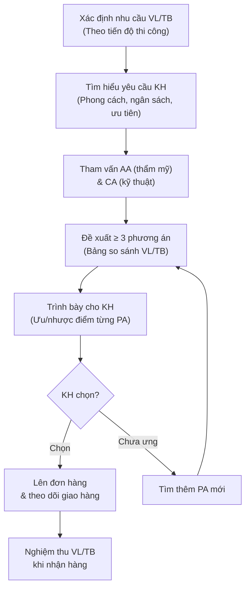

# Tư Vấn Vật Liệu & Thiết Bị Cho KH

> **Mã SOP:** SOP-05-004
> **Phiên bản:** 1.0
> **Ngày hiệu lực:** 2026-03-27
> **Áp dụng:** Tất cả gói dịch vụ (QTDA / TLXN / TLXN TX)

---

## 1. Mục Đích

Hỗ trợ KH lựa chọn vật liệu & thiết bị phù hợp với **ngân sách, phong cách thiết kế và yêu cầu kỹ thuật** của công trình, đảm bảo nguyên tắc **minh bạch, khách quan** và tối ưu chi phí cho KH.

---

## 2. Nguyên Tắc Tư Vấn

> ⚠️ **NGUYÊN TẮC BẮT BUỘC:**

| # | Nguyên tắc                                                    |
| - | -------------------------------------------------------------- |
| 1 | **Minh bạch giá cả:** Mọi báo giá phải là giá niêm yết công khai, có nguồn rõ ràng |
| 2 | **Không hưởng hoa hồng ngầm:** Account KHÔNG nhận kickback từ NCC |
| 3 | **Đa phương án:** Luôn đề xuất ≥ 3 phương án cho KH lựa chọn |
| 4 | **Quyền quyết định thuộc KH:** Account tư vấn, KH quyết định cuối cùng |
| 5 | **Phối hợp chuyên môn:** AA góp ý thẩm mỹ, CA góp ý kỹ thuật, PM góp ý ngân sách |

---

## 3. Sơ Đồ Quy Trình

---

## 4. Thời Điểm Tư Vấn Theo Tiến Độ Thi Công

| Giai đoạn thi công         | VL/TB cần tư vấn                                    | Thời điểm tư vấn        |
| --------------------------- | ---------------------------------------------------- | ------------------------ |
| **Trước khởi công**        | Cọc, thép, xi măng, cát đá (nếu KH muốn chọn)       | Phase 3                  |
| **Phần thô**               | Gạch xây, xi măng, thép, bê tông thương phẩm          | Đầu Phase 4             |
| **Hoàn thiện**             | Gạch ốp lát, sơn, trần thạch cao, cửa, lan can       | Khi đổ BT sàn tầng cuối |
| **Cơ điện**                | Dây điện, ống nước, thiết bị vệ sinh, điều hòa        | Khi hoàn thiện 50%       |
| **Nội thất**               | Tủ bếp, tủ quần áo, rèm, gương, đèn trang trí       | Khi hoàn thiện 70%       |
| **Thiết bị đặc biệt**     | Thang máy, PCCC, hệ thống thông minh (smart home)     | Phase 2-3 (lead time dài) |

> 📌 **Lưu ý:** Một số VL/TB có lead time dài (thang máy: 2-3 tháng, cửa nhôm: 1-2 tháng). Account phải cảnh báo KH sớm để tránh ảnh hưởng tiến độ.

---

## 5. Quy Trình Chi Tiết

### 5.1 Bước 1: Xác Định Nhu Cầu

- Kiểm tra tiến độ thi công → Xác định VL/TB cần mua sắm trong 2-4 tuần tới
- Hỏi KH:
  - Phong cách mong muốn (hiện đại / cổ điển / tối giản / ...)
  - Ngân sách dự kiến cho hạng mục này
  - Thương hiệu yêu thích (nếu có)
  - Ưu tiên: Giá thấp / Chất lượng cao / Thương hiệu

### 5.2 Bước 2: Tham Vấn Chuyên Môn

| Vai trò | Góp ý về                            |
| ------- | ------------------------------------ |
| **AA**  | Phù hợp thiết kế, màu sắc, phong cách |
| **CA**  | Tính kỹ thuật, thi công được không, bền không |
| **PM**  | Phù hợp ngân sách tổng, có phát sinh không |

### 5.3 Bước 3: Lập Bảng So Sánh

| Tiêu chí           | Phương án A      | Phương án B      | Phương án C      |
| ------------------- | ---------------- | ---------------- | ---------------- |
| Thương hiệu         | [Tên]            | [Tên]            | [Tên]            |
| Xuất xứ             | [Nước]           | [Nước]           | [Nước]           |
| Đơn giá             | xxx đ/m² (hoặc cái) | xxx đ/m²      | xxx đ/m²         |
| Tổng chi phí dự kiến | xxx triệu       | xxx triệu        | xxx triệu        |
| Bảo hành            | x năm            | x năm            | x năm            |
| Ưu điểm             | [...]            | [...]            | [...]            |
| Nhược điểm          | [...]            | [...]            | [...]            |
| NCC gợi ý           | [Tên NCC]        | [Tên NCC]        | [Tên NCC]        |
| Đánh giá AA (thẩm mỹ) | ⭐⭐⭐⭐     | ⭐⭐⭐         | ⭐⭐⭐⭐⭐    |
| Đánh giá CA (kỹ thuật) | ⭐⭐⭐⭐⭐  | ⭐⭐⭐⭐      | ⭐⭐⭐         |
| **Khuyến nghị**     | Tốt nhất về KT   | Cân bằng         | Tốt nhất về TM  |

### 5.4 Bước 4: Trình Bày Cho KH

- Gửi bảng so sánh kèm **khuyến nghị rõ ràng** (nhưng không ép)
- Giải thích ưu/nhược điểm từng phương án bằng ngôn ngữ dễ hiểu
- Nếu KH cần, sắp xếp đi xem showroom/mẫu thực tế CÙNG KH

### 5.5 Bước 5: Theo Dõi & Nghiệm Thu

- Sau khi KH chọn → Hỗ trợ lên đơn hàng
- Theo dõi lịch giao hàng, cảnh báo nếu chậm
- Phối hợp CA nghiệm thu VL/TB khi nhận hàng (đúng chủng loại, số lượng, CL)

---

## 6. Database Vật Liệu & NCC

Account xây dựng & duy trì danh sách NCC tin cậy trên Larksuite:

| Thông tin              | Mô tả                                  |
| ---------------------- | --------------------------------------- |
| Tên NCC                | [Tên công ty/cửa hàng]                  |
| Lĩnh vực              | Gạch / Sơn / Thiết bị VS / ...         |
| Liên hệ               | SĐT, email, địa chỉ showroom           |
| Giá niêm yết           | Link bảng giá công khai                 |
| Ưu đãi KH NCM         | Chiết khấu %, quà tặng (nếu có)        |
| Rating nội bộ          | Đánh giá từ các dự án trước             |
| Ghi chú                | Lưu ý đặc biệt                         |

> 📌 Database được cập nhật liên tục, PM & CA cũng đóng góp đánh giá sau mỗi dự án.

---

## 7. Khác Biệt Theo Gói Dịch Vụ

| Hạng mục                   | QTDA / TLXN              | TLXN TX                        |
| --------------------------- | ------------------------ | ------------------------------ |
| Hình thức tư vấn            | Trực tiếp + đi xem mẫu  | Online (ảnh, video, link web)  |
| Đi showroom cùng KH        | Có (nếu KH cần)          | Không (hướng dẫn KH tự đi)    |
| Nghiệm thu VL nhận hàng    | CA kiểm tra trực tiếp    | Hướng dẫn KH tự kiểm qua ảnh/video |

---

## 8. Tài Liệu Liên Quan

| Tài liệu                     | Link                                                                         |
| ----------------------------- | ---------------------------------------------------------------------------- |
| Hỗ trợ chọn thầu phụ & NCC  | [ho-tro-lua-chon-thau-phu-ncc.md](./ho-tro-lua-chon-thau-phu-ncc.md)        |
| Kiểm soát ngân sách          | [quan-ly-ngan-sach-chi-phi.md](./quan-ly-ngan-sach-chi-phi.md)               |
| Đối tác NCC                  | [../08-PHOI-HOP-DOI-TAC/nha-cung-cap/](../08-PHOI-HOP-DOI-TAC/nha-cung-cap/) |
