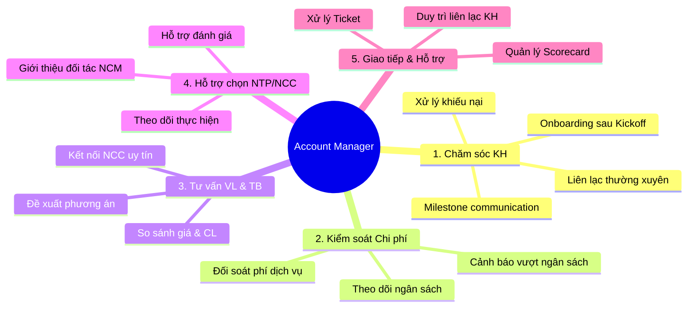

# Vai Trò, Chức Năng & KPI của Account Manager

> **Mã SOP:** SOP-05-001
> **Phiên bản:** 1.0
> **Ngày hiệu lực:** 2026-03-27
> **Áp dụng:** Tất cả gói dịch vụ (QTDA / TLXN / TLXN TX)

---

## 1. Định Nghĩa Vai Trò

Account Manager (Account) là **đầu mối quan hệ khách hàng** trong suốt vòng đời dự án, từ khi tiếp nhận KH ở buổi Kickoff cho đến khi đóng dự án và hết thời hạn bảo hành.

> **Sứ mệnh:** Account là hậu phương vững chắc chăm sóc KH. Account thu thập Ticket, kiểm soát rủi ro cảm xúc và báo cáo trực tiếp cho PO nếu PM, AA, CA giải quyết vấn đề không tốt. Account KHÔNG làm báo cáo định kỳ cho Chủ nhà.
---

## 2. Năm Nhóm Chức Năng Chính

### 2.1 Chăm sóc Quan hệ Khách hàng (Customer Success)

- Là **người KH liên hệ đầu tiên** khi có bất kỳ vấn đề nào
- Là **hậu phương** theo dõi sự hài lòng của KH, không trực tiếp gửi báo cáo định kỳ.
- Chủ động nắm bắt cảm xúc KH, xử lý các sự cố/khiếu nại (Ticket).
- Nếu phát hiện PM, AA, CA làm việc không tốt -> Account thu thập thông tin và **mách cho PO** để PO có chế tài xử lý.
- Báo cáo trực tiếp cho **PO (Project Owner)**

> 👉 Chi tiết: [cham-soc-khach-hang.md](./cham-soc-khach-hang.md)

### 2.2 Kiểm soát Ngân sách & Chi phí

- **Hỗ trợ (S)** PM trong việc lập Khái toán Ngân sách đầu dự án để nắm cấu trúc chi phí, từ đó quản lý và tư vấn vật liệu sau này.
- **Trực tiếp nhập liệu thu chi hàng tuần** cho dự án lên phần mềm quản lý, từ đó đối soát dòng tiền và giúp chủ nhà bớt gánh nặng quản lý sổ sách thi công.
- Đối soát thu phí dịch vụ trợ lý hàng tháng với Kế toán công ty
- Cảnh báo khi chi phí tiến gần hoặc vượt ngân sách KH
- Cung cấp dữ liệu chi phí rõ ràng để CA/AA đưa vào báo cáo KH

> 👉 Chi tiết: [quan-ly-ngan-sach-chi-phi.md](./quan-ly-ngan-sach-chi-phi.md)

### 2.3 Tư vấn Vật liệu & Thiết bị

- Hỗ trợ KH chọn vật liệu/thiết bị phù hợp ngân sách & phong cách
- Kết nối KH với mạng lưới NCC uy tín của NCM
- Đảm bảo nguyên tắc minh bạch: giá niêm yết công khai

> 👉 Chi tiết: [tu-van-vat-lieu-thiet-bi.md](./tu-van-vat-lieu-thiet-bi.md)

### 2.4 Hỗ trợ Lựa chọn Nhà thầu phụ & NCC

- Giới thiệu đối tác từ mạng lưới NCM cho KH
- Hỗ trợ KH đánh giá, so sánh và lựa chọn
- Theo dõi chất lượng làm việc của NTP/NCC

> 👉 Chi tiết: [ho-tro-lua-chon-thau-phu-ncc.md](./ho-tro-lua-chon-thau-phu-ncc.md)

### 2.5 Giao tiếp & Hỗ trợ KH

- Tiếp nhận & xử lý Ticket, sự cố, khiếu nại phát sinh từ mọi bên trong dự án (KH, đối tác, thầu phụ). Ticket không dùng cho các thắc mắc thông thường.
- Quản lý Scorecard đánh giá dịch vụ hàng tháng
- Duy trì liên lạc thường xuyên với KH
- Phối hợp cung cấp thông tin cho CA/AA để lập báo cáo

---

## 3. Ranh Giới Trách Nhiệm Account vs PM

| Lĩnh vực              | Account                                   | PM                                     |
| ---------------------- | ----------------------------------------- | -------------------------------------- |
| **Giao tiếp KH**      | Đầu mối chính cho quan hệ & cảm xúc KH  | Trao đổi kỹ thuật & vận hành          |
| **Ngân sách**          | Theo dõi & cung cấp dữ liệu (**R**)        | Phê duyệt & kiểm soát tổng (**A**)    |
| **Quyết định kỹ thuật** | Không quyết định                         | Quyết định & chịu trách nhiệm         |
| **Ticket**             | Tiếp nhận & phân loại (**R**)            | Xử lý kỹ thuật (**C**)                |
| **Báo cáo tuần**      | Trực tiếp nhập liệu Ngân sách/Thu chi (**R**) | Lập thành 1 báo cáo gửi KH (AA/CA gửi) |
| **Vật liệu/TB**       | Tư vấn & kết nối NCC                     | Góp ý kỹ thuật                        |
| **Thầu phụ/NCC**      | Hỗ trợ KH lựa chọn                       | Quyết định kỹ thuật                   |
| **Scorecard**          | Thu thập & quản lý (**R**)               | Được thông báo (**I**)                |
| **Bảo hành**          | Theo dõi & phản hồi KH (**R**)          | Tham vấn kỹ thuật (**C**)             |

---

## 4. Ma Trận RACI Account Theo Phase

| Phase                | Account Role | Hoạt động chính                                         |
| -------------------- | :----------: | -------------------------------------------------------- |
| **Phase 1: Kickoff** | **R**        | Tiếp nhận KH, Kickoff, phỏng vấn requirement            |
| **Phase 2: TK**      | **S** / I    | Hỗ trợ tổng hợp yêu cầu TK, duy trì liên lạc KH       |
| **Phase 3: Chọn NT** | I            | Hỗ trợ KH đánh giá thầu phụ/NCC                        |
| **Phase 4: TC**      | **R**        | Ngân sách, Ticket, chăm sóc KH, tư vấn VL         |
| **Phase 5: NTBG**    | **R**        | Bàn giao công trình cùng PM                              |
| **Phase 6: BH**      | **R**        | Bảo hành, Scorecard, feedback, đóng dự án               |

> 📌 Chi tiết đầy đủ: [../00-TONG-QUAN/ma-tran-RACI.md](../00-TONG-QUAN/ma-tran-RACI.md)

---

## 5. KPI Đo Lường Hiệu Suất Account

| KPI                            | Mục tiêu          | Tần suất đo | Nguồn dữ liệu      |
| ------------------------------ | ------------------ | ------------ | -------------------- |
| Scorecard trung bình           | ≥ 4.0 / 5.0       | Hàng tháng   | Scorecard từ KH      |
| SLA tiếp nhận Ticket           | ≤ 4h làm việc     | Realtime     | Larksuite             |
| Tỷ lệ cung cấp DL báo cáo đúng hạn | ≥ 95%              | Hàng tháng   | Tracking nội bộ      |
| Tần suất liên lạc KH          | Theo chuẩn/Phase   | Hàng tuần    | Log Zalo/Larksuite   |
| Chi phí thực tế vs. Kế hoạch  | Sai lệch ≤ 10%    | Hàng tháng   | Báo cáo chi phí     |
| Tỷ lệ KH giới thiệu (NPS)    | ≥ 50%              | Sau bàn giao | Survey               |
| Số Ticket quá hạn SLA         | 0                  | Hàng tháng   | Larksuite             |

---

## 6. Quy Trình Hand-off Nội Bộ Account

Khi Account nghỉ phép, chuyển công tác, hoặc thay đổi nhân sự:

| Bước | Hành động                                       | Thời hạn       |
| ---- | ------------------------------------------------ | -------------- |
| 1    | Account cũ tổng hợp status dự án hiện tại       | 2 ngày trước   |
| 2    | Họp bàn giao giữa Account cũ → Account mới + PM | 1 buổi         |
| 3    | Account mới liên hệ KH giới thiệu bản thân      | Trong ngày     |
| 4    | Account mới review toàn bộ hồ sơ trên Larksuite  | 1-2 ngày       |
| 5    | PM theo dõi trong 1 tuần đầu                     | 1 tuần         |

> ⚠️ **KH phải được thông báo trước** khi thay đổi Account. Không được "im lặng thay người".

---

## 7. Tài Liệu Liên Quan

| Tài liệu                | Link                                                         |
| ------------------------ | ------------------------------------------------------------ |
| Flow tổng thể dự án     | [../00-TONG-QUAN/flow-tong-the-du-an.md](../00-TONG-QUAN/flow-tong-the-du-an.md) |
| Ma trận RACI             | [../00-TONG-QUAN/ma-tran-RACI.md](../00-TONG-QUAN/ma-tran-RACI.md) |
| Họp Kickoff dự án       | [../01-PHOI-HOP-SALE-QLDA/hop-kickoff-du-an.md](../01-PHOI-HOP-SALE-QLDA/hop-kickoff-du-an.md) |
| Stakeholder Map          | [../00-TONG-QUAN/stakeholder-map.md](../00-TONG-QUAN/stakeholder-map.md) |
