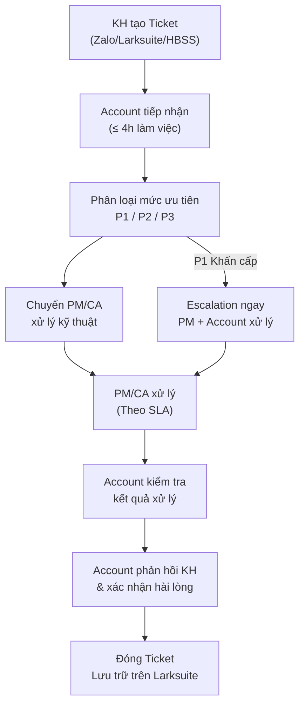
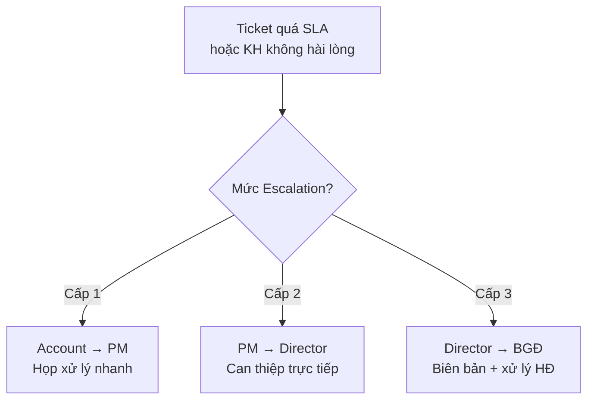

# Xử Lý Ticket & Khiếu Nại Từ KH

> **Mã SOP:** SOP-05-007
> **Phiên bản:** 1.0
> **Ngày hiệu lực:** 2026-03-27
> **Áp dụng:** Tất cả gói dịch vụ (QTDA / TLXN / TLXN TX)

---

## 1. Mục Đích

Chuẩn hóa quy trình tiếp nhận, phân loại, chuyển xử lý và phản hồi Ticket từ KH, đảm bảo SLA theo HĐ và duy trì sự hài lòng của KH. Account là **R** (Responsible) cho toàn bộ vòng đời Ticket.

---

## 2. Sơ Đồ Quy Trình

---

## 3. Phân Loại Mức Ưu Tiên

| Mức     | Mô tả                                    | Ví dụ                                        | SLA Phản hồi | SLA Xử lý    |
| ------- | ----------------------------------------- | ---------------------------------------------- | ------------ | ------------- |
| **P1**  | Khẩn cấp — Ảnh hưởng an toàn / tiến độ  | Sập giàn giáo, ngập nước, NT bỏ dở            | ≤ 1h         | ≤ 24h         |
| **P2**  | Quan trọng — Ảnh hưởng chất lượng        | Thi công sai bản vẽ, VL không đúng chủng loại  | ≤ 4h         | ≤ 3 ngày      |
| **P3**  | Thông thường — Yêu cầu / Kiến nghị       | Hỏi tiến độ, yêu cầu thay đổi nhỏ, góp ý     | ≤ 4h         | ≤ 7 ngày      |

---

## 4. Quy Trình Chi Tiết

### 4.1 Tiếp Nhận Ticket

| Bước | Hành động                                        | Thời hạn    |
| ---- | ------------------------------------------------- | ----------- |
| 1    | KH gửi yêu cầu qua bất kỳ kênh nào               | —           |
| 2    | Account ghi nhận & tạo Ticket trên Larksuite       | ≤ 4h        |
| 3    | Phản hồi KH xác nhận đã tiếp nhận                 | ≤ 4h        |
| 4    | Ghi nhận thông tin: Nội dung, ngày tạo, mức ưu tiên | ≤ 4h       |

> **Mẫu phản hồi tiếp nhận:**
> *"Dạ anh/chị [Tên KH], em đã ghi nhận yêu cầu về [tóm tắt nội dung]. Ticket số [#xxx] đã được tạo. Em sẽ phản hồi kết quả xử lý trong [thời gian theo SLA]. Cảm ơn anh/chị."*

### 4.2 Phân Loại & Chuyển Xử Lý

| Mức | Chuyển cho ai                | Cách chuyển                        |
| --- | ----------------------------- | ---------------------------------- |
| P1  | PM + CA (đồng thời)          | Gọi điện/Zalo + Tag trên Larksuite |
| P2  | PM hoặc CA (tùy nội dung)    | Tag trên Larksuite + Zalo           |
| P3  | PM hoặc CA (tùy nội dung)    | Tag trên Larksuite                  |

### 4.3 Theo Dõi Xử Lý

- Account **KHÔNG tự xử lý kỹ thuật** — chuyển PM/CA
- Account theo dõi tiến độ xử lý hàng ngày (P1), 2 ngày/lần (P2), hàng tuần (P3)
- Nếu quá 50% SLA chưa xử lý → Nhắc nhở PM/CA
- Nếu hết SLA chưa xử lý → Escalation

### 4.4 Phản Hồi KH

| Bước | Hành động                                               |
| ---- | --------------------------------------------------------- |
| 1    | Kiểm tra kết quả xử lý từ PM/CA                          |
| 2    | Liên hệ KH thông báo kết quả (kèm ảnh/video nếu cần)    |
| 3    | Hỏi KH: "Anh/chị đã hài lòng với kết quả chưa?"          |
| 4    | Nếu KH hài lòng → Đóng Ticket                             |
| 5    | Nếu KH chưa hài lòng → Ghi nhận thêm → Chuyển PM/CA tiếp |

### 4.5 Đóng Ticket

- Cập nhật trạng thái trên Larksuite: **Đã hoàn tất**
- Ghi nhận: Ngày đóng, kết quả, hài lòng (Có/Không)
- Lưu trữ để thống kê báo cáo tháng

---

## 5. Quy Trình Escalation

| Cấp   | Điều kiện                                        | Người xử lý    | Thời hạn    |
| ------ | ------------------------------------------------- | --------------- | ----------- |
| Cấp 1 | Quá SLA hoặc KH phản ánh lần 2                   | PM              | 24h         |
| Cấp 2 | PM không giải quyết được hoặc KH bức xúc nghiêm trọng | Director     | 48h         |
| Cấp 3 | Ảnh hưởng HĐ hoặc KH đe dọa pháp lý              | BGĐ            | Theo tình huống |

---

## 6. Xử Lý Khiếu Nại Chính Thức

Khi KH khiếu nại chính thức (bằng văn bản hoặc yêu cầu gặp quản lý):

| Bước | Hành động                                        | Ai            | Thời hạn |
| ---- | ------------------------------------------------- | ------------- | -------- |
| 1    | Tiếp nhận & ghi nhận toàn bộ nội dung khiếu nại  | Account       | Ngay     |
| 2    | Báo cáo PM + BGĐ                                  | Account       | ≤ 2h     |
| 3    | Xác minh nội dung khiếu nại (kiểm tra thực tế)   | PM + CA       | ≤ 24h    |
| 4    | Lập biên bản xác minh                              | PM            | ≤ 24h    |
| 5    | Đề xuất giải pháp cho KH                          | PM + Account  | ≤ 48h    |
| 6    | Trình bày giải pháp cho KH                         | Account + PM  | Theo KH  |
| 7    | Theo dõi thực hiện giải pháp                       | Account       | Liên tục |
| 8    | Xác nhận KH hài lòng & đóng khiếu nại             | Account       | Sau xử lý |

---

## 7. Thống Kê & Báo Cáo Ticket

### 7.1 Báo Cáo Hàng Tháng (Trong BC tháng cho KH)

| Chỉ số                  | Giá trị             |
| ------------------------ | -------------------- |
| Tổng Ticket trong tháng | x                    |
| P1 / P2 / P3            | x / x / x            |
| Đã xử lý                | x                    |
| Đang mở                 | x                    |
| Quá SLA                 | x                    |
| Tỷ lệ xử lý đúng SLA   | xx%                  |
| Tỷ lệ KH hài lòng       | xx%                  |

### 7.2 Dashboard Nội Bộ (PM Review hàng tuần)

- Tổng Ticket mở theo dự án
- Ticket quá SLA (highlight đỏ)
- Trend: Số Ticket tăng/giảm so với tháng trước

---

## 8. Tài Liệu Liên Quan

| Tài liệu                  | Link                                                                              |
| --------------------------- | --------------------------------------------------------------------------------- |
| Scorecard & Đánh giá DV    | [scorecard-danh-gia-dich-vu.md](./scorecard-danh-gia-dich-vu.md)                 |
| Chăm sóc KH                | [cham-soc-khach-hang.md](./cham-soc-khach-hang.md)                                |
| Escalation nội bộ          | [../09-PHOI-HOP-NOI-BO/escalation-noi-bo.md](../09-PHOI-HOP-NOI-BO/escalation-noi-bo.md) |
