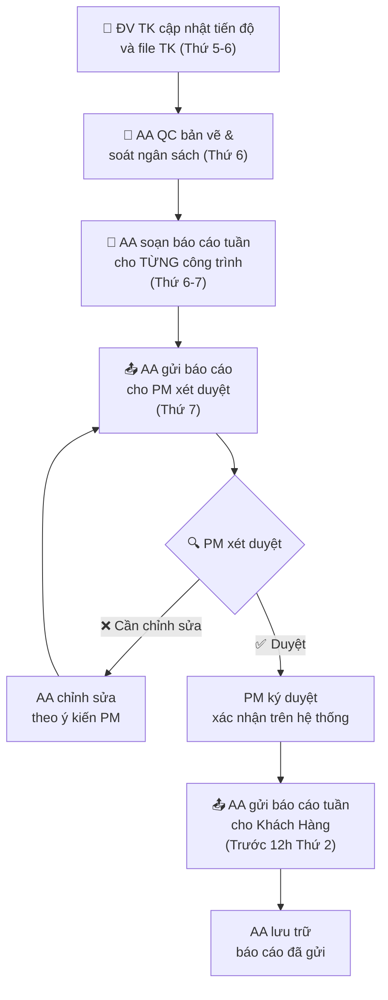
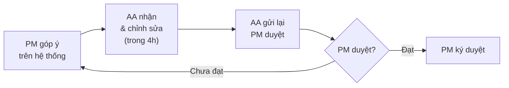

# Báo Cáo Tuần Cho PM & Khách Hàng

> **Mã SOP:** SOP-06-003
> **Phiên bản:** 1.0
> **Ngày hiệu lực:** 2026-03-28
> **Áp dụng:** Tất cả gói dịch vụ (QTDA / TLXN / TLXN TX)

---

## 1. Mục Đích

Quy định quy trình AA soạn **báo cáo thiết kế hàng tuần** trong **Giai đoạn Thiết Kế** mà mình phụ trách, trình PM xét duyệt, và gửi cho khách hàng. Báo cáo đảm bảo KH được cập nhật tiến độ bản vẽ và ý tưởng thiết kế.
*(Lưu ý: Báo cáo hàng tuần ở Giai đoạn Thi Công sẽ do CA phụ trách).*

> ⚠️ **Nguyên tắc bắt buộc:**
>
> - AA **PHẢI soạn báo cáo tuần cho MỌI công trình** mà mình phụ trách
> - Báo cáo **PHẢI được PM duyệt** trước khi gửi KH
> - **KHÔNG ĐƯỢC** gửi báo cáo cho KH khi chưa có chữ ký duyệt của PM

---

## 2. Sơ Đồ Quy Trình



---

## 3. Timeline Quy Trình Báo Cáo Tuần

| Ngày                    | Ai | Hành động                                                                 |
| ------------------------ | -- | ---------------------------------------------------------------------------- |
| **Thứ 5-6**       | AA | Đốc thúc ĐV TK cập nhật tiến độ, nộp file thiết kế mới nhất    |
| **Thứ 6**         | AA | Kiểm tra chéo (QC bản vẽ) và đối chiếu khối lượng/ngân sách     |
| **Thứ 6-7**       | AA | Soạn báo cáo tuần cho **từng công trình** theo Template chuẩn |
| **Thứ 7**         | AA | Gửi TOÀN BỘ báo cáo tuần cho PM xét duyệt                            |
| **CN-T2 sáng**    | PM | Review, góp ý, yêu cầu chỉnh sửa (nếu cần)                           |
| **CN-T2 sáng**    | AA | Chỉnh sửa theo ý kiến PM (nếu có)                                      |
| **Trước 12h T2** | AA | Sau khi PM duyệt → Gửi báo cáo tuần cho KH                             |

> 📌 **Quy tắc 48h:** Từ lúc chốt dữ liệu (Thu 6) đến khi KH nhận báo cáo (Thứ 2 sáng) không quá 48 giờ làm việc.

---

## 4. AA Cần Thu Thập Dữ Liệu Gì Từ ĐV Thiết Kế?

AA **chủ động liên hệ ĐV TK trước Thứ 6** để đảm bảo nhận đủ dữ liệu:

| Dữ liệu cần thu thập                    | Nguồn | Ghi chú                                 |
| ------------------------------------------- | ------ | ---------------------------------------- |
| Tiến độ ra bản vẽ thực tế            | ĐV TK | So sánh với Master Schedule            |
| Hạng mục bản vẽ đã chốt              | ĐV TK | Mô tả chi tiết                        |
| Kế hoạch nộp bản vẽ tuần tới         | ĐV TK | Theo kế hoạch                          |
| Vấn đề phát sinh (thẩm mỹ/kỹ thuật) | ĐV TK | Nếu có, kèm hành động đã xử lý |

---

## 5. Template Báo Cáo Tuần (Dùng Cho Mỗi Công Trình)

```
━━━━━━━━━━━━━━━━━━━━━━━━━━━━━━━━━━━━━
BÁO CÁO TUẦN — DỰ ÁN [TÊN KHÁCH HÀNG]
Tuần: [Số tuần] | Từ [DD/MM] đến [DD/MM/YYYY]
━━━━━━━━━━━━━━━━━━━━━━━━━━━━━━━━━━━━━

📊 TIẾN ĐỘ THIẾT KẾ
• MB Công Năng: [X]% | Phối Cảnh 3D: [X]% | KT Kỹ Thuật: [X]%
• Trạng thái: ✅ Đúng hạn / ⚠️ Trễ X ngày / 🔴 Nguy cơ cao
• Nhận xét: [Tóm tắt nguyên nhân nếu trễ tiến độ]

📐 KẾT QUẢ KIỂM TRA (QC) & NGÂN SÁCH
• Khối lượng/Ngân sách: [Khớp khái toán / Vượt X% do vật liệu Y]
• QC Bản vẽ: [Ghi chú nếu phát hiện lỗi công năng/kỹ thuật cần ĐV TK sửa]

📅 KẾ HOẠCH TUẦN TỚI
• [Hạng mục dự kiến hoàn thành]: [Mô tả công việc]

⚠️ VẤN ĐỀ PHÁT SINH (nếu có)
• [Vấn đề]: [Hành động đã/sẽ xử lý của ĐV TK/AA]

🖼 HÌNH ẢNH 3D/Concept MỚI (nếu có)
[Đính kèm 3-5 ảnh concept mới nhất]

━━━━━━━━━━━━━━━━━━━━━━━━━━━━━━━━━━━━━
Soạn bởi: AA [Tên AA]
Duyệt bởi: PM [Tên PM] — Ngày duyệt: [DD/MM/YYYY]
━━━━━━━━━━━━━━━━━━━━━━━━━━━━━━━━━━━━━
```

---

## 6. Quy Trình PM Xét Duyệt

### 6.1 PM Kiểm Tra Nội Dung Báo Cáo

PM duyệt báo cáo tuần theo các tiêu chí sau:

| Tiêu chí kiểm tra                      | Yêu cầu                                          |
| ----------------------------------------- | -------------------------------------------------- |
| Số liệu tiến độ chính xác          | Khớp với Master Schedule và dữ liệu ĐV TK    |
| Hình ảnh rõ ràng, đúng công trình | Không dùng ảnh cũ hoặc sai công trình       |
| Vấn đề phát sinh ghi đầy đủ       | Không giấu vấn đề; ghi rõ hành động       |
| Kế hoạch tuần tới khả thi            | Phù hợp với Resources và tiến độ tổng thể |
| Ngôn ngữ chuyên nghiệp                | Không lỗi chính tả, đúng format              |
| Đúng template                           | Đúng cấu trúc template chuẩn                  |

### 6.2 Xử Lý Khi PM Yêu Cầu Chỉnh Sửa



> ⚠️ **Quy tắc:** Tối đa 2 vòng chỉnh sửa. Nếu sau 2 vòng vẫn chưa đạt, PM cần họp trực tiếp AA để hướng dẫn.

---

## 7. Quy Trình Gửi Báo Cáo Cho Khách Hàng

### 7.1 Điều Kiện Bắt Buộc Trước Khi Gửi KH

- [X] PM đã ký duyệt báo cáo (trên hệ thống hoặc xác nhận qua chat)
- [X] Báo cáo đúng template, đúng format
- [X] Hình ảnh rõ ràng, có caption
- [X] File đúng định dạng (PDF hoặc theo quy định KH)

### 7.2 Kênh Gửi Báo Cáo

| Kênh gửi           | Ưu tiên | Ghi chú                                |
| -------------------- | :-------: | --------------------------------------- |
| Nhóm Zalo dự án   |     1     | Kênh chính cho KH cá nhân           |
| Email                |     2     | Khi KH yêu cầu hoặc báo cáo tháng |
| Larksuite (nội bộ) |    —    | Lưu trữ bản sao nội bộ             |

### 7.3 Mẫu Tin Nhắn Gửi KH

```
Kính gửi Anh/Chị [Tên KH],

Trợ Lý Xây Nhà gửi Anh/Chị Báo cáo tiến độ tuần [số tuần] 
cho công trình [Tên CT]:

📎 [Đính kèm file báo cáo tuần]

Tổng quan:
• Tiến độ thực tế: [X]% (Kế hoạch: [X]%)
• Trạng thái: [Đúng hạn / Trễ X ngày]

Nếu Anh/Chị có thắc mắc, vui lòng phản hồi ngay 
trong nhóm này ạ.

Trân trọng,
AA [Tên] — Dự án [Tên KH]
```

---

## 8. AA Phụ Trách Nhiều Công Trình

Khi AA phụ trách nhiều công trình đồng thời, áp dụng quy tắc sau:

| Quy tắc                                         | Chi tiết                                                            |
| ------------------------------------------------ | -------------------------------------------------------------------- |
| **Mỗi công trình = 1 báo cáo riêng** | Không gộp nhiều công trình vào 1 báo cáo                     |
| **Gửi PM duyệt theo batch**              | Gửi tất cả báo cáo cùng lúc vào Thứ 7                       |
| **PM duyệt tập trung**                   | PM review tất cả báo cáo trong CN-T2 sáng                       |
| **Ưu tiên công trình có vấn đề**   | Soạn báo cáo công trình phức tạp/có phát sinh trước       |
| **Bảng theo dõi trạng thái**           | AA duy trì bảng tracking trạng thái báo cáo từng công trình |

### Bảng Theo Dõi Trạng Thái Báo Cáo Tuần

| Công trình  | Dữ liệu ĐV TK | AA QC & Soạn | Gửi PM duyệt | PM duyệt | Gửi KH | Ghi chú |
| ------------- | :--------------: | :-----------: | :------------: | :-------: | :-----: | -------- |
| DA [Tên KH1] |        ☐        |      ☐      |       ☐       |    ☐    |   ☐   |          |
| DA [Tên KH2] |        ☐        |      ☐      |       ☐       |    ☐    |   ☐   |          |
| DA [Tên KH3] |        ☐        |      ☐      |       ☐       |    ☐    |   ☐   |          |

---

## 9. Xử Lý Tình Huống

| Tình huống                                     | Hành động của AA                                                     |
| ------------------------------------------------ | ------------------------------------------------------------------------ |
| ĐV TK nộp dữ liệu trễ (sau cam kết)        | AA nhắc ĐV TK; nếu qua 24h không nộp → báo PM và Account         |
| PM chưa duyệt báo cáo đến sáng Thứ 2     | AA nhắc PM; nếu 10h T2 chưa duyệt → báo PO                         |
| KH yêu cầu đổi phương án thiết kế mạnh | AA ghi nhận, báo lại Account để tư vấn chi phí/thời gian        |
| Không có tiến triển đáng kể trong tuần   | Vẫn phải gửi báo cáo, ghi rõ lý do (ĐV TK chậm, chờ duyệt...) |
| Bản vẽ nhận từ ĐV TK sai QC quá nhiều     | AA liệt kê thiếu sót, yêu cầu ĐV TK sửa ngay lập tức           |

---

## 10. Tài Liệu Liên Quan

| Tài liệu                             | Link                                                                  |
| -------------------------------------- | --------------------------------------------------------------------- |
| SOP Báo cáo & Review định kỳ (PM) | [../04-PM/bao-cao-review-dinh-ky.md](../04-PM/bao-cao-review-dinh-ky.md) |
| SOP Quản lý thi công (PM)           | [../04-PM/quan-ly-thi-cong.md](../04-PM/quan-ly-thi-cong.md)             |
| Template Báo cáo tuần               | [../10-BIEU-MAU-TEMPLATE/](../10-BIEU-MAU-TEMPLATE/)                     |
| Quản lý hồ sơ & nhập liệu AA     | [quan-ly-ho-so-nhap-lieu.md](./quan-ly-ho-so-nhap-lieu.md)               |
