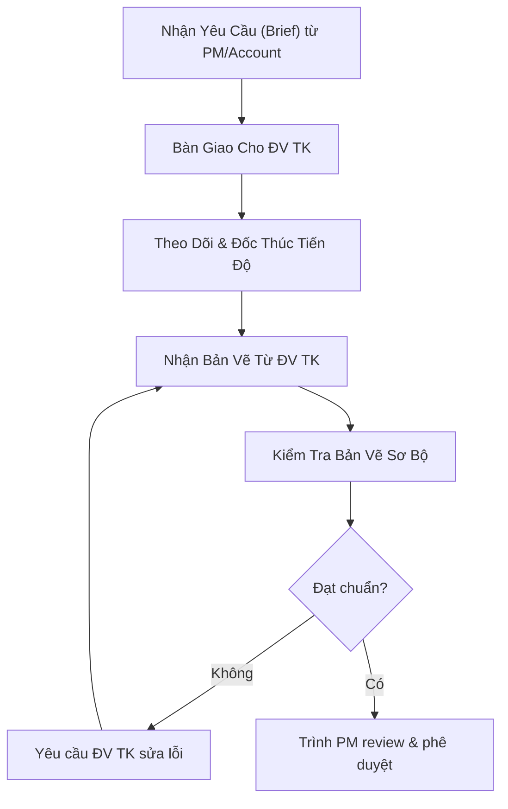

# Phối Hợp Đơn Vị Thiết Kế

> **Mã SOP:** SOP-06-002
> **Phiên bản:** 1.0
> **Ngày hiệu lực:** 2026-03-28

---

## 1. Mục Đích

Quy định quy trình AA làm việc với Đơn vị Thiết kế (ĐV TK), từ khâu bàn giao yêu cầu thiết kế ban đầu (Brief), đốc thúc tiến độ bản vẽ đến duyệt sơ bộ bản vẽ trước khi trình PM quyết định.

---

## 2. Quy Trình Tổng Quát

---

## 3. Các Bước Chi Tiết

### 3.1 Bàn Giao Yêu Cầu Thiết Kế (Brief)
- **Tiếp nhận:** AA nhận đầy đủ thông tin yêu cầu của Khách Hàng từ Account và PM (Style, Ngân sách, Công năng, Phong thủy).
- **Phân loại thông tin:** Đảm bảo brief thiết kế rõ ràng, không mâu thuẫn giữa "Ngân sách" và "Ý tưởng". Nếu phát hiện bất hợp lý, phản hồi ngay với PM.
- **Bàn giao ĐV TK:** Gửi chính thức Brief qua nhóm Zalo dự án hoặc Email. Setup buổi Kickoff mảng Thiết kế (nếu cần).

### 3.2 Theo Dõi, Đốc Thúc & Tham Gia Họp Thiết Kế
- **Tham gia họp 100%:** AA bắt buộc phải có mặt trong TẤT CẢ các buổi họp giữa CĐT và ĐV TK (bất kể online hay offline) để sát cánh cùng CĐT. Tại đây, AA hỗ trợ Account tư vấn vật liệu, phối cảnh, bản vẽ... giúp Account và CĐT chốt luôn NCC/thầu phụ từ sớm.
- **Lên kế hoạch:** Thống nhất Master Schedule mảng thiết kế (Ngày chốt MB công năng -> Ngày chốt 3D -> Ngày ra bản vẽ kỹ thuật).
- **Đốc thúc hằng ngày:** AA chủ động liên hệ ĐV TK ít nhất 2 ngày/lần để nắm tình hình. Không đợi đến deadline mới hỏi.
- **Báo cáo trễ hạn:** Nếu phát hiện ĐV TK có dấu hiệu chậm trễ > 24h so với tiến độ cam kết, AA lập tức báo cho PM để PM ra mặt xử lý.

### 3.3 Kiểm Tra Sơ Bộ Bản Vẽ (QC Chuyên Sâu)
Khi nhận bản vẽ từ ĐV TK, AA (với chuyên môn kiến trúc) là tấm khiên kỹ thuật đầu tiên. KHÔNG gửi thẳng bản vẽ cho PM hay KH mà phải kiểm tra theo Checklist:
- [x] **Xung đột kỹ thuật:** Phát hiện các điểm đụng chạm bất hợp lý (VD: kết cấu đụng kiến trúc, MEP đi vướng dầm...).
- [x] **Công năng & Tiện nghi:** Bố trí không gian có hợp lý không? Đảm bảo thông gió, ánh sáng tự nhiên và công năng sử dụng mượt mà. Đảm bảo yếu tố dễ dàng bảo trì, lau chùi sau này.
- [x] **Khối lượng vs. Ngân sách:** Đối chiếu ý tưởng thiết kế với Khái toán ban đầu. (Thiết kế đưa vào quá nhiều trần vòm, ốp vách so với khai toán -> Báo Account).
- [x] **Trình bày:** Đủ layer, kích thước, khung tên chuẩn.

> 🚫 **Giới hạn can thiệp:** AA kiểm soát mọi khía cạnh kỹ thuật, công năng, trải nghiệm sử dụng nhưng tuyệt đối **KHÔNG can thiệp quá sâu vào Thẩm mỹ (aesthetics)** (VD: bắt bẻ gu màu sắc, style thiết kế). Thẩm mỹ phụ thuộc vào sở thích của mỗi Khách hàng, AA chỉ cung cấp góc nhìn chuyên môn. Mọi thay đổi lớn ảnh hưởng kết cấu, PHẢI xin ý kiến PM.

### 3.4 Trình PM Và Gửi Khách Hàng
- Chỉ khi bản vẽ "sạch" lỗi, AA mới trình PM review.
- Sau khi PM "OK", PM sẽ quyết định việc gửi cho KH (Account hỗ trợ nếu cần). AA không tự ý pass bản vẽ chưa duyệt cho KH.

---

## 4. Rủi Ro Thường Gặp & Cách Xử Lý
| Rủi ro | Cách xử lý của AA |
| --- | --- |
| ĐV TK không phản hồi tin nhắn quá 1 ngày | Chuyển kênh liên lạc (gọi điện). Vẫn không được -> Báo PM. |
| Bản vẽ 3D rất đẹp nhưng phi thực tế | Phân tích lý do phi thực tế (Ví dụ: Không có đường xả nước), note lại gửi PM quyết định. |
| KH thay đổi ý định sau khi đã chốt 3D | Báo ngay cho PM và Account. Account sẽ làm việc với KH về việc rủi ro chậm tiến độ / phát sinh phí thiết kế. |
