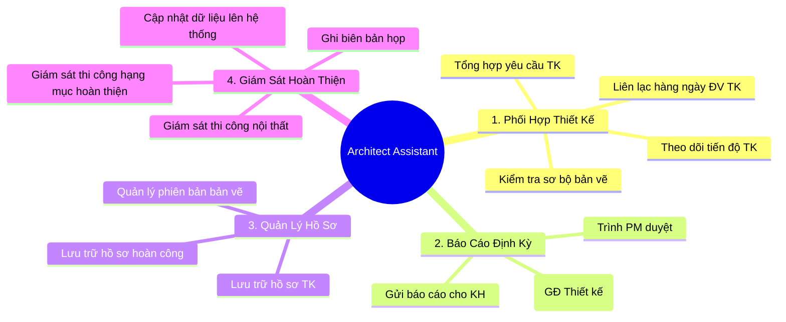
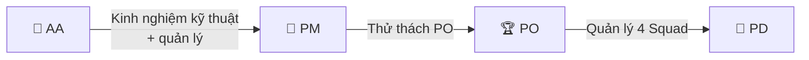

# Vai Trò, Chức Năng & KPI của Architect Assistant

> **Mã SOP:** SOP-06-001
> **Phiên bản:** 1.0
> **Ngày hiệu lực:** 2026-03-28
> **Áp dụng:** Tất cả gói dịch vụ (QTDA / TLXN / TLXN TX)

---

## 1. Định Nghĩa Vai Trò

**Architect Assistant (AA)** là người **hỗ trợ PM trong mảng thiết kế, hồ sơ và báo cáo**. AA là đầu mối liên lạc hàng ngày với đơn vị thiết kế (ĐV TK), chịu trách nhiệm kiểm tra sơ bộ bản vẽ, quản lý hồ sơ dự án, và tham gia giám sát thi công ở giai đoạn hoàn thiện/nội thất theo nguyên tắc sở trường kiến trúc.

> **Sứ mệnh:** Đảm bảo hồ sơ thiết kế đầy đủ, chính xác — báo cáo thiết kế đúng hạn — đồng thời đảm bảo hình ảnh thi công thực tế bám sát ý đồ thiết kế ban đầu.

---

## 2. Bốn Nhóm Chức Năng Chính

---

## 3. Chi Tiết Trách Nhiệm Theo Phase

### Phase 1: Chuyển Giao & Kickoff

- Chờ PM setup dự án xong trên Larksuite, HBSS; hiểu rõ cấu trúc để sẵn sàng cập nhật hồ sơ lưu trữ.
- Hỗ trợ PM lập Khái toán ngân sách xây nhà

### Phase 2: Thiết Kế

- **Tổng hợp yêu cầu thiết kế** từ Account + KH
- **Liên lạc hàng ngày** với ĐV TK — theo dõi tiến độ nộp bản vẽ
- **Kiểm tra và bóc tách chuyên sâu bản vẽ (QC)**: Trực tiếp soát xét chéo (cross-check) để phát hiện và cảnh báo các xung đột giữa các bộ môn (Kiến trúc, Kết cấu, MEP, Nội thất), do AA có nền tảng >5 năm kinh nghiệm. PM sẽ là người review và phê duyệt cuối cùng.
- **Kiểm soát khối lượng & Ngân sách:** So sánh khối lượng bản vẽ thiết kế thực tế so với Khái toán ban đầu. Nếu phát hiện chênh lệch, báo ngay cho Account để Account làm việc với CĐT điều chỉnh ngân sách cho hợp lý.
- **Lưu trữ toàn bộ hồ sơ TK** (bản vẽ, hợp đồng, biên bản)

### Phase 3: Lựa Chọn Nhà Thầu

- *(AA không tham gia trực tiếp vào việc lựa chọn nhà thầu hay làm báo giá. AA chỉ hỗ trợ quản lý hồ sơ kỹ thuật nếu PM yêu cầu).*

### Phase 4: Thi Công

- Ghi biên bản họp giao ban công trường.
- **Báo cáo "điểm rơi" nhà thầu phụ:** Dựa vào tiến độ thực tế, AA tính toán và báo cho Account thời điểm chính xác các nhà thầu phụ, NCC (thạch cao, mộc, điện lạnh...) cần có mặt tại công trình. Nhờ đó, Account kịp thời chốt HĐ và xếp lịch thi công với CĐT.
- **Tham gia giám sát mảng Hoàn thiện & Nội thất:** Vì đây là chuyên môn sâu của AA (kiến trúc), AA sẽ trực tiếp hỗ trợ CA và PM trong việc giám sát chất lượng các hạng mục ốp lát, trần thạch cao, sơn, lắp ráp đồ mộc, đèn trang trí... để đảm bảo thi công đúng ý đồ thẩm mỹ của bản vẽ 3D.

### Phase 5 & 6: Nghiệm Thu, Bàn Giao & Đóng DA

- Bàn giao hồ sơ hoàn công
- Hỗ trợ PM tổng hợp Lesson Learned
- Lưu trữ toàn bộ hồ sơ dự án theo quy định

---

## 4. Ma Trận Phối Hợp

| AA phối hợp với | Nội dung phối hợp                                            | Tần suất   |
| ------------------ | --------------------------------------------------------------- | ------------ |
| **Account**  | - Báo cáo chênh lệch khối lượng/ngân sách (GĐ thiết kế). - Tại các cuộc họp thiết kế, hỗ trợ Account tư vấn vật liệu, phối cảnh để Account chốt NCC với CĐT. - Báo lịch thầu phụ vào công trường (GĐ thi công). | Thường xuyên |
| **PM**       | Nhận chỉ đạo, báo cáo chuyên môn kiến trúc/xung đột kỹ thuật để PM kiểm soát rủi ro, duyệt báo cáo gửi KH. | Hàng ngày  |
| **ĐV TK**   | Liên lạc đốc thúc tiến độ TK, nhận/gửi và kiểm tra bản vẽ.         | Hàng ngày  |
| **KH**       | Gửi báo cáo định kỳ (sau khi PM duyệt). Tư vấn vật liệu/bản vẽ tại các buổi họp. | Giai đoạn TK  |

---

## 5. KPI của AA

| Chỉ tiêu                                                 | Mục tiêu | Đo lường                       |
| ---------------------------------------------------------- | ---------- | --------------------------------- |
| Báo cáo tuần (GĐ Thiết kế)                           | 100%       | Trước 12h Thứ 2 hàng tuần    |
| Hồ sơ TK lưu trữ đầy đủ                            | 100%       | Kiểm tra khi nghiệm thu TK      |
| Kiểm tra bản vẽ từng giai đoạn trước khi trình PM | ≥ 95%     | Tỷ lệ bản vẽ qua kiểm tra AA |
| Phản hồi ĐV TK trong ngày                              | ≤ 24h     | Đo bằng lịch sử chat/email    |
| Biên bản họp ghi đầy đủ                             | 100%       | Trong ngày sau cuộc họp        |

---

## 6. Lịch Vận Hành Hàng Tuần Của AA

| Ngày                | Hoạt động chính                                                        |
| -------------------- | -------------------------------------------------------------------------- |
| **Thứ 2**     | Gửi báo cáo tuần cho KH (sau khi PM duyệt)                            |
| **Thứ 3-4**   | Phối hợp ĐV TK; kiểm tra bản vẽ; cập nhật hồ sơ                  |
| **Thứ 5**     | Ghi biên bản họp giao ban (nếu có); nhận dữ liệu từ CA            |
| **Thứ 6**     | Nhận dữ liệu cuối tuần từ CA; bắt đầu soạn báo cáo tuần       |
| **Thứ 7**     | Hoàn thiện báo cáo tuần → Gửi PM duyệt                             |
| **Chủ nhật** | Chỉnh sửa theo ý kiến PM (nếu có) → Sẵn sàng gửi KH sáng Thứ 2 |

---

## 7. Quyền Hạn & Giới Hạn

| Quyền                                        | AA được làm |   Phải qua PM   |
| --------------------------------------------- | :-------------: | :---------------: |
| Góp ý thiết kế cho ĐV TK                 |       ✅       |        —        |
| Yêu cầu ĐV TK chỉnh sửa bản vẽ nhỏ    |       ✅       |        —        |
| Yêu cầu thay đổi phạm vi thiết kế      |       —       |        ✅        |
| Gửi báo cáo tuần cho KH                   |       ✅       | Sau khi PM duyệt |
| Liên hệ KH về vấn đề thiết kế         |       —       |        ✅        |
| Cập nhật hồ sơ/dữ liệu vào hệ thống (Larksuite, HBSS) |       ✅       |        —        |

---

## 8. Con Đường Thăng Tiến

> Điều kiện: AA muốn lên PM cần tích lũy kinh nghiệm quản lý thiết kế, thi công ≥ 1 năm, hoàn thành ≥ 5 dự án, KPI đạt ≥ 12 tháng liên tiếp.

---

## 9. Công Cụ Phần Mềm Yêu Cầu

- **HBSS (Lark):** Bắt buộc sử dụng làm nền tảng chính để quản lý hồ sơ dự án, cập nhật tiến độ, giao việc và báo cáo.
- **Timemark:** Bắt buộc sử dụng khi quay phim, chụp ảnh hiện trạng công trình/thiết kế nhằm đảm bảo tính minh bạch (ảnh có gắn tọa độ và mốc thời gian thực tế).

---

## 10. Tài Liệu Liên Quan

| Tài liệu              | Link                                                                                  |
| ----------------------- | ------------------------------------------------------------------------------------- |
| Flow tổng thể dự án | [../00-TONG-QUAN/flow-tong-the-du-an.md](../00-TONG-QUAN/flow-tong-the-du-an.md)         |
| Ma trận RACI           | [../00-TONG-QUAN/ma-tran-RACI.md](../00-TONG-QUAN/ma-tran-RACI.md)                       |
| SOP PM                  | [../04-PM/vai-tro-trach-nhiem.md](../04-PM/vai-tro-trach-nhiem.md)                       |
| Escalation nội bộ     | [../09-PHOI-HOP-NOI-BO/escalation-noi-bo.md](../09-PHOI-HOP-NOI-BO/escalation-noi-bo.md) |
