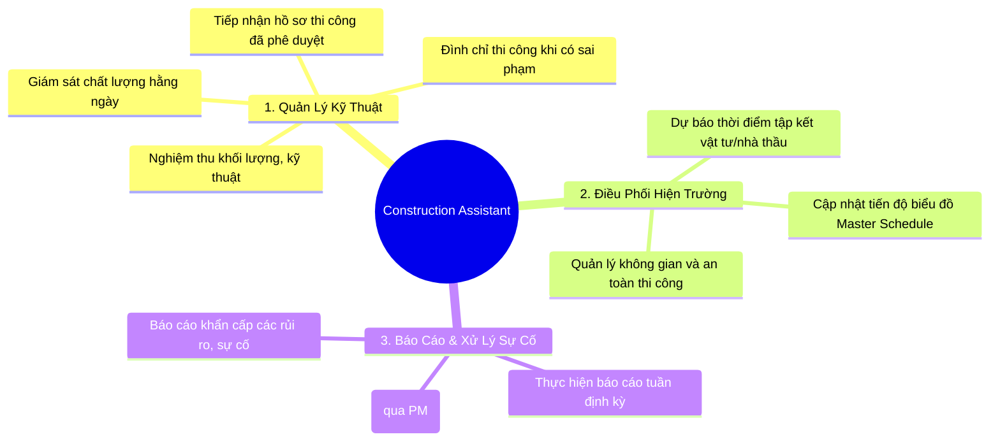

# Vai Trò, Chức Năng & KPI của Construction Assistant (CA)

> **Mã SOP:** SOP-07-001
> **Phiên bản:** 2.1
> **Ngày hiệu lực:** 2026-03-28
> **Áp dụng:** Gói dịch vụ Quản trị Dự án / Thiết kế & Thi công TLXN 

---

## 1. Định Nghĩa Vai Trò

**Construction Assistant (CA)** là **Đại diện kỹ thuật thường trực của công ty tại công trường**. CA làm việc dưới sự quản lý, chỉ đạo và điều hành trực tiếp từ **Project Manager (PM)**. CA thực thi nhiệm vụ giám sát, kiểm soát chất lượng và tiến độ, nhưng không có thẩm quyền tự quyết định thay đổi thiết kế hoặc phát sinh ngân sách. Mọi vấn đề vượt thẩm quyền phải được báo cáo và xin ý kiến chỉ đạo từ PM.

> **Sứ mệnh:** Đảm bảo toàn bộ công tác thi công tuân thủ tuyệt đối hồ sơ thiết kế đã được phê duyệt, tiêu chuẩn kỹ thuật hiện hành, quy định an toàn lao động và cam kết tiến độ dự án. Trực tiếp thực hiện công tác điều phối, liên kết chặt chẽ với các phòng ban (AA, Account) nhằm tối ưu hóa tiến độ và nguồn lực.

---

## 2. Các Nhóm Chức Năng Chính

### 2.1 Tiếp Nhận Hồ Sơ Thiết Kế Thi Công
- CA **chỉ** được phép sử dụng bộ hồ sơ bản vẽ thi công chính thức do **Architect Assistant (AA)** bàn giao (bao gồm bản cứng tại hiện trường và bản mềm trên hệ thống lưu trữ), có đính kèm chữ ký phê duyệt (Approved for Construction) của PM.
- Nghiêm cấm sử dụng các bản vẽ chưa được phê duyệt, bản thảo hoặc tài liệu trực tiếp từ Đơn vị Thiết kế/Nhà thầu phụ rẽ nhánh.
- Trong trường hợp phát hiện bất cập kỹ thuật hoặc sai lệch giữa thiết kế và hiện trạng, CA có trách nhiệm phản hồi bằng văn bản/hình ảnh về cho AA và PM để có phương án điều chỉnh trước khi triển khai thi công.

### 2.2 Giám Sát Hiện Trường & Xác Nhận Khối Lượng
- Thực hiện công tác giám sát thường trực (hoặc theo sự phân công của PM) đối với chất lượng thi công, an toàn lao động và vệ sinh môi trường (tiêu chuẩn 5S).
- Trực tiếp nghiệm thu chất lượng, số lượng vật tư đầu vào; nghiệm thu chuyển giai đoạn thi công (Ví dụ: Hoàn tất công tác cốt thép trước khi đổ bê tông).
- Phối hợp với AA thực hiện công tác nghiệm thu các hạng mục hoàn thiện, lắp đặt nội thất nhằm đảm bảo tính thẩm mỹ và công năng theo thiết kế.
- **Xử lý sự cố thi công (Mô hình Hybrid):** CA được quyền trực tiếp ra lệnh TẠM DỪNG THI CÔNG ngay lập tức tại hiện trường nếu phát hiện lỗi vi phạm nghiêm trọng (sai kết cấu, mất an toàn lao động rủi ro cao). Sau khi lập biên bản ghi nhận bằng `Timemark`, CA báo cáo ngay cho PM để PM ra quyết định cuối cùng (phạt, đập bỏ, thay thế hoặc thay đổi bản vẽ). Đối với các lỗi nhỏ (thẩm mỹ), CA yêu cầu nhà thầu khắc phục ngay tại chỗ mà không cần chờ PM.

### 2.3 Điều Phối Tiến Độ & Kế Hoạch Tổ Chức Thi Công
- Dựa trên tiến độ thi công thực tế tại từng hạng mục, CA có nhiệm vụ đối chiếu với Biểu đồ tiến độ dự án (Master Schedule) để **dự báo chính xác thời điểm** cần cung ứng vật tư hoặc thời điểm nhà thầu phụ (MEP, thạch cao, mộc...) cần bắt đầu triển khai.
- Thực hiện thông báo kế hoạch này cho bộ phận **Account** (tối thiểu trước 5-7 ngày) nhằm đảm bảo quá trình làm việc với Chủ đầu tư, công tác mua sắm và ký kết hợp đồng phụ diễn ra đúng hạn, tránh tình trạng gián đoạn thi công.

### 2.4 Báo Cáo Định Kỳ & Quản Trị Rủi Ro
- Thực hiện lập **Báo cáo tiến độ tuần** (Giai đoạn Thi công) vào mỗi Thứ 6.
- Toàn bộ báo cáo gửi Khách hàng phải trải qua bước kiểm duyệt và phê duyệt của PM.
- Lập tức báo cáo PM đối với mọi rủi ro, sự cố phát sinh tại dự án (tai nạn, vi phạm an toàn, rủi ro pháp lý với cư dân xung quanh, thiệt hại vật tư). Phối hợp cung cấp hồ sơ sự việc để Account thực hiện công tác chăm sóc Khách hàng (Ticket) khi có yêu cầu.

---

## 3. Ma Trận Phối Hợp Sự Kiện

| Đối đối tác / Phòng ban | Phương thức và nội dung phối hợp                                                                                       | Tần suất       |
| -------------------------- | ------------------------------------------------------------------------------------------------------------------------- | ---------------- |
| **Project Manager (PM)** | Nhận chỉ đạo công việc, báo cáo tiến độ định kỳ, báo cáo sự cố khẩn cấp và đề xuất phương án giải quyết (nếu có).           | Hằng ngày      |
| **Architect Assistant (AA)** | Tiếp nhận bản vẽ thi công đã phê duyệt. Phối hợp công tác nghiệm thu chất lượng các hạng mục hoàn thiện và lắp đặt thiết bị.| Định kỳ/Sự kiện|
| **Account**               | Cung cấp mốc thời gian dự kiến thi công của dự án nhằm hỗ trợ công tác đấu thầu phụ/cung ứng vật tư. Phối hợp giải quyết khiếu nại.| Thường xuyên     |
| **Khách Hàng**            | Trực tiếp giải trình các vấn đề kỹ thuật thông thường tại công trình; Cập nhật báo cáo tiến độ qua Nhóm Zalo (sau khi PM duyệt). | Thường xuyên     |
| **Nhà Thầu Thi Công**      | Giám sát, đôn đốc tiến độ, đo đạc nghiệm thu khối lượng và lập biên bản hiện trường.                                      | Hằng ngày      |

---

## 4. Các Chỉ Số Đánh Giá Hiệu Quả (KPI)

| Chỉ tiêu đo lường                                          | Mục tiêu | Phương pháp theo dõi                 |
| ------------------------------------------------------------ | ---------- | --------------------------------------- |
| Báo cáo thi công tuần hoàn thành và đúng hạn               | 100%       | Trước 12h Thứ 2 hàng tuần (Có PM duyệt)|
| Tỷ lệ phát hiện và ngăn chặn thi công sai bản vẽ/tiêu chuẩn | ≥ 95%     | Thống kê biên bản xử lý hiện trường     |
| Mức độ an toàn lao động, vệ sinh công trường                | 0 sự cố    | Hệ thống báo cáo rủi ro dự án           |
| Tính kịp thời trong thông báo kế hoạch vật tư/thầu phụ       | Sớm ≥5 ngày| Nhật ký trao đổi Account                |

---

## 5. Thẩm Quyền Làm Việc

| Hạng mục công việc                               | Thẩm quyền CA quyết định |  Cần PM phê duyệt  |
| -------------------------------------------------- | :-------------------------: | :------------------: |
| Đình chỉ thi công do sai phạm kỹ thuật/an toàn |             ✅             |          —          |
| Phê duyệt mẫu vật tư, chuẩn loại vật tư đưa vào |             ✅             |          —          |
| Phê duyệt thay đổi biện pháp tổ chức thi công      |             —             |          ✅          |
| Thẩm định và thay đổi chi tiết thiết kế / khối lượng|             —             |          ✅          |
| Ban hành Báo cáo tiến độ tuần cho Khách hàng     |             —             |          ✅          |

---

## 6. Công Cụ Phần Mềm Yêu Cầu

- **HBSS (Lark):** Bắt buộc sử dụng để quản lý thông tin, lưu trữ nhật ký thi công, báo cáo sự cố và làm Báo cáo tuần.
- **Timemark:** Bắt buộc sử dụng để chụp ảnh/quay video làm minh chứng cho mọi báo cáo, lỗi thi công hoặc nghiệm thu (tự động gắn tọa độ, mốc thời gian thực tế vào ảnh).

---

## 7. Hệ Thống Tài Liệu Tham Chiếu

| Tên tài liệu                          | Liên kết lưu trữ                                                                      |
| --------------------------------------- | --------------------------------------------------------------------------------------- |
| Sơ đồ luồng dự án tổng thể            | [../00-TONG-QUAN/flow-tong-the-du-an.md](../00-TONG-QUAN/flow-tong-the-du-an.md)         |
| Ma trận phân bổ trách nhiệm (RACI)    | [../00-TONG-QUAN/ma-tran-RACI.md](../00-TONG-QUAN/ma-tran-RACI.md)                       |
| Quy trình Phối hợp Thi công Hiện trường | [phoi-hop-thi-cong-hien-truong.md](./phoi-hop-thi-cong-hien-truong.md)                  |
| Hệ thống Biểu mẫu & Checklist         | [checklist-nghiem-thu/README.md](./checklist-nghiem-thu/README.md)                      |
